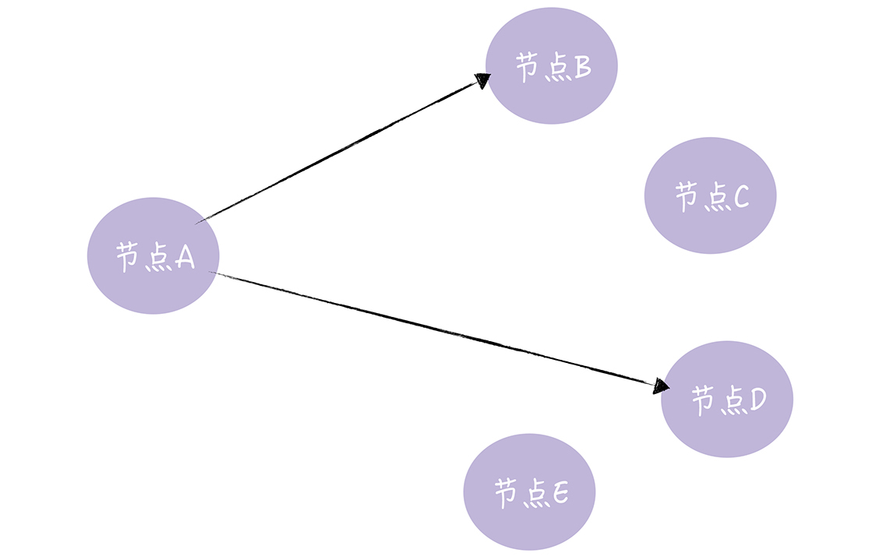
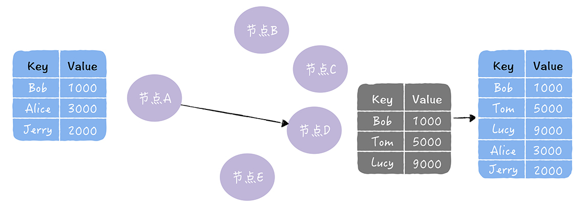
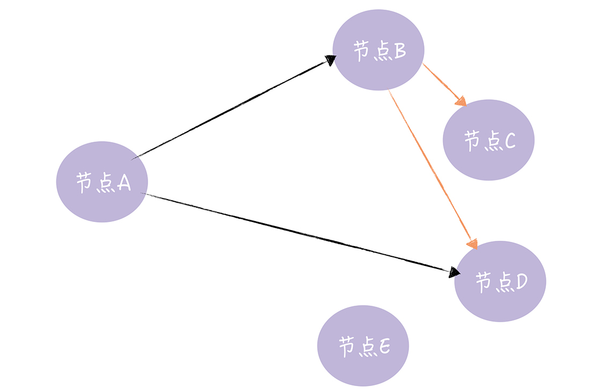
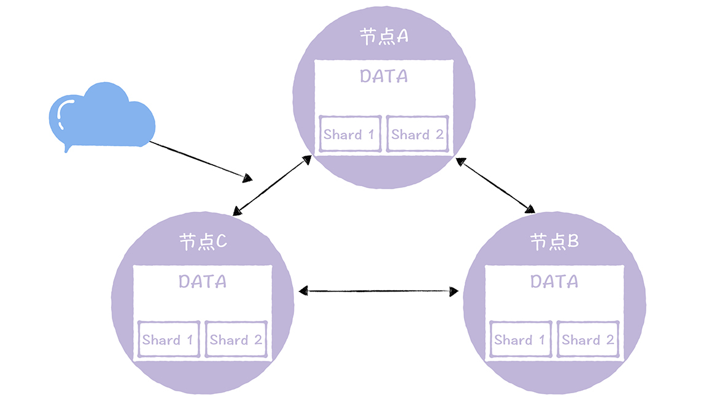
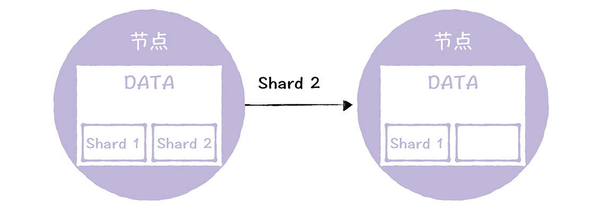
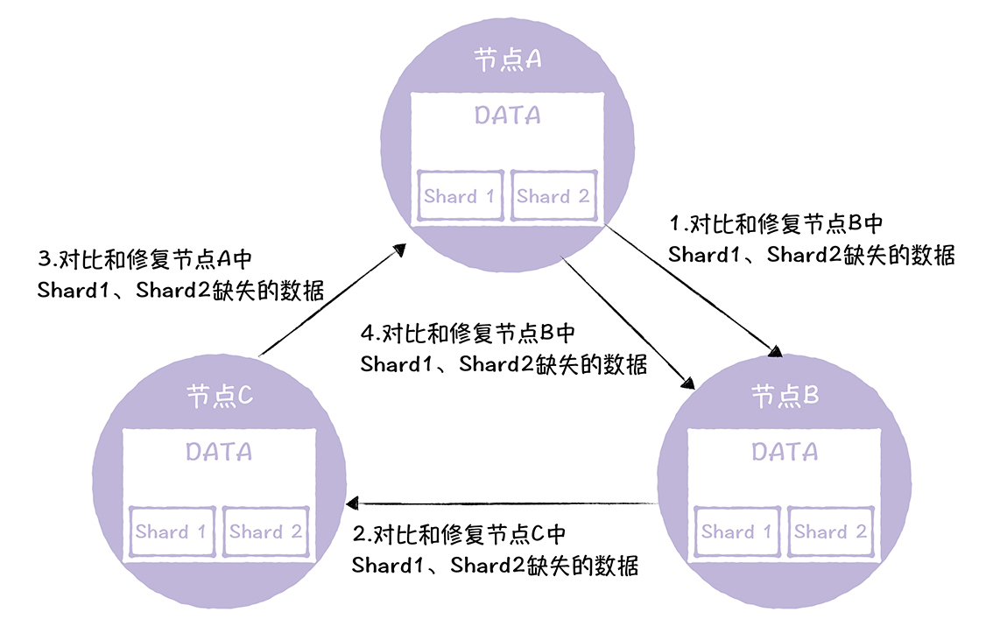

---
date: "2019-06-23"
---  
      
# 11 | Gossip协议：流言蜚语，原来也可以实现一致性
你好，我是韩健。

有一部分同学的业务在可用性上比较敏感，比如监控主机和业务运行的告警系统。这个时候，相信你希望自己的系统能在极端情况下（比如集群中只有一个节点在运行）也能运行。回忆了二阶段提交协议和Raft算法之后，你发现它们都需要全部节点或者大多数节点正常运行，才能稳定运行，那么它们就不适合了。而根据Base理论，你需要实现最终一致性，怎么样才能实现最终一致性呢？

在我看来，你可以通过Gossip协议实现这个目标。

Gossip协议，顾名思义，就像流言蜚语一样，利用一种随机、带有传染性的方式，将信息传播到整个网络中，并在一定时间内，使得系统内的所有节点数据一致。对你来说，掌握这个协议不仅能很好地理解这种最常用的，实现最终一致性的算法，也能在后续工作中得心应手地实现数据的最终一致性。

为了帮你彻底吃透Gossip协议，掌握实现最终一致性的实战能力，我会先带你了解Gossip三板斧，因为这是Gossip协议的核心内容，也是实现最终一致性的常用三种方法。然后以实际系统为例，带你了解在实际系统中是如何实现反熵的。接下来，就让我们开始今天的内容吧。

## Gossip的三板斧

Gossip的三板斧分别是：直接邮寄（Direct Mail）、反熵（Anti-entropy）和谣言传播（Rumor mongering）。

<!-- [[[read_end]]] -->

直接邮寄：就是直接发送更新数据，当数据发送失败时，将数据缓存下来，然后重传。从图中你可以看到，节点A直接将更新数据发送给了节点B、D。

在这里我想补充一点，直接邮寄虽然实现起来比较容易，数据同步也很及时，但可能会因为缓存队列满了而丢数据。也就是说，只采用直接邮寄是无法实现最终一致性的，这一点我希望你能注意到。

那如何实现最终一致性呢？答案就是反熵。本质上，反熵是一种通过异步修复实现最终一致性的方法（关于异步修复，你可以回顾一下[04讲](https://time.geekbang.org/column/article/200717)）。常见的最终一致性系统（比如Cassandra），都实现了反熵功能。

反熵指的是集群中的节点，每隔段时间就随机选择某个其他节点，然后通过互相交换自己的所有数据来消除两者之间的差异，实现数据的最终一致性：

从图2中你可以看到，节点A通过反熵的方式，修复了节点D中缺失的数据。那具体怎么实现的呢？

**其实，在实现反熵的时候，主要有推、拉和推拉三种方式。**我将以修复下图中，2个数据副本的不一致为例，具体带你了解一下。

推方式，就是将自己的所有副本数据，推给对方，修复对方副本中的熵：

拉方式，就是拉取对方的所有副本数据，修复自己副本中的熵：

理解了推和拉之后，推拉这个方式就很好理解了，这个方式就是同时修复自己副本和对方副本中的熵：

也许有很多同学，会觉得反熵是一个很奇怪的名词。其实，你可以这么来理解，反熵中的熵是指混乱程度，反熵就是指消除不同节点中数据的差异，提升节点间数据的相似度，降低熵值。

另外需要你注意的是，因为反熵需要节点两两交换和比对自己所有的数据，执行反熵时通讯成本会很高，所以我不建议你在实际场景中频繁执行反熵，并且可以通过引入校验和（Checksum）等机制，降低需要对比的数据量和通讯消息等。

虽然反熵很实用，但是执行反熵时，相关的节点都是已知的，而且节点数量不能太多，如果是一个动态变化或节点数比较多的分布式环境（比如在DevOps环境中检测节点故障，并动态维护集群节点状态），这时反熵就不适用了。**那么当你面临这个情况要怎样实现最终一致性呢？答案就是谣言传播。**

谣言传播，广泛地散播谣言，它指的是当一个节点有了新数据后，这个节点变成活跃状态，并周期性地联系其他节点向其发送新数据，直到所有的节点都存储了该新数据：

从图中你可以看到，节点A向节点B、D发送新数据，节点B收到新数据后，变成活跃节点，然后节点B向节点C、D发送新数据。其实，谣言传播非常具有传染性，它适合动态变化的分布式系统。

## 如何使用Anti-entropy实现最终一致

在分布式存储系统中，实现数据副本最终一致性，最常用的方法就是反熵了。为了帮你彻底理解和掌握在实际环境中实现反熵的方法，我想以自研InfluxDB的反熵实现为例，具体带你了解一下。

在自研InfluxDB中，一份数据副本是由多个分片组成的，也就是实现了数据分片，三节点三副本的集群，就像下图的样子：

反熵的目标是确保每个DATA节点拥有元信息指定的分片，而且不同节点上，同一分片组中的分片都没有差异。比如说，节点A要拥有分片Shard1和Shard2，而且，节点A的Shard1和Shard2，与节点B、C中的Shard1和Shard2，是一样的。

那么，在DATA节点上，存在哪些数据缺失的情况呢？也就说，我们需要解决哪些问题呢？

我们将数据缺失，分为这样2种情况。

* 缺失分片：也就是说，在某个节点上整个分片都丢失了。
* 节点之间的分片不一致：也就是说，节点上分片都存在，但里面的数据不一样，有数据丢失的情况发生。  
  第一种情况修复起来不复杂，我们只需要将分片数据，通过RPC通讯，从其他节点上拷贝过来就可以了：

你需要注意的是第二种情况，因为第二种情况修复起来要复杂一些。我们需要设计一个闭环的流程，按照一个顺序修复，执行完流程后，也就是实现了一致性了。具体是怎么设计的呢？

它是按照一定顺序来修复节点的数据差异，先随机选择一个节点，然后循环修复，每个节点生成自己节点有、下一个节点没有的差异数据，发送给下一个节点，进行修复（为了方便演示，假设Shard1、Shard2在各节点上是不一致的）：

从图中你可以看到，数据修复的起始节点为节点A，数据修复是按照顺时针顺序，循环修复的。需要你注意的是，最后节点A又对节点B的数据执行了一次数据修复操作，因为只有这样，节点C有、节点B缺失的差异数据，才会同步到节点B上。

学到这里你可以看到，在实现反熵时，实现细节和最初算法的约定有些不同。比如，不是一个节点不断随机选择另一个节点，来修复副本上的熵，而是设计了一个闭环的流程，一次修复所有节点的副本数据不一致。

为什么这么设计呢？因为我们希望能在一个确定的时间范围内实现数据副本的最终一致性，而不是基于随机性的概率，在一个不确定的时间范围内实现数据副本的最终一致性。

这样做能减少数据不一致对监控视图影响的时长。而我希望你能注意到，技术是要活学活用的，要能根据场景特点权衡妥协，设计出最适合这个场景的系统功能。**最后需要你注意的是，因为反熵需要做一致性对比，很消耗系统性能，所以建议你将是否启用反熵功能、执行一致性检测的时间间隔等，做成可配置的，能在不同场景中按需使用。**

## 内容小结

以上就是本节课的全部内容了，本节课我主要带你了解了Gossip协议、如何在实际系统中实现反熵等。我希望你明确这样几个重点：

1.  作为一种异步修复、实现最终一致性的协议，反熵在存储组件中应用广泛，比如Dynamo、InfluxDB、Cassandra，我希望你能彻底掌握反熵的实现方法，在后续工作中，需要实现最终一致性时，优先考虑反熵。

2.  因为谣言传播具有传染性，一个节点传给了另一个节点，另一个节点又将充当传播者，传染给其他节点，所以非常适合动态变化的分布式系统，比如Cassandra采用这种方式动态管理集群节点状态。

在实际场景中，实现数据副本的最终一致性时，一般而言，直接邮寄的方式是一定要实现的，因为不需要做一致性对比，只是通过发送更新数据或缓存重传，来修复数据的不一致，性能损耗低。在存储组件中，节点都是已知的，一般采用反熵修复数据副本的一致性。当集群节点是变化的，或者集群节点数比较多时，这时要采用谣言传播的方式，同步更新数据，实现最终一致。

## 课堂思考

既然使用反熵实现最终一致性时，需要通过一致性检测发现数据副本的差异，如果每次做一致性检测时都做数据对比的话，肯定是比较消耗性能的，那有什么办法降低一致性检测时的性能消耗呢？欢迎在留言区分享你的看法，与我一同讨论。

最后，感谢你的阅读，如果这篇文章让你有所收获，也欢迎你将它分享给更多的朋友。