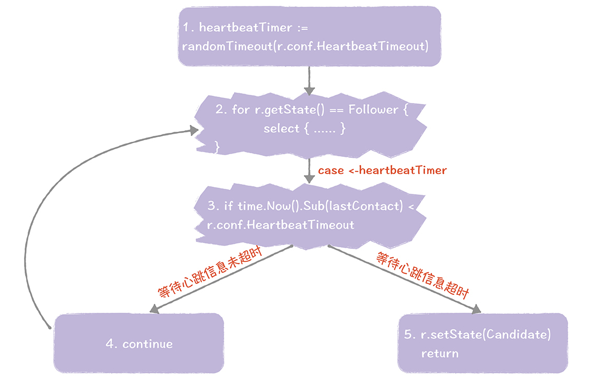
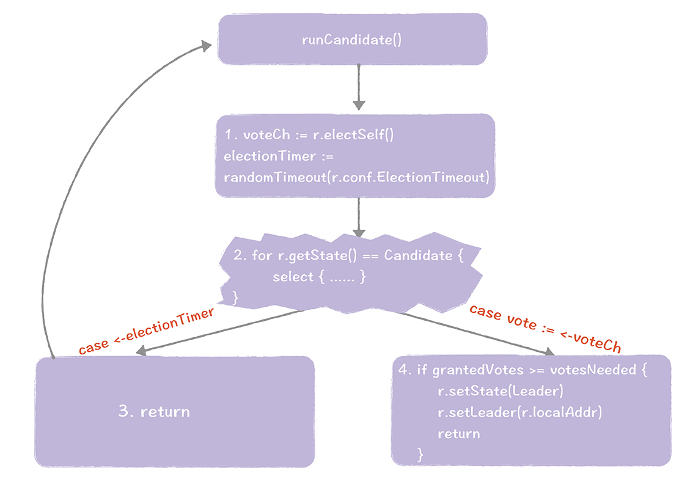
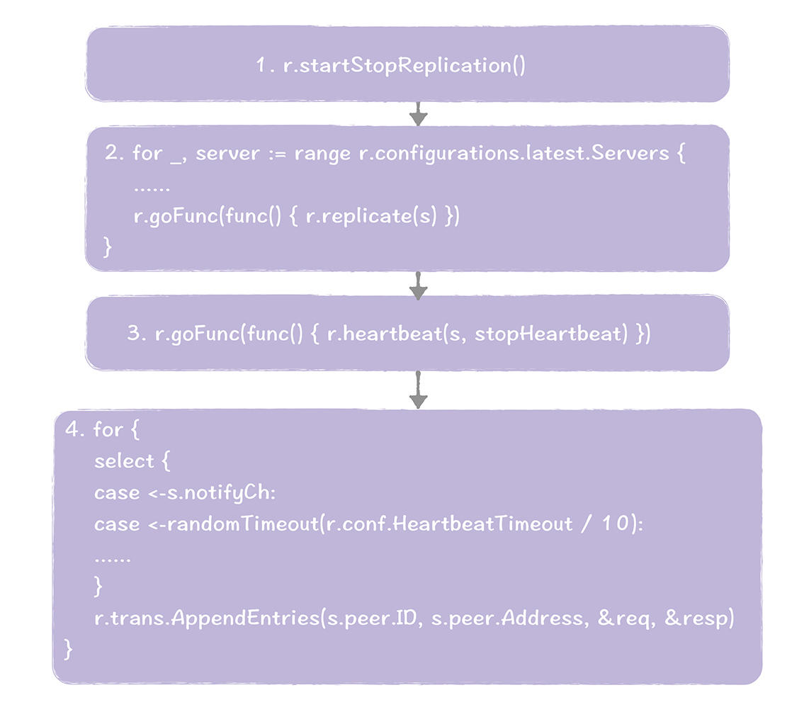
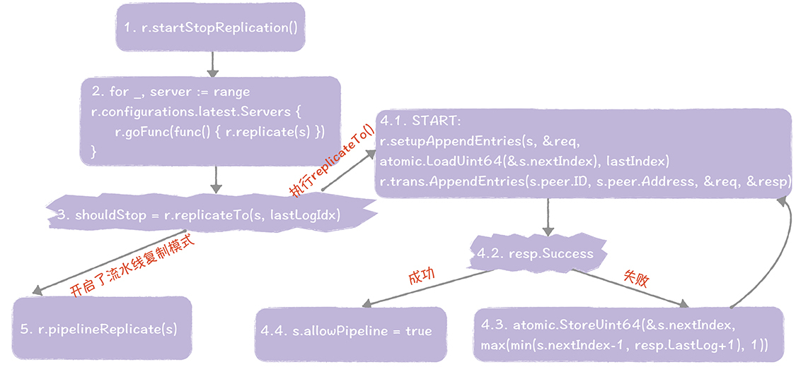
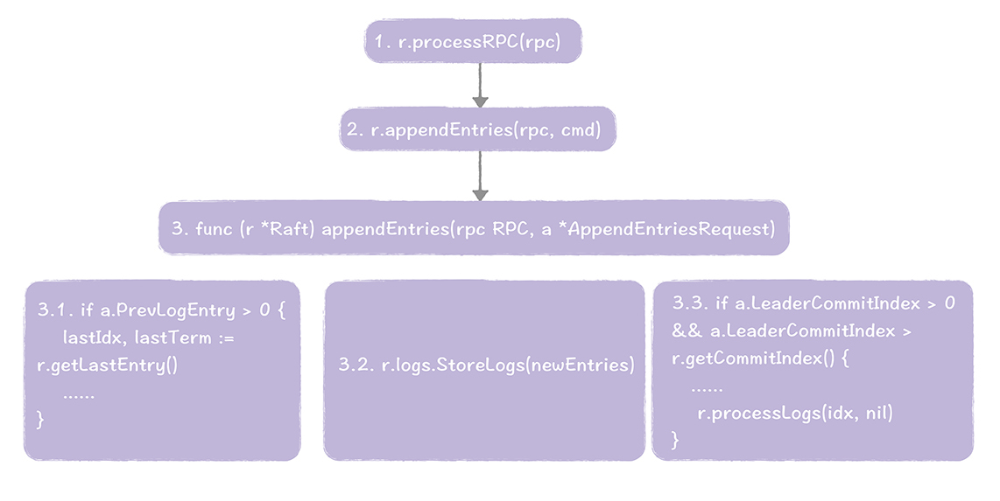

---
date: "2019-06-23"
---  
      
# 17  | Hashicorp Raft（一）：如何跨过理论和代码之间的鸿沟？
你好，我是韩健。

很多同学在开发系统的时候，都会有这样的感觉：明明自己看了很多资料，掌握了技术背后的原理，可在开发和调试的时候还是很吃力，这是为什么呢？

答案很简单，因为理论和实践本来就是两回事，实践不仅需要掌握API接口的用法，还需要理解API背后的代码实现。

所以，如果你在使用Raft开发分布式系统的时候，仅仅阅读Raft论文或者Raft实现的API手册，是远远不够的。你还要吃透API背后的代码实现，“不仅知其然，也要知其所以然”，这样才能“一切尽在掌握中”，从而开发实现能稳定运行的分布式系统。那么怎么做才能吃透Raft的代码实现呢？

要知道，任何Raft实现都承载了两个目标：实现Raft算法的原理，设计易用的API接口。所以，你不仅要从算法原理的角度理解代码实现，而且要从场景使用的角度理解API接口的用法。

而我会用两节课的时间，**从代码实现和接口使用两个角度，**带你循序渐进地掌握当前流行的一个Raft实现：[Hashicorp Raft](https://github.com/hashicorp/raft)（以最新稳定版v1.1.1为例）。希望你在这个过程中集中注意力，勾划重点，以便提高学习效率，吃透原理对应的技术实现，彻底掌握Raft算法的实战技巧。

本节课，我会从算法原理的角度，聊一聊Raft算法的核心功能（领导者选举和日志复制）在Hashicorp Raft中是如何实现的。（如果Raft算法的原理你已经忘得差不多了，那你可以先回顾下7～9讲，加深印象之后，再进入今天的学习。）

<!-- [[[read_end]]] -->

## Hashicorp Raft如何实现领导者选举？

**在我看来，阅读源码的关键，在于找到代码的入口函数，**比如在Golang代码中，程序的入口函数一般为main\(\)函数，那么领导者选举的入口函数是哪个呢？

我们知道，典型的领导者选举在本质上是节点状态的变更。具体到Hashicorp Raft源码中，领导者选举的入口函数run\(\)，在raft.go中以一个单独的协程运行，来实现节点状态变迁，就像下面的样子：

```
    func (r *Raft) run() {
            for {
                    select {
                    // 关闭节点
                    case <-r.shutdownCh:
                            r.setLeader("")
                            return
                    default:
                    }
    
                    switch r.getState() {
                    // 跟随者
                    case Follower:
                            r.runFollower()
                    // 候选人
                    case Candidate:
                            r.runCandidate()
                    // 领导者
                    case Leader:
                            r.runLeader()
                    }
            }
    }
    

```

从上面这段代码中，你能看到，Follower（跟随者）、Candidate（候选人）、Leader（领导者）三个节点状态对应的功能，都被抽象成一个函数，分别是runFollower\(\)、runCandidate\(\)和runLeader\(\)。

### 数据结构

在[07讲](https://time.geekbang.org/column/article/204472)中，我们先学习了节点状态，不过主要侧重理解节点状态的功能作用（比如说，跟随者相当于普通群众，领导者是霸道总裁），并没有关注它在实际代码中是如何实现的，所以我们先来看看在Hashicorp Raft中是如何实现节点状态的。

节点状态相关的数据结构和函数，是在state.go中实现的。跟随者、候选人和领导者的3个状态，是由RaftState定义的，一个无符号32位的只读整型数值（uint32）：

```
    type RaftState uint32
    const (
            // 跟随者
            Follower RaftState = iota
            // 候选人
            Candidate
            // 领导者
            Leader
            // 关闭状态
            Shutdown
    )
    

```

需要注意的是，**也存在一些需要使用字符串格式的节点状态的场景（比如日志输出），**这时你可以使用RaftState.String\(\)函数。

你应该还记得，每个节点都有属于本节点的信息（比如任期编号），那么在代码中如何实现这些信息呢？这就要说到raftState数据结构了。

raftState属于结构体类型，是表示节点信息的一个大数据结构，里面包含了只属于本节点的信息，比如节点的当前任期编号、最新提交的日志项的索引值、存储中最新日志项的索引值和任期编号、当前节点的状态等，就像下面的样子：

```
    type raftState struct {
            // 当前任期编号
            currentTerm uint64
    
            // 最大被提交的日志项的索引值
            commitIndex uint64
    
            // 最新被应用到状态机的日志项的索引值
            lastApplied uint64
    
            // 存储中最新的日志项的索引值和任期编号  
            lastLogIndex uint64
            lastLogTerm  uint64
    
            // 当前节点的状态
            state RaftState
    
            ......
    }
    

```

节点状态与节点信息的定义就是这么简单，这里我就不多说了。而在分布式系统中要实现领导者选举，更重要的一层内容是实现RPC消息，因为领导者选举的过程，就是一个RPC通讯的过程。

在理论篇中我说过，Raft算法中支持多种RPC消息（比如请求投票RPC消息、日志复制RPC消息）。所以接下来我们看一看，在Hashicorp Raft中又是怎样实现RPC消息的。又因为在一个RPC消息中，最重要的部分就是消息的内容，所以我们先来看一看RPC消息对应的数据结构。

RPC消息相关的数据结构是在commands.go中定义的，比如，日志复制RPC的请求消息，对应的数据结构为AppendEntriesRequest。而AppendEntriesRequest是一个结构体类型，里面包含了Raft算法论文中约定的字段，比如以下这些内容。

* Term：当前的任期编号。
* PrevLogEntry：表示当前要复制的日志项，前面一条日志项的索引值。
* PrevLogTerm：表示当前要复制的日志项，前面一条日志项的任期编号。
* Entries：新日志项。

具体的结构信息，就像下面的样子：

```
    type AppendEntriesRequest struct {
            // 当前的任期编号，和领导者信息（包括服务器ID和地址信息）
            Term   uint64
            Leader []byte
    
            // 当前要复制的日志项，前面一条日志项的索引值和任期编号
            PrevLogEntry uint64
            PrevLogTerm  uint64
    
            // 新日志项
            Entries []*Log
    
            // 领导者节点上的已提交的日志项的最大索引值
            LeaderCommitIndex uint64
    }
    

```

我建议你可以采用上面的思路，对照着算法原理去学习其他RPC消息的实现，这样一来你就能掌握独立学习的能力了。其他RPC消息的数据结构我就不一一描述了（如果你遇到问题，可以在留言区留言）。

现在，你已经了解了节点状态和RPC消息的格式，掌握了这些基础知识后，我们继续下一步，看看在Hashicorp Raft中是如何进行领导者选举的。

### 选举领导者

首先，在初始状态下，集群中所有的节点都处于跟随者状态，函数runFollower\(\)运行，大致的执行步骤，就像下图的样子：



我带你走一遍这五个步骤，便于你加深印象。

1.  根据配置中的心跳超时时长，调用randomTimeout\(\)函数来获取一个随机值，用以设置心跳超时时间间隔。
2.  进入到for循环中，通过select实现多路IO复用，周期性地获取消息和处理。如果步骤1中设置的心跳超时时间间隔发生了超时，执行步骤3。
3.  如果等待心跳信息未超时，执行步骤4，如果等待心跳信息超时，执行步骤5。
4.  执行continue语句，开始一次新的for循环。
5.  设置节点状态为候选人，并退出runFollower\(\)函数。

当节点推举自己为候选人之后，函数runCandidate\(\)执行，大致的执行步骤，如图所示：



同样的，我们走一遍这个过程，加深一下印象。

1.  首先调用electSelf\(\)发起选举，给自己投一张选票，并向其他节点发送请求投票RPC消息，请求他们选举自己为领导者。然后调用randomTimeout\(\)函数，获取一个随机值，设置选举超时时间。
2.  进入到for循环中，通过select实现多路IO复用，周期性地获取消息和处理。如果发生了选举超时，执行步骤3，如果得到了投票信息，执行步骤4。
3.  发现了选举超时，退出runCandidate\(\)函数，然后再重新执行runCandidate\(\)函数，发起新一轮的选举。
4.  如果候选人在指定时间内赢得了大多数选票，那么候选人将当选为领导者，调用setState\(\)函数，将自己的状态变更为领导者，并退出runCandidate\(\)函数。

当节点当选为领导者后，函数runLeader\(\)就执行了：



整个过程，主要有4个步骤。

1.  调用startStopReplication\(\)，执行日志复制功能。
2.  然后启动新的协程，调用replicate\(\)函数，执行日志复制功能。
3.  接着在replicate\(\)函数中，启动一个新的协程，调用heartbeat\(\)函数，执行心跳功能。
4.  在heartbeat\(\)函数中，周期性地发送心跳信息，通知其他节点，我是领导者，我还活着，不需要你们发起新的选举。

其实，在Hashicorp Raft中实现领导者选举并不难，你只要充分理解上述步骤，并记住，领导者选举本质上是节点状态变迁，跟随者、候选人、领导者对应的功能函数分别为runFollower\(\)、runCandidate\(\)、runLeader\(\)，就可以了。

## Hashicorp Raft如何复制日志？

学习[08](https://time.geekbang.org/column/article/205784)讲之后，你应该知道了日志复制的重要性，因为Raft是基于强领导者模型和日志复制，最终实现强一致性的。那么你该如何学习日志复制的代码实现呢？和学习“如何实现领导者选举”一样，你需要先了解了日志相关的数据结构，阅读日志复制相关的代码。

学习了理论篇后，你应该还记得日志复制是由领导者发起的，跟随者来接收的。可能有同学已经想到了，领导者复制日志和跟随者接收日志的入口函数，应该分别在runLeader\(\)和runFollower\(\)函数中调用的。赞！理解正确！

* 领导者复制日志的入口函数为startStopReplication\(\)，在runLeader\(\)中，以r.startStopReplication\(\)形式被调用，作为一个单独协程运行。
* 跟随者接收日志的入口函数为processRPC\(\)，在runFollower\(\)中以r.processRPC\(rpc\)形式被调用，来处理日志复制RPC消息。

不过，在分析日志复制的代码实现之前，咱们先来聊聊日志相关的数据结构，便于你更好地理解代码实现。

### 数据结构

08讲中我提到过，一条日志项主要包含了3种信息，分别是指令、索引值、任期编号，而在Hashicorp Raft实现中，日志对应的数据结构和函数接口是在log.go中实现的，其中，日志项对应的数据结构是结构体类型的，就像下面的样子：

```
    type Log struct {
            // 索引值
            Index uint64
    
            // 任期编号
            Term uint64
    
            // 日志项类别
            Type LogType
    
            // 指令
            Data []byte
    
            // 扩展信息
            Extensions []byte
    }
    

```

我强调一下，与协议中的定义不同，日志项对应的数据结构中，包含了LogType和Extensions两个额外的字段：

* LogType可用于标识不同用途的日志项，比如，使用LogCommand标识指令对应的日志项，使用LogConfiguration表示成员变更配置对应的日志项。
* Extensions可用于在指定日志项中存储一些额外的信息。**这个字段使用的比较少，在调试等场景中可能会用到，你知道有这么个字段就可以了。**  
  说完日志复制对应的数据结构，我们分步骤看一下，在Hashicorp Raft中是如何实现日志复制的。

### 领导者复制日志

日志复制是由领导者发起，在runLeader\(\)函数中执行的，主要有这样几个步骤。



1.  在 runLeader\(\)函数中，调用startStopReplication\(\)函数，执行日志复制功能。
2.  启动一个新协程，调用replicate\(\)函数，执行日志复制相关的功能。
3.  在replicate\(\)函数中，调用replicateTo\(\)函数，执行步骤4，如果开启了流水线复制模式，执行步骤5。
4.  在replicateTo\(\)函数中，进行日志复制和日志一致性检测，如果日志复制成功，则设置s.allowPipeline = true，开启流水线复制模式。
5.  调用pipelineReplicate\(\)函数，采用更高效的流水线方式，进行日志复制。

在这里我强调一下，在什么条件下开启了流水线复制模式，很多同学可能会在这一块儿产生困惑，因为代码逻辑上有点儿绕。**你可以这么理解，是在不需要进行日志一致性检测，复制功能已正常运行的时候，开启了流水线复制模式，**目标是在环境正常的情况下，提升日志复制性能，如果在日志复制过程中出错了，就进入RPC复制模式，继续调用replicateTo\(\)函数，进行日志复制。

### 跟随者接收日志

领导者复制完日志后，跟随者会接收日志并开始处理日志。跟随者接收和处理日志，是在runFollower\(\)函数中执行的，主要有这样几个步骤。



1.  在runFollower\(\)函数中，调用processRPC\(\)函数，处理接收到的RPC消息。
2.  在processRPC\(\)函数中，调用appendEntries\(\)函数，处理接收到的日志复制RPC请求。
3.  appendEntries\(\)函数，是跟随者处理日志的核心函数。在步骤3.1中，比较日志一致性；在步骤3.2中，将新日志项存放在本地；在步骤3.3中，根据领导者最新提交的日志项索引值，来计算当前需要被应用的日志项，并应用到本地状态机。

讲到这儿，你应该可以了解日志复制的代码实现了吧。关于更多的Raft原理的代码实现，你可以继续阅读源码来学习，如果在学习过程中有疑问，欢迎给我留言。

## 内容小结

本节课我主要带你了解了如何从算法原理的角度理解Hashicorp Raft实现，有几个重点我想强调一下：

1.  跟随者、候选人、领导者3种节点状态都有分别对应的功能函数，当需要查看各节点状态相关的功能实现时（比如，跟随者如何接收和处理日志），都可以将对应的函数作为入口函数，来阅读代码和研究功能实现。

2.  raft.go是Hashicorp Raft的核心代码文件，大部分的核心功能都是在这个文件中实现的，平时可以多研究这个文件中的代码，直到彻底吃透，掌握。

3.  在Hashicorp Raft中，支持两种节点间通讯机制，内存型和TCP协议型，其中，内存型通讯机制，主要用于测试，2种通讯机制的代码实现，分别在文件inmem\_transport.go和tcp\_transport.go中。

4.  Hashicorp Raft实现，是常用的Golang版Raft算法的实现，被众多流行软件使用，如Consul、InfluxDB、IPFS等，相信你对它并不陌生。其他的实现还有[Go-Raft](https://github.com/goraft/raft)、[LogCabin](https://github.com/logcabin/logcabin)、[Willemt-Raft](https://github.com/willemt/raft)等，不过我建议你在后续开发分布式系统时，优先考虑Hashicorp Raft，因为Hashicorp Raft实现，功能完善、代码简洁高效、流行度高，可用性和稳定性被充分打磨。

最后，关于如何高效地阅读源码，我还想多说一说。在我看来，高效阅读源码的关键在于抓住重点，要有“底线”，不要芝麻和西瓜一把抓，什么都想要，最终陷入到枝节琐碎的细节中出不来。什么是重点呢？我认为重点是数据结构和关键的代码执行流程，比如在Hashicorp Raft源码中，日志项对应的数据结构、RPC消息对应的数据结构、选举领导者的流程、日志复制的流程等，这些就是重点。

有的同学可能还有疑问：在阅读源码的时候，如果遇到不是很明白的代码，该怎么办呢？我建议你可以通过打印日志或GDB单步调试的方式，查看上下文中的变量的内容、代码执行逻辑等，帮助理解。

## 课堂思考

在Hashicorp Raft实现中，我讲了如何实现选举领导者，以及如何复制日志等，那么在Hashicorp Raft中，网络通讯是如何实现的呢？欢迎在留言区分享你的看法，与我一同讨论。

最后，感谢你的阅读，如果这篇文章让你有所收获，也欢迎你将它分享给更多的朋友。