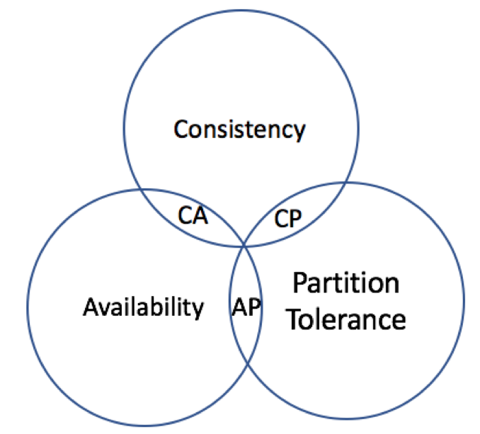
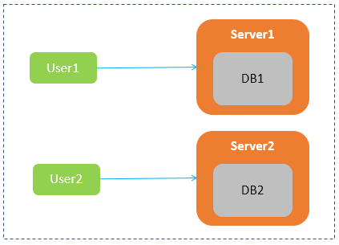
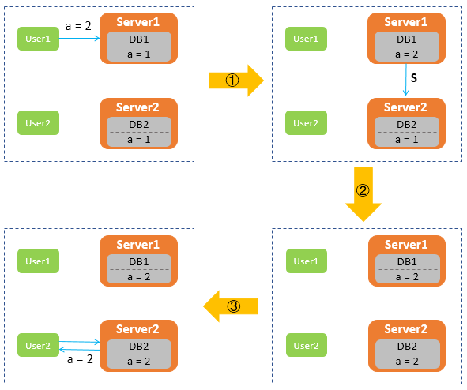
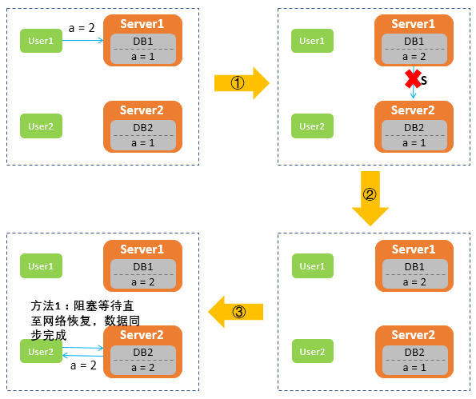
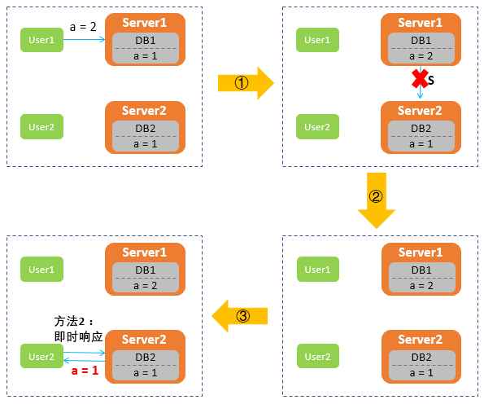
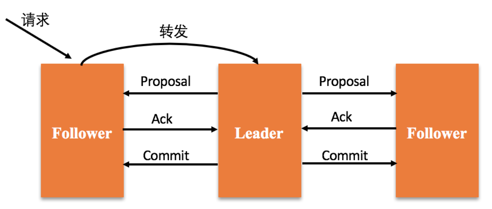
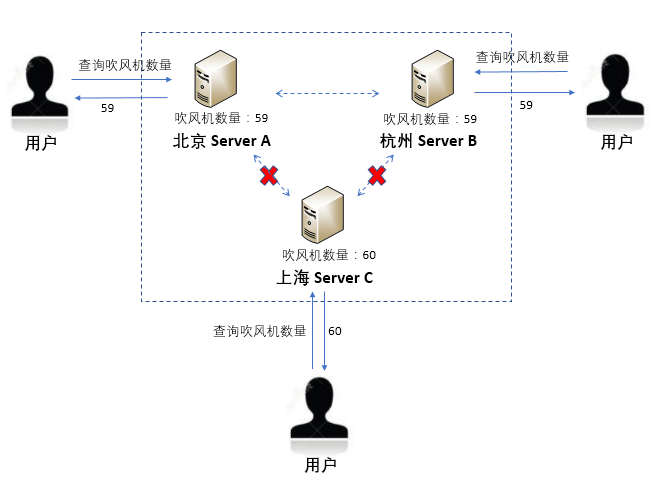
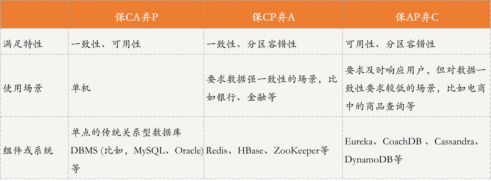
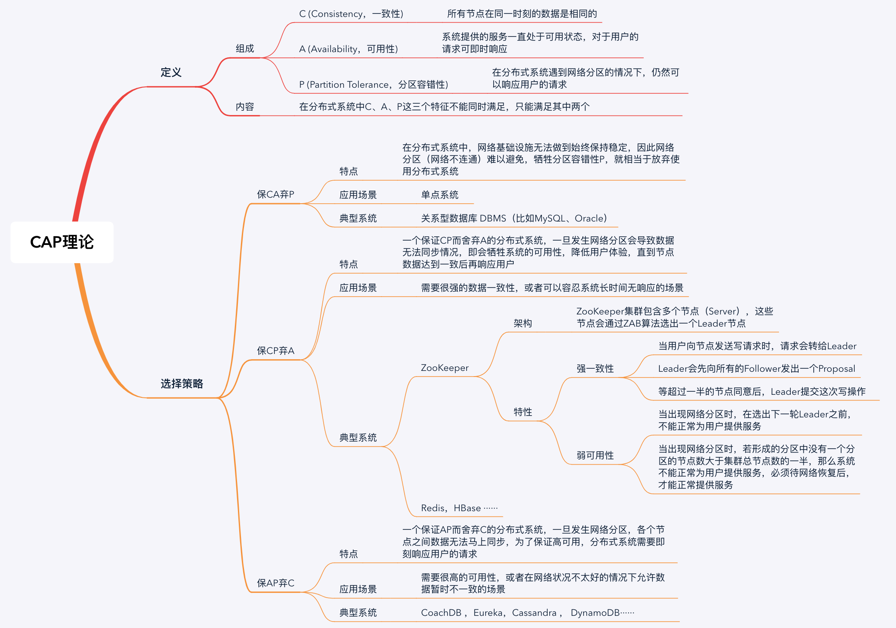

---
date: "2019-06-23"
---  
      
# 23 | CAP理论：这顶帽子我不想要
你好，我是聂鹏程。今天，我来继续带你打卡分布式核心技术。

在开篇词中，我将分布式计算划分为了四横四纵。而在前面的文章中，我们已经一起学习了四横中的分布式计算、分布式通信和分布式资源池化三横的相关知识。比如，在分布式计算中，我们学习了分布计算模式，包括MapReduce、Stream、Actor和流计算的原理和实际应用；在分布式通信中，我们学习了远程调用、订阅发布和消息队列模式的原理和应用；在分布式资源池化中，我们学习了分布式系统架构和分布式调度架构。

相信通过对这些内容的学习，你已经对分布式技术有比较深刻的了解了。分布式系统处理的关键对象是数据，前面这些文章也都是为数据处理服务的。那么，数据本身相关的分布式技术有哪些呢？这就是接下来的几讲，我要带你学习的四横中的最后一横“分布式数据存储与管理”的相关技术。

在正式介绍分布式数据存储技术之前，我需要先带你了解一个基本理论，也就是CAP理论。前面提到，分布式系统处理的关键对象是数据，而数据其实是与用户息息相关的。CAP理论指导分布式系统的设计，以保证系统的可用性、数据一致性等特征。比如电商系统中，保证用户可查询商品数据、保证不同地区访问不同服务器查询的数据是一致的等。

<!-- [[[read_end]]] -->

话不多说，接下来，我们就一起打卡CAP理论吧。

## 什么是CAP？

如果你之前没有听说过CAP理论的话，看到这三个字母第一反应或许是“帽子”吧。那么，在分布式领域中，CAP这顶“帽子”到底是什么呢？我们先来看看**这三个字母分别指的是什么**吧。

接下来，我结合电商的例子，带你理解CAP的含义。

假设某电商，在北京、杭州、上海三个城市建立了仓库，同时建立了对应的服务器\{A, B, C\}用于存储商品信息。比如，某电吹风在北京仓库有20个，在杭州仓库有10个，在上海仓库有30个。那么，CAP这三个字母在这个例子中分别代表什么呢？

首先，我们来看一下C。**C代表Consistency**，一致性，是指所有节点在同一时刻的数据是相同的，即更新操作执行结束并响应用户完成后，所有节点存储的数据会保持相同。

在电商系统中，A、B、C中存储的该电吹风的数量应该是20+10+30=60。假设，现在有一个北京用户买走一个电吹风，服务器A会更新数据为60-1=59，与此同时要求B和C也更新为59，以保证在同一时刻，无论访问A、B、C中的哪个服务器，得到的数据均是59。

然后，看一下A。**A代表Availability**，可用性，是指系统提供的服务一直处于可用状态，对于用户的请求可即时响应。

在电商系统中，用户在任一时刻向A、B、C中的任一服务器发出请求时，均可得到即时响应，比如查询商品信息等。

最后，我们看一下P。**P代表Partition Tolerance**，分区容错性，是指在分布式系统遇到网络分区的情况下，仍然可以响应用户的请求。网络分区是指因为网络故障导致网络不连通，不同节点分布在不同的子网络中，各个子网络内网络正常。

在电商系统中，假设C与A和B的网络都不通了，A和B是相通的。也就是说，形成了两个分区\{A, B\}和\{C\}，在这种情况下，系统仍能响应用户请求。

一致性、可用性和分区容错性，就是分布式系统的三个特征。那么，我们平时说的**CAP理论又是什么呢**？

**CAP理论**指的就是，在分布式系统中C、A、P这三个特征不能同时满足，只能满足其中两个，如下图所示。这，是不是有点像分布式系统在说，这顶“帽子”我不想要呢？

接下来，我就通过一个例子和你进一步解释下，**什么是CAP以及CAP为什么不能同时满足**吧。

如下图所示，网络中有两台服务器Server1和Server2，分别部署了数据库DB1和DB2，这两台机器组成一个服务集群，DB1和DB2两个数据库中的数据要保持一致，共同为用户提供服务。用户User1可以向Server1发起查询数据的请求，用户User2可以向服务器Server2发起查询数据的请求，它们共同组成了一个分布式系统。

对这个系统来说，分别满足C、A和P指的是：

* 在满足一致性C的情况下，Server1和Server2中的数据库始终保持一致，即DB1和DB2内容要始终保持相同；
* 在满足可用性A的情况下，用户无论访问Server1还是Server2，都会得到即时响应；
* 在满足分区容错性P的情况下，Server1和Server2之间即使出现网络故障也不会影响Server1和Server2分别处理用户的请求。

当用户发起请求时，收到请求的服务器会及时响应，并将用户更新的数据同步到另一台服务器，保证数据一致性。具体的工作流程，如下所示：

1.  用户User1向服务器Server1发起请求，将数据库DB1中的数据a由1改为2；
2.  系统会进行数据同步，即图中的S操作，将Server1中DB1的修改同步到服务器Server2中，使得DB2中的数据a也被修改为2；
3.  当User2向Server2发起读取数据a的请求时，会得到a最新的数据值2。

这其实是在网络环境稳定、系统无故障的情况下的工作流程。但在实际场景中，网络环境不可能百分之百不出故障，比如网络拥塞、网卡故障等，会导致网络故障或不通，从而导致节点之间无法通信，或者集群中节点被划分为多个分区，分区中的节点之间可通信，分区间不可通信。

这种由网络故障导致的集群分区情况，通常被称为“网络分区”。

在分布式系统中，网络分区不可避免，因此分区容错性P必须满足。接下来，我们就来讨论一下**在满足分区容错性P的情况下，一致性C和可用性A是否可以同时满足。**

假设，Server1和Server2之间网络出现故障，User1向Server1发送请求，将数据库DB1中的数据a由1修改为2，而Server2由于与Server1无法连接导致数据无法同步，所以DB2中a依旧是1。这时，**User2向Server2发送读取数据a的请求时，Server2无法给用户返回最新数据，那么该如何处理呢？**

我们能想到的处理方式有如下两种。

**第一种处理方式是，**保证一致性C，牺牲可用性A：Server2选择让User2的请求阻塞，一直等到网络恢复正常，Server1被修改的数据同步更新到Server2之后，即DB2中数据a修改成最新值2后，再给用户User2响应。

**第二种处理方式是，**保证可用性A，牺牲一致性C：Server2选择将旧的数据a=1返回给用户，等到网络恢复，再进行数据同步。

除了以上这两种方案，没有其他方案可以选择。可以看出：在满足分区容错性P的前提下，一致性C和可用性A只能选择一个，无法同时满足。

## CAP选择策略及应用

通过上面的分析，你已经知道了分布式系统无法同时满足CAP这三个特性，那该如何进行取舍呢？

其实，C、A和P，没有谁优谁劣，只是不同的分布式场景适合不同的策略。接下来，**我就以一些具体场景为例，分别与你介绍保CA弃P、保CP弃A、保AP弃C这三种策略，以帮助你面对不同的分布式场景时，知道如何权衡这三个特征。**

比如，对于涉及钱的交易时，数据的一致性至关重要，因此保CP弃A应该是最佳选择。2015年发生的支付宝光纤被挖断的事件，就导致支付宝就出现了不可用的情况。显然，支付宝当时的处理策略就是，保证了CP而牺牲了A。

而对于其他场景，大多数情况下的做法是选择AP而牺牲C，因为很多情况下不需要太强的一致性（数据始终保持一致），只要满足最终一致性即可。

最终一致性指的是，不要求集群中节点数据每时每刻保持一致，在可接受的时间内最终能达到一致就可以了。不知道你是否还记得，在[第6篇文章](https://time.geekbang.org/column/article/144970)分布式事务中介绍的基于分布式消息的最终一致性方案？没错，这个方案对事务的处理，就是选择AP而牺牲C的例子。

这个方案中，在应用节点之间引入了消息中间件，不同节点之间通过消息中间件进行交互，比如主应用节点要执行修改数据的事务，只需要将信息推送到消息中间件，即可执行本地的事务，而不需要备应用节点同意修改数据才能真正执行本地事务，备应用节点可以从消息中间件获取数据。

### 保CA弃P

首先，我们看一下保CA弃P的策略。

在分布式系统中，现在的网络基础设施无法做到始终保持稳定，网络分区（网络不连通）难以避免。牺牲分区容错性P，就相当于放弃使用分布式系统。因此，在分布式系统中，这种策略不需要过多讨论。

既然分布式系统不能采用这种策略，那单点系统毫无疑问就需要满足CA特性了。比如关系型数据库 DBMS（比如MySQL、Oracle）部署在单台机器上，因为不存在网络通信问题，所以保证CA就可以了。

### 保CP弃A

如果一个分布式场景需要很强的数据一致性，或者该场景可以容忍系统长时间无响应的情况下，保CP弃A这个策略就比较适合。

一个保证CP而舍弃A的分布式系统，一旦发生网络分区会导致数据无法同步情况，就要牺牲系统的可用性，降低用户体验，直到节点数据达到一致后再响应用户。

我刚刚也提到了，这种策略通常用在涉及金钱交易的分布式场景下，因为它任何时候都不允许出现数据不一致的情况，否则就会给用户造成损失。因此，这种场景下必须保证CP。

保证CP的系统有很多，典型的有Redis、HBase、ZooKeeper等。接下来，我就**以ZooKeeper为例，带你了解它是如何保证CP的。**

首先，我们看一下ZooKeeper架构图。

备注：此图引自[ZooKeeper官网](https://zookeeper.apache.org/doc/current/zookeeperOver.html)。

ZooKeeper集群包含多个节点（Server），这些节点会通过分布式选举算法选出一个Leader节点。在ZooKeeper中选举Leader节点采用的是ZAB算法，你可以再回顾下[第4篇文章](https://time.geekbang.org/column/article/143329)中的相关内容。

在ZooKeeper集群中，Leader节点之外的节点被称为Follower节点，**Leader节点会专门负责处理用户的写请求**：

* 当用户向节点发送写请求时，如果请求的节点刚好是Leader，那就直接处理该请求；
* 如果请求的是Follower节点，那该节点会将请求转给Leader，然后Leader会先向所有的Follower发出一个Proposal，等超过一半的节点同意后，Leader才会提交这次写操作，从而保证了数据的强一致性。

具体示意图如下所示：

当出现网络分区时，如果其中一个分区的节点数大于集群总节点数的一半，那么这个分区可以再选出一个Leader，仍然对用户提供服务，但在选出Leader之前，不能正常为用户提供服务；如果形成的分区中，没有一个分区的节点数大于集群总节点数的一半，那么系统不能正常为用户提供服务，必须待网络恢复后，才能正常提供服务。

这种设计方式保证了分区容错性，但牺牲了一定的系统可用性。

### 保AP弃C

如果一个分布式场景需要很高的可用性，或者说在网络状况不太好的情况下，该场景允许数据暂时不一致，那这种情况下就可以牺牲一定的一致性了。

网络分区出现后，各个节点之间数据无法马上同步，为了保证高可用，分布式系统需要即刻响应用户的请求。但，此时可能某些节点还没有拿到最新数据，只能将本地旧的数据返回给用户，从而导致数据不一致的情况。

**适合保证AP放弃C的场景有很多。**比如，很多查询网站、电商系统中的商品查询等，用户体验非常重要，所以大多会保证系统的可用性，而牺牲一定的数据一致性。

以电商购物系统为例，如下图所示，某电吹风在北京仓库有20个，在杭州仓库有10个，在上海仓库有30个。初始时，北京、杭州、上海分别建立的服务器\{A, B, C\}存储该电吹风的数量均为60个。

假如，上海的网络出现了问题，与北京和杭州网络均不通，此时北京的用户通过北京服务器A下单购买了一个电吹风，电吹风数量减少到59，并且同步给了杭州服务器B。也就是说，现在用户的查询请求如果是提交到服务器A和B，那么查询到的数量为59。但通过上海服务器C进行查询的结果，却是60。

当然，待网络恢复后，服务器A和B的数据会同步到C，C更新数据为59，最终三台服务器数据保持一致，用户刷新一下查询界面或重新提交一下查询，就可以得到最新的数据。而对用户来说，他们并不会感知到前后数据的差异，到底是因为其他用户购买导致的，还是因为网络故障导致数据不同步而产生的。

当然，你可能会说，为什么上海服务器不能等网络恢复后，再响应用户请求呢？可以想象一下，如果用户提交一个查询请求，需要等上几分钟、几小时才能得到反馈，那么用户早已离去了。

也就是说这种场景适合优先保证AP，因为如果等到数据一致之后再给用户返回的话，用户的响应太慢，可能会造成严重的用户流失。

目前，采用保AP弃C的系统也有很多，比如CoachDB、Eureka、Cassandra、DynamoDB等。

### 对比分析

保CA弃P、保CP弃A和保AP弃C这三种策略，以方便你记忆和理解。

## 知识扩展：CAP和ACID的“C”“A”是一样的吗？

首先，我们看一下CAP中的C和ACID中的C是否一致。

* CAP中的C强调的是数据的一致性，也就是集群中节点之间通过复制技术保证每个节点上的数据在同一时刻是相同的。
* ACID中的C强调的是事务执行前后，数据的完整性保持一致或满足完整性约束。也就是不管在什么时候，不管并发事务有多少，事务在分布式系统中的状态始终保持一致。具体原理可参考第6篇文章“[分布式事务：All or Nothing](https://time.geekbang.org/column/article/144970)”。

其次，我们看一下CAP中的A和ACID中的A。

* CAP中的A指的是可用性（Availability），也就是系统提供的服务一直处于可用状态，即对于用户的请求可即时响应。
* ACID中的A指的是原子性（Atomicity），强调的是事务要么执行成功，要么执行失败。

因此，CAP和ACID中的“C”和“A”是不一样的，不能混为一谈。

## 总结

今天，我主要与你分享的是CAP理论。

首先，我通过电商的例子带你了解了CAP这三个字母在分布式系统中的含义以及CAP理论，并与你证明了，C、A和P在分布式系统中最多只能满足两个。

然后，我为你介绍了分布式系统设计时如何选择CAP策略，包括保CA弃P、保CP弃A、保AP弃C，以及这三种策略适用的场景。

最后，我再通过一张思维导图来归纳一下今天的核心知识点吧。

相信通过今天的学习，你不仅对CAP理论有了更深刻的认识，并且可以针对不同场景采用哪种策略给出自己的建议。加油，行动起来，为你的业务场景选择一种合适的策略，来指导分布式系统的设计吧。相信你，一定可以的！

## 思考题

CAP理论和BASE理论的区别是什么？

我是聂鹏程，感谢你的收听，欢迎你在评论区给我留言分享你的观点，也欢迎你把这篇文章分享给更多的朋友一起阅读。我们下期再会！