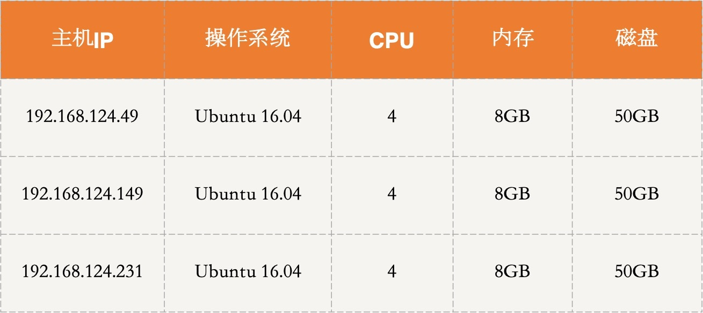

---
date: "2019-06-23"
---  
      
# 34 | 搭建一个分布式实验环境：纸上得来终觉浅，绝知此事要躬行
你好，我是聂鹏程。

上一讲，我以购买火车票为例，为你串讲了分布式技术的应用，帮助你理解所学分布式技术可以应用到哪些业务中。其实，到目前为止，我们主要是从理论上学习相关的分布式技术。但，“纸上得来终觉浅，绝知此事要躬行”。

今天，我就以Kubernetes为例，和你一起搭建一个分布式实验环境。我先简单和你说下这篇文章的内容分配：

* 不会特别详细地讲述搭建过程，而是着重说明搭建的主要步骤以及可能遇到的问题；
* 在讲述搭建过程时，串联一下其中涉及的分布式相关知识；
* 搭建完Kubernetes集群之后，我会以部署Nginx服务为例，帮助你更直观地体验分布式技术，以巩固、加深对分布式技术的理解。

话不多说，接下来，我们就一起搭建这个分布式实验环境吧。

## 搭建目标

Kubernetes是Google开源的容器集群管理系统，是Borg的开源版本。我在[第9篇文章](https://time.geekbang.org/column/article/148187)中讲解集中式架构时，和你分析过Kubernetes集群属于主从架构的分布式集群。

Kubernetes集群主要由Master节点和Worker节点组成。Master节点就是中心服务器，负责对集群进行调度管理；Worker节点是真正的工作节点，负责运行业务应用的容器。而容器是一种虚拟化技术，通过限制自身使用的资源来实现资源隔离，可以为应用提供一整套运行环境，从而实现了服务运行环境的隔离，进而实现了故障隔离。你可以回顾下[第30篇文章](https://time.geekbang.org/column/article/175213)中，资源隔离的相关内容。

<!-- [[[read_end]]] -->

接下来，我们明确下这次搭建分布式实验室环境的目标：

* 搭建一个Kubernetes集群，包括一个Master节点，两个Worker节点;
* 在Kubernetes集群上创建一个Nginx服务。

## 搭建前的准备

今天我们要搭建的Kubernetes集群，以3台服务器为例，一台作为Master节点，两台作为Worker节点。服务器应具备的条件如下：

* Ubuntu 16.04操作系统；
* 2GB或以上的内存；
* 2核CPU或以上；
* 服务器间网络连通；
* 每台服务器具有唯一的主机名、MAC地址和product\_uuid；
* 通过执行命令swapoff -a来关闭Swap；
* 30GB及以上的磁盘空间；
* 具备外网访问权限，以方便获取相关镜像。

在这次部署中，我采用的机器配置如下：



准备工作完成后，我们就开始搭建集群吧。

## Kubernetes集群搭建

搭建Kubernetes集群的步骤，主要包括安装Docker，安装部署kubeadm、kubelet、kubectl，部署Master节点，部署Worker节点，安装网络插件这几步。

其中，安装Docker、部署Master节点和Worker节点涉及分布式的，需要在多个节点上部署，比如Docker节点需要在每个Worker节点部署，Master节点若为集群模式，需要在多个节点上配置主备，Worker节点需要与Master节点建立连接等。

接下来， 我们具体看看如何一步一步搭建出Kubernetes集群吧。

### 1\. 安装Docker

Kubernetes是一个容器集群管理系统，因此每个Worker节点会运行容器，以实现业务运行环境隔离。我们在每台服务器上采用如下命令安装Docker：

```
    apt-get install -y docker.io
    

```

### 2\. 安装部署kubeadm、kubelet、kubectl

kubeadm是Kubernetes社区提供的一个部署工具，该工具将kubelet组件之外的其他组件均采用容器部署，实现了自动化， 避免了手动部署容器的麻烦，简化了部署操作。

其中，Master节点包括API Server、Scheduler、Cluster State Store\(默认etcd\)和Control Manager Srever核心组件；Worker节点包括kubelet和kube-proxy核心组件。具体的组件功能和原理，你可以再回顾下[第9篇文章](https://time.geekbang.org/column/article/148187)中的相关内容。

kubelet组件本身是一个管控容器的组件，需要执行配置容器网络等操作，这些操作需要在宿主机上执行，不采用容器部署。因此，kubelet组件需要单独部署，而不能用kubeadm进行部署。

除此之外，我们还需要安装一下kubectl组件。这个组件是Kubernetes的命令行工具，通过kubectl可以部署和管理应用，查看资源，创建、删除和更新组件。

那么，如何部署kubeadm、kubelet和kubectl这三个组件呢？

apt是Linux下常用的安装管理工具，这里我就采用apt来安装这三个组件。

首先，我们需要添加Kubernetes源。

 *    你可以通过执行以下语句获取Kubernetes源（需要外网权限）：

```
    sudo apt-get update && sudo apt-get install -y apt-transport-https curl
    curl -s https://packages.cloud.google.com/apt/doc/apt-key.gpg | sudo apt-key add -
    cat <<EOF | sudo tee /etc/apt/sources.list.d/kubernetes.list
    deb https://apt.kubernetes.io/ kubernetes-xenial main
    EOF
    

```

然后使用以下命令更新源：

```
    sudo apt-get update
    

```

 *    这时，我们就可以使用如下命令来安装kubelet、kubectl和kubeadm了：

```
    sudo apt-get install -y kubelet kubeadm kubectl
    

```

 *    如果没有外网访问权限，在添加kubernetes源的时候可以执行以下命令来添加阿里云的Kubernetes源：

```
    cat <<EOF | sudo tee /etc/apt/sources.list.d/kubernetes.list
    deb https://mirrors.aliyun.com/kubernetes/apt kubernetes-xenial main
    EOF
    

```

同样的，使用以下命令来更新源：

```
    apt-get update # 忽略gpg的报错信息
    

```

最后，使用如下命令安装kubelet、kubectl和kubeadm：

```
    apt-get install -y kubelet kubeadm kubectl --allow-unauthenticated
    

```

安装好这三个组件之后，我们就可以使用kubeadm来一键部署集群节点了。

首先，我们来部署Master节点。

### 3\. 部署Master节点

这一步其实就是容器化启动Master节点中的各个组件，直接使用kubeadm工具提供的一条命令kubeadm init即可自动安装。

kubeadm init这条命令底层其实就是将Master的各个组件，比如API Server、etcd等，以Pod形式（容器集合）运行起来。

当然了，你可以部署多个Master节点来实现集群的高可用，比如两个Master节点互为主备（你可以回顾下[第31篇文章](https://time.geekbang.org/column/article/175545)中介绍的主备机制）。具体的部署方法，你可以参考[这篇文章](https://kubernetes.io/docs/setup/production-environment/tools/kubeadm/high-availability/)。

除此之外，etcd组件也可以采用集群方式部署，从而保证了数据不会丢失。etcd采用的是Raft强一致性协议，相关技术你可以再回顾下[第4篇文章](https://time.geekbang.org/column/article/143329)中的相关问题。

**在本次部署中我以一个Master节点为例为你讲解集群的搭建**，关于Master为集群的方式，各节点上kubernetes配置类似，你可以参考Kubernetes官网。

在这里，我把192.168.124.49这台机器作为Master节点。在该机器上直接执行kubeadm init，即可完成部署：

```
    kubeadm init
    

```

如果有外网访问权限，基本就可以部署成功了。那么，我们可以根据如下信息判断自己是否部署成功：

```
    Your Kubernetes control-plane has initialized successfully!
    
    To start using your cluster, you need to run the following as a regular user:
    
      mkdir -p $HOME/.kube
      sudo cp -i /etc/kubernetes/admin.conf $HOME/.kube/config
      sudo chown $(id -u):$(id -g) $HOME/.kube/config
    
    You should now deploy a pod network to the cluster.
    Run "kubectl apply -f [podnetwork].yaml" with one of the options listed at:
      https://kubernetes.io/docs/concepts/cluster-administration/addons/
    
    Then you can join any number of worker nodes by running the following on each as root:
    
    kubeadm join 192.168.124.49:6443 --token uv17vd.q3ber8i5knxg4h0x \
        --discovery-token-ca-cert-hash sha256:c55bd70d346d809e1079565cc1fc1a05f001671cc9f2d02c55bbbc4a00bcc2a3
    

```

可以看到，想要使用集群，需要执行以下命令，执行结束后才可以使用kubectl。

```
    mkdir -p $HOME/.kube
    cp -i /etc/kubernetes/admin.conf $HOME/.kube/config
    chown $(id -u):$(id -g) $HOME/.kube/config
    

```

如果没有外网访问权限，会报pull image xxxxxx的错误。

此时不要慌，从报错信息中，我们可以看到哪些镜像拉取不成功。我们可以手动在Docker Hub上寻找相对应的组件及版本，进行拉取，然后再通过Docker打tag，修改为需要的镜像。

比如，以\[ERROR ImagePull\]: failed to pull image k8s.gcr.io/kube-apiserver:v1.16.3为例，可以通过以下代码进行拉取。

```
    # 可以拉取的相对应的组件和版本
    docker pull aiotceo/kube-apiserver:v1.16.3
    # 通过打tag的方式修改为所需要的镜像
    docker tag aiotceo/kube-apiserver:v1.16.3 k8s.gcr.io/kube-apiserver:v1.16.3
    

```

然后重新执行 kubeadm init即可。

从以上操作也可以看出，**kubeadm的底层其实就是将容器化组件的操作实现了自动化， 省去了手动部署的麻烦**。

部署完Master节点后，我们来继续部署Worker节点。

### 4\. 部署Worker节点

部署Worker节点与部署Master节点类似，都可以通过命令一键部署。这里，我们使用kubeadm提供的kubeadm join命令来进行自动化部署。

kubeadm join命令的底层与kubeadm init类似，会自动以Pod形式运行Worker节点中需要的组件。不同的是，命令执行后，底层还需要将Worker节点加入到Kubernetes集群中。

执行kubeadm join命令后（具体命令如下所示），就可以看到Kubernetes集群中的节点信息了。这条命令中需要配置Master节点的IP和Port信息，目的是Worker节点根据IP和Port信息建立连接，并在建立连接的基础上，建立心跳机制。

具体的心跳机制，你可以参考[第31篇文章](https://time.geekbang.org/column/article/175545)中关于故障恢复的内容。

到目前为止，Kubernetes的集群已经完成大半了，下面我们继续部署集群。

根据Master节点部署成功后输出结果的最后几行可以知道，想要加入集群，可以执行kubeadm join命令。我在另外2台机器上都执行了如下命令：

```
    kubeadm join 192.168.124.49:6443 --token uv17vd.q3ber8i5knxg4h0x \
        --discovery-token-ca-cert-hash sha256:c55bd70d346d809e1079565cc1fc1a05f001671cc9f2d02c55bbbc4a00bcc2a3
    

```

这条命令执行后，一个集中式架构的雏形就搭建完成了。接下来，我们需要安装相应的网络插件，以实现Kubernetes集群中Pod之间的通信。

### 5\. 安装网络插件

网络插件有很多，比如Canal、Flannel、Weave等。不同的插件命令不一致，具体命令可参考官网。

这里，我以安装Weave插件为例，通过执行以下命令完成安装：

```
    sysctl net.bridge.bridge-nf-call-iptables=1
    
    kubectl apply -f "https://cloud.weave.works/k8s/net?k8s-version=$(kubectl version | base64 | tr -d '\n')"
    

```

### 6\. 验证

到这里，集群就部署完成了，是不是很简单呢？接下来，我就通过获取节点和Pod信息来验证一下集群部署是否成功。

可以通过刚刚安装的kubectl组件提供的命令查看集群的相关信息。比如，查看节点的运行状态可以通过kubectl get nodes来获得，查看各个组件对应的Pod运行状态可以通过kubectl get pods来获得。命令执行结果，如下所示：

```
    kubectl get nodes
    
    # NAME           STATUS   ROLES    AGE   VERSION
    # vm1-pc   Ready    master   11h   v1.16.3
    # vm2-pc   Ready    <none>   11h   v1.16.3
    # vm3-pc   Ready    <none>   24m   v1.16.3
    
    kubectl get pods --all-namespaces
    
    # NAMESPACE     NAME                                   READY   STATUS    RESTARTS   AGE
    # kube-system   coredns-5644d7b6d9-9dprc               1/1     Running   0          11h
    # kube-system   coredns-5644d7b6d9-ljv5w               1/1     Running   0          11h
    # kube-system   etcd-vm1-pc                      1/1     Running   0          11h
    # kube-system   kube-apiserver-vm1-pc            1/1     Running   0          11h
    # kube-system   kube-controller-manager-vm1-pc   1/1     Running   0          11h
    # kube-system   kube-proxy-qpvtb                       1/1     Running   0          25m
    # kube-system   kube-proxy-v2xnb                       1/1     Running   0          11h
    # kube-system   kube-proxy-wkxzg                       1/1     Running   0          11h
    # kube-system   kube-scheduler-vm1-pc            1/1     Running   0          11h
    # kube-system   weave-net-6nj4c                        2/2     Running   0          25m
    # kube-system   weave-net-lm6dh                        2/2     Running   0          37m
    # kube-system   weave-net-vwnc2                        2/2     Running   0          37m
    

```

可以看到，节点全部是Ready状态，各个组件对应的Pod也处于Running状态，表明部署成功。

### 7\. 可能遇到的问题

如果整个安装失败的话，可以重置，重新安装，即重新kubeadm init

```
    kubeadm reset 
    

```

部署Worker节点时，pod部署不成功。原因可能是因为没有外网访问权限，镜像拉取不下来，可以通过以下命令查看pod的相关信息：

```
    # 检查所有pod是否正常
    kubectl get pod --all-namespaces -o wide
    #如果pod处于非running状态，则查看该pod：
    kubectl describe pod xxxxx -n kube-system 
    

```

从错误信息里可以查看到是哪个镜像拉取不下来，与部署Master节点时采用的方式一样，到Docker Hub上手动拉取镜像，并设置Tag即可。

至此，Kubernetes集群就配置成功了。

集群环境搭建后，如何验证集群是可用的呢？或者说，如何在集群上运行服务呢？接下来，我就以Nginx服务为例，带你了解如何在Kubernetes集群上进行服务部署。当然，你可以参考这个例子，在Kubernetes集群上部署其他服务。

## Nginx服务部署

Kubernetes推荐使用YAML配置文件的方式来创建服务，所以我接下来会使用这种方式部署完成Nginx服务的部署。

部署Nginx服务这个Demo时，我会创建两个Kubernetes对象（Kubernetes对象是Kubernetes系统中的持久实体，用于表示集群的状态），一个是Deployment，一个是Service：

* Deployment对象规定Pod创建的相关信息，比如期望创建几个Pod，每个Pod应该部署什么应用等。
* Service对象用来给用户访问提供接口。它可以通过Label Selector（标签选择器）来指定可以访问的Pod有哪些。关于Kubernetes对象的相关内容，你可以参考[这篇文章](http://docs.kubernetes.org.cn/232.html)。

因为Pod是Kubernetes中最小的工作单元，所以Nginx服务都部署在Pod中。下面，我就来创建一个Deployment对象来创建我们期望的Pod状态。

首先，创建一个YAML配置文件，我将其命名为nginx-deployment.yaml。为将用户请求负载均衡到不同的Pod，减轻单个Pod的访问压力，这里我会创建三个Pod共同运行Nginx服务。

文件内容如下：

```
    apiVersion: apps/v1
    kind: Deployment
    metadata:
      name: nginx-deployment
      labels:
        app: nginx
    spec:
      replicas: 3
      selector:
        matchLabels:
          app: nginx
      template:
        metadata:
          labels:
            app: nginx
        spec:
          containers:
          - name: nginx
            image: nginx:latest
            ports:
            - containerPort: 80
    

```

文件中，replicas字段就是副本数量，也就是Pod数量，设置为3，即创建三个Pod来运行Nginx服务；template字段规定了单个Pod中运行哪些容器，这里运行的是名称为nginx的容器。

 *    创建完配置文件后，通过以下命令就可以将Deployment对象创建成功。

```
    kubectl apply -f nginx-deployment.yaml
    

```

执行后，就等待对象的创建，可以通过以下命令来查看创建是否成功。

```
    kubectl get deployment
    

```

以下是我创建成功后的输出：

```
    NAME               READY   UP-TO-DATE   AVAILABLE   AGE
    nginx-deployment   3/3     3            3           3m17s
    

```

同时，你也可以通过以下命令来查看创建的Pod的信息：

```
    kubectl get pod
    

```

以下是我的输出结果：

```
    NAME                               READY   STATUS    RESTARTS   AGE
    nginx-deployment-59c9f8dff-dtg4w   1/1     Running   0          3m15s
    nginx-deployment-59c9f8dff-f2hmv   1/1     Running   0          3m15s
    nginx-deployment-59c9f8dff-lsvdh   1/1     Running   0          3m15s
    

```

创建完deployment之后，我们来创建Service服务。同样是通过配置文件来创建，文件名是nginx-service.yaml，内容如下：

```
    apiVersion: v1
    kind: Service
    metadata:
      name: nginx-service
      labels:
        app: nginx
    spec:
      ports:
      - port: 88
        targetPort: 80
      selector:
        app: nginx
      type: NodePort
    

```

文件中port属性就是service对外提供的端口。

同样的，采用kubectl apply命令创建Nginx服务：

```
    kubectl apply -f nginx-service.yaml
    

```

执行完成后，可以通过以下命令来查看创建是否成功：

```
    kubectl get service
    

```

以下是我的输出结果：

```
    NAME            TYPE        CLUSTER-IP       EXTERNAL-IP   PORT(S)          AGE
    kubernetes      ClusterIP   10.96.0.1        <none>        443/TCP          12h
    nginx-service   NodePort    10.101.29.9      <none>        88:30755/TCP     5m12s
    

```

现在我们就可以通过访问Nginx服务来查看它是否部署成功了。访问该服务可以通过以下命令：

```
    curl 10.101.29.9:88
    

```

结果如下，表明Nginx服务部署成功。

```
    <!DOCTYPE html>
    <html>
    <head>
    <title>Welcome to nginx!</title>
    <style>
        body {
            width: 35em;
            margin: 0 auto;
            font-family: Tahoma, Verdana, Arial, sans-serif;
        }
    </style>
    </head>
    <body>
    <h1>Welcome to nginx!</h1>
    <p>If you see this page, the nginx web server is successfully installed and
    working. Further configuration is required.</p>
    
    <p>For online documentation and support please refer to
    <a href="http://nginx.org/">nginx.org</a>.<br/>
    Commercial support is available at
    <a href="http://nginx.com/">nginx.com</a>.</p>
    
    <p><em>Thank you for using nginx.</em></p>
    </body>
    </html>
    

```

在这个过程中，有两个步骤涉及[负载均衡](https://time.geekbang.org/column/article/173398)的相关知识：

* 一个是创建Deployment时，该Deployment会创建三个Pod，而Pod需要部署到某个Worker节点中，因此会将Pod均衡部署到各个Worker节点中；
* 另一个是用户访问，Nginx服务后台三个运行的Pod都可以提供服务，用户访问到来时，可以均衡分布到各个Pod中进行处理。

到这里，我们搭建的目标就完成了，下面为你留几个实验题，你可以尝试去搭建一下或运行一下，以进一步加深对分布式技术的理解。

* 实验一：搭建高可用Kubernetes集群，也就是通过etcd实现Master节点以集群模式部署。具体搭建方法可参考<https://kubernetes.io/docs/setup/production-environment/tools/kubeadm/high-availability/>；
* 实验二：在Kubernetes上部署Cassandra，其中Cassandra作为服务部署到容器中，以学习Cassandra集群的节点发现、集群组件等原理，具体搭建方法可参考<https://kubernetes.io/docs/tutorials/stateful-application/cassandra/>；
* 实验三：在Kubernetes集群上通过部署一个MySQL服务，体验在Kubernetes集群上如何运行一个单实例有状态应用。具体搭建方法可参考<https://kubernetes.io/docs/tasks/run-application/run-single-instance-stateful-application/>。

好了，整个搭建环境，我就讲到这里。

其实，到这里，对分布式世界的探索可以说才刚开始，只有动手去实践，你学到的知识才能真正转化为你自己的。加油，赶紧行动起来吧。

## 总结

今天，我主要带你学习了搭建分布式实验环境。

首先，我以Kubernetes为例，介绍了如何搭建 Kubernetes集群环境，其中包括容器、Master节点、Worker节点等配置和安装。

然后，在搭建好的Kubernetes集群的基础上，我以Nginx服务为例，展示了如何在Kubernetes集群上部署服务。

其实，今天我演示的Demo只是冰山一角。在Kubernetes中，有很多非常实用的功能，比如Kubernetes可以让服务持续不断运行，当有Pod出现故障时，会自动重启另一个Pod来达到Deployment配置文件中规定的期望状态；还可以自动实现版本更迭等。

相信通过本讲的学习，你会对分布式技术有更进一步的认知。加油，赶紧行动起来，为你的服务搭建一个分布式实验环境吧。

我是聂鹏程，感谢你的收听，欢迎你在评论区给我留言分享你的观点，也欢迎你把这篇文章分享给更多的朋友一起阅读。我们下期再会！