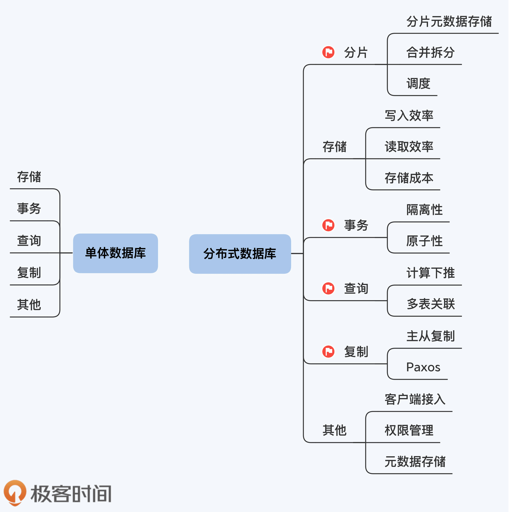

---
date: "2019-06-23"
---  
      
# 开篇词｜为什么要学习分布式数据库？
你好，我是王磊，你也可以叫我Ivan，现在是光大银行首席数据架构师。这门课，我想和你聊聊分布式数据库这个话题。

说起分布式数据库啊，很多人的第一反应是，这东西还很新吧？一般的公司是不是根本就用不上？我有必要学吗？

## 分布式数据库可以解决什么问题？

简单来说，分布式数据库就是用分布式架构实现的关系型数据库。注意，我们说的是关系型数据库，所以像MongoDB这样的NoSQL产品，不是我们这门课要讲的重点。

那为什么要用分布式架构呢？原因很简单，就是性能和可靠性。由于各种原因，IBM大型机这样的专用设备已经不再是多数企业的可选项，而采用x86架构的通用设备在单机性能和可靠性上都不能满足要求，因此分布式架构就成为了一个必然的选择。

你可能会问，哪来那么多高性能和高可靠性需求，有人用吗？别说，还真不少。近几年，阿里巴巴、腾讯、百度、字节跳动、美团、滴滴、快手、知乎、58等互联网公司，都已经开始使用分布式数据库；而传统的金融、电信行业，也在快速跟进，据我所知，像交通银行、中信银行、光大银行、北京银行和一些城市商业银行，也都已经上线了分布式数据库。可以说，**在各种因素的推动下，分布式数据库已经成为一种技术潮流，甚至是新基建的一部分。**

<!-- [[[read_end]]] -->

分布式数据库能得到广泛使用，其中很重要的因素就是供应商不再是Oracle这样的国外商业巨头，越来越多的国内公司和开源软件杀入这个领域。

比如，阿里巴巴的OceanBase是高举高打的方式，每年双十一大促都要秀一下性能，虽然这个性能统计方法有待商榷，但毕竟已经应用在关键业务上了。TiDB也在努力培育市场，技术社区做得有声有色，在互联网领域有了大量实施案例。GoldenDB已经随着中信银行的新一代核心业务系统上线投产，截至目前平稳运行了三个月左右。其他分布式数据库包括CockroachDB、YugabyteDB、TBase、TDSQL、巨杉、VoltDB、GaussDB 300等等，还有很多产品正在赶来的路上。

你看，分布式数据库是名副其实的“供需两旺”。

我们要学分布式数据库的另一个原因在于，你可以通过学习它的设计思想，提高自己的架构设计水平和代码能力。分布式数据库是学术研究与工业实践的完美结合，深入其中你会看到很多极致的设计方法。通过学习分布式数据库的架构设计，形成内化的设计能力，一定是架构师的要诀之一。

比如，我就受益于分布式数据库的设计思想，带领团队一起开发了一款叫作Pharos的软件，实现了百亿海量数据下的复杂查询。

## 抓住主线，高效学习分布式数据库

我猜你可能会觉得分布式数据库很复杂，学起来太难。其实完全不用担心，我们这门课的使命就是要破除神秘感，**找出分布式数据库的学习路径，帮你抓住它的核心内容。**

那怎么找到这条学习路径呢，这就得从数据库说起了。数据库其实就做了两个操作，读和写。但就这两件事，有时也会冲突，写入快、读取可能就会慢，另外还得考虑存储空间的成本。有个RUM猜想就是说这个事情，读放大、写放大、存储空间放大，最多只能避免两个，三选二。这是第一个部分，存储的设计。

系统总是要多人使用吧，这就带来并发的问题，出现写写冲突和读写冲突时采用什么策略，这是第二部分事务模型。

数据库的操作接口是SQL，基于关系模型来定义数据结构和操作原语，而且还有各种索引、优化措施，让SQL执行得更快，这是第三个部分查询引擎。

任何架构都要避免单点故障，所以数据库会有一个复制机制，多个节点形成主备关系，主备之间同步数据，这样可靠性就有了保障，这是第四部分复制。

最后，还有一些必备的辅助工作，客户端接入、权限控制、元数据存储。这样一个基本的数据库就可以运行了。

归纳一下，数据库就是要做好五件事，存储、事务、查询、复制和其他。对分布式数据库来说，不仅要继续做这五件事，还要多出一件事，分片。在这六件事中，存储和其他这两件事与单体数据库差不多，难点就在事务、查询、复制和分片这四件。

我们来具体说说这四件事。

第一件，也就是多出的那一件事，叫分片元数据存储和分片调度。

既然已经是多个节点，那一张表的数据还放在一个节点上吗，是不是该分散一下提高性能\?这样，表就不再是数据的最小存储单元了，换成了分片，也就是表的水平切分下来的一部分，这和分区的概念很像。但是，这一分散，使用数据时总得知道去哪找吧\?这就是分片元数据。另外，这分片也不是静止的，有很多因素会导致分片在节点间移动，比如分片存储的数据太多或者访问压力太大，这就需要对分片进行拆分、合并以及调度。

第二件是事务，准确地说是分布式事务。它和单机事务完全不一样，虽然数据库早就有了XA协议作为标准，理论上支持跨库事务，可是那性能实在太差啊。使用XA协议的MySQL集群，操作延时是单机的10倍。这是什么概念？根本没法在生产环境用。所以，还得研究更加高效的分布式事务模型。

第三件是查询，查到数据很容易，难的还是高性能。而且数据都分片了，一个查询任务如何分配，是在某个节点上集中数据还是把逻辑推给各个节点，这都是要设计权衡的。

第四件是复制，也就是高可靠设计，原来的单机复制机制也可以延用，但是在这种复制机制下，只有主节点工作，备节点闲着。现在，新的设计是在分片基础上用Paxos协议建立复制组，这样就有了更小的高可靠单元，让每个复制组的主副本交叉部署在多个节点上，就可以充分利用机器资源。

你看，只要抓住了这四件事，是不是就掌握了分布式数据库的学习要点。

采用这种抓主线的学习方式，还能让你避免一下子就陷入安装部署、操作指令等细节中，摆脱学完以后还是不知道产品原理、碰到没见过的问题依然是束手无策的窘境。所以在这门课里，我会带你**摆脱这些细节，从原理层面深入分析。**具体来说，**我会以一个中立的视角去给你剖析主流产品的运行机制和理论依据，横向比较它们的差异，分析这些技术决策背后的动机，帮助你快速建立起对分布式数据库全面的认知体系。**

## 我是怎么设计这门课的？

接下来，我要和你说说整个课程的设计。

我会在**基础篇**为你讲解分布式数据库的基本概念、主流产品的架构风格、一些基本功能，以及分布式数据库设计的难点，帮助你建立对分布式数据库的整体认知。

在**开发篇**，我会带你深入到一个个关键功能的设计中，挖掘其背后可选择的理论设计方案，分析方案之间的差异，以及工业界产品在落地实现时的改进。也就是说，开发篇的设计思路是从问题到解决方案，再到产品实现。

这样一来，你不仅能在纵向上搭建一个分布式数据库的多层知识目录，还能从横向上针对每一个关键功能对比各种主流产品的设计选择，最终形成一个网络化的体系。

在**实践篇**我会聚焦于架构选型，告诉你在企业中引入分布式数据库需要关注哪些事情、做些什么准备，比如会给运维带来哪些冲击、怎么去做测试，其他企业是基于什么原因选择分布式数据库的。同时，我还会为你梳理一份分布式数据库的产品图鉴，带你一起检阅这个时代最酷的基础软件。你也可以将它当成产品维度的课程索引，反向检索产品的设计。

还有，我必须再次声明一下：各种分布式数据库产品的安装部署、操作指令、性能调优等都不在这次课程的范畴内。一方面，这确实超出了我的个人能力，毕竟要面对如此多的产品；另一方面，只要你选择了正确的方向，就很容易从其他渠道获得详实的资料和具体的指导。

另外，关于必备基础我也要提一下，想要学习这门课，是不是得对数据库的内部运行机制或者分布式技术有深刻的认识呀？你放心，不需要这么多基础。我上面介绍的课程设计思路，其实就是为了帮你可以低门槛地学习，只要你具备一定的编程基础，有一些数据库的使用经验，以及对SQL运行优化有直观的感受，就能够从课程里汲取前人的智慧、提升自己的技术竞争力。

## 关于我

说了这么多，还没有和你介绍下我自己。我在数据领域有超过15年的工作经验了，一直在关注企业数据架构、大数据生态体系以及分布式架构，服务过多家大型金融机构。

从2013年开始，作为数据领域的主要设计者，我推动了光大银行从传统数据仓库向大数据生态的转型，主导了大数据开发平台、数据中台等多个重要系统的架构设计工作，获得了银行业的多个技术奖项，是大数据技术在金融行业的第一批践行者。

2018年，光大银行启动了分布式数据库选型工作，我作为技术专家深度参与了这项工作。在调研过程中，我有幸与很多产品专家进行了深入的讨论，甚至是争论。这个过程，让我有机会了解各种产品在设计背后的考虑和权衡，也拓展了对当前工业界工艺水准的整体认识。

最后我想说的是，分布式数据库凝聚了无数学者与工程师的智慧，灿若星辰。希望这个课程能带你穿越时空，开启一场与大师的对话之旅。

如果你身边也有些想要或者必须要学习分布式数据库的朋友，我希望你把这个课程分享给他 / 她，你们可以一起学习，互相鼓励。

欢迎你多多给我留言，与分布式数据库相不相关都可以，只要是我熟悉的领域就一定会认真给你答复。今天是开篇词，也希望你留言说说自己对这门课的期待，或者自己目前遇到的问题，我们下一讲见！