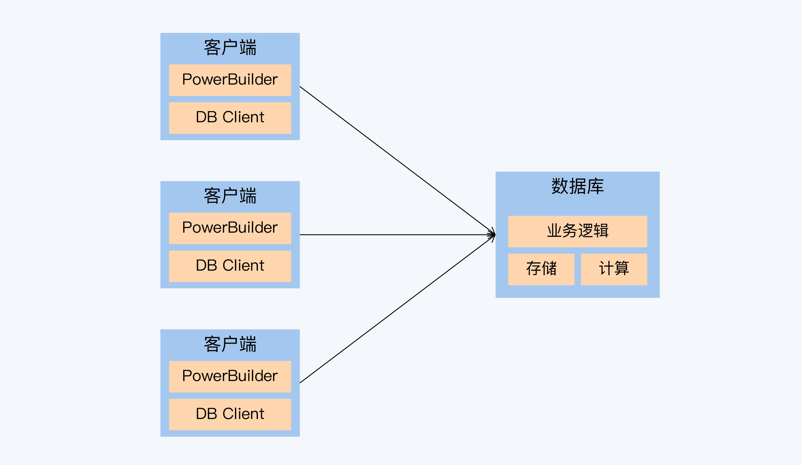
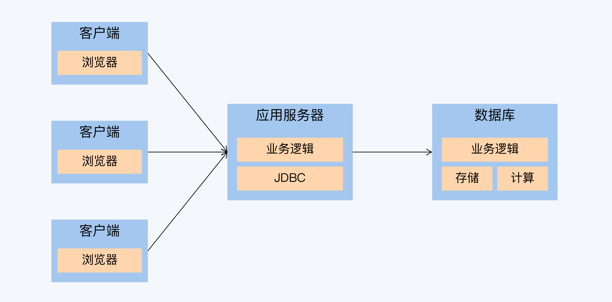
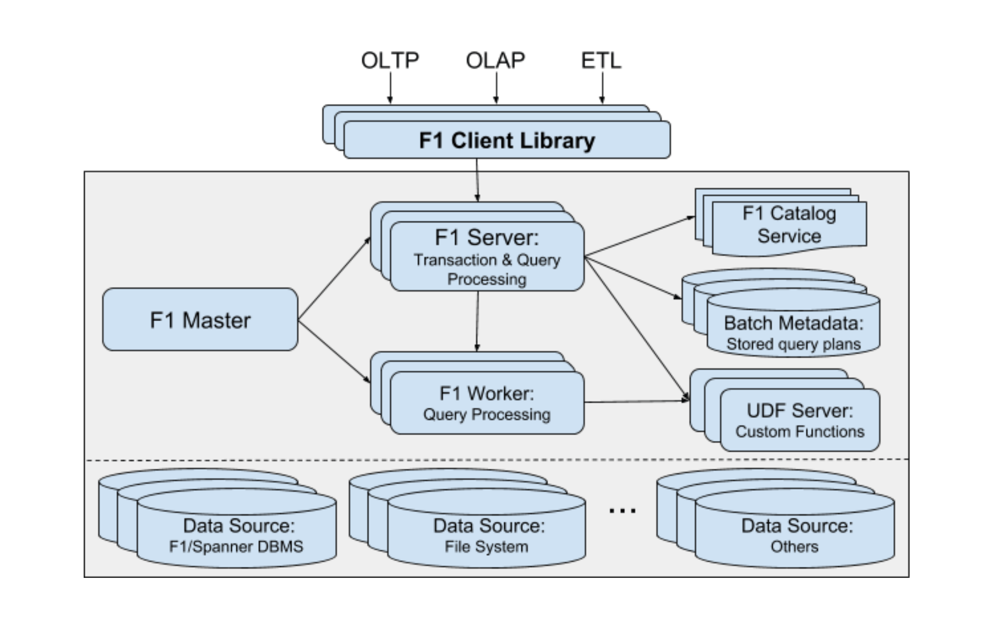
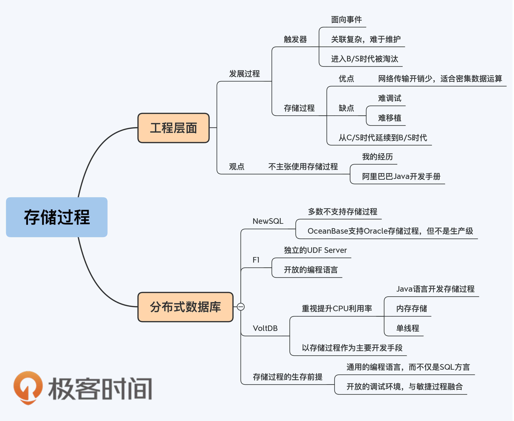

---
date: "2019-06-23"
---  
      
# 16 | 为什么不建议你使用存储过程？
你好，我是王磊，你也可以叫我Ivan。

今天，我们一起来到了这门课的第16讲。如果你学习并理解了前面的所有课程，那么我要恭喜你，这不仅是因为你学完了一半的课程，还意味着你已经征服了“数据库事务”这座高峰。当然，如果你有困惑的地方，也不必沮丧，因为接下来会是一小段平缓地带，我们会探讨一些相对独立的问题。比如我们今天的话题，为什么不建议你使用存储过程？

有些资深的数据库开发同学可能不同意这个观点，我猜他们大概会说：“存储过程很好呀，那些用不好的人就是自己水平烂，不接受反驳！”其实，我就有过这样的念头，但是现在的我面对分布式数据库，会更倾向于少用或者不用存储过程。下面，我就来和你分享下这个心路历程吧。

## 我从C/S时代走来

当我刚成为一个名程序员时，正好是C/S架构时代的末期。那时最流行的开发套件是PowerBuilder和Sybase数据库。PowerBuilder是一款可视化开发工具，有点像VB，开发好的程序运行在用户的PC终端上，通过驱动程序连接远端的数据库。而Sybase当时正与Oracle争夺数据库的头把交椅，它和SQL Server有很深的渊源，两者在架构和语言上都很像。



在这个C/S架构中，数据库不仅承担了数据存储、计算功能，还要运行很重的业务逻辑，相当于数据库同时承担了应用服务器（Application Server）的大多数功能。而这些业务逻辑的技术载体就是存储过程。所以，不管是Sybase还是Oracle，它们存储过程的功能都非常强大。

<!-- [[[read_end]]] -->

## 触发器被抛弃

进入B/S时代，大家对数据库的理解发生了变化，应用服务器承载了服务器端的主要业务逻辑，那还要不要使用存储过程呢？你看，这和我们今天的问题是一样的。当时的主流观点认为存储过程还有存在价值的，但是它的同胞兄弟触发器则被彻底抛弃了。



为什么呢？其实，触发器和存储过程一样也是一种自定义函数。但它并不是显式调用，而是在操作数据表的时候被动触发，也就是执行insert、update和delete时；而且你还可以选择触发时机是在操作前还是操作后，也就before和after的语义。

听上去这个功能很强大吧，有点面向事件编程的意思。但是，如果你维护过触发器的逻辑就会发现，这是一个大坑。随着业务的发展和变更，触发器的逻辑会越来越复杂，就有人会在触发器的逻辑里操纵另一张表，而那张表上又有其他触发器牵连到其他表，这样慢慢就变成一个交错网络。

这简直就是一个地雷阵，你只要踏错一小步，经过一串连锁反应就会演变成一场大灾难。所以，触发器毫无悬念地退出了历史舞台。

## 存储过程的优点

存储过程的调用清晰，不存在触发器的问题。它的优点很明显，逻辑运行在数据库，没有网络传输数据的开销，所以在进行数据密集型操作时，性能优势很突出。

关于存储过程的使用，我有一段亲身经历，虽然过去了很多年但依然记忆深刻。当时要开发一个功能，追溯业务实体间的影响关系，比如A影响B，B又影响到C。这个功能就是要以A为输入，把B和C都找出来，当然这个影响关系不只是三层了，一直要追溯到所有被影响的实体。

今天，我们都知道这是一个典型的关联关系查询，适合用图数据库来处理。但那个时候还没有可用的图数据库，我们需要在Oracle上解决这个问题。有一个比我更年轻的同事写了一段Java代码来实现这个功能，我猜他没有经历过C/S时代。程序运行起来，应用服务器不断地访问这张表，处理每一条记录的关联关系。性能可想而知，在一个数据量较少的测试环境上，程序足足跑了三十分钟。这大大超出了用户的容忍范围，必须要优化。

关于解决方案，我想你也猜到了，我换成了存储过程来实现同样的逻辑，因为不需要网络传输，性能大幅度提升。最后，存储过程花了大概二十几秒就得到了同样的结果。“干得漂亮！“我当时这么告诉自己。

## 存储过程的问题

但是后来，我发现了这个方案的问题，那就是移植性差。我们开发的产品要部署到客户环境里，会受到相关基础软件的制约。

有一次，刚好碰到这个客户没有使用Oracle，所以其他同事将我写的逻辑翻写到了客户使用的数据库上。我们给这个数据库取个化名，就叫它TDB吧。可是，移植到TDB之后的存储过程并没有跑出结果，直接失败退出。我觉得很奇怪，就跟踪了这段代码，最后发现问题不在逻辑本身，而在数据库上。答案是这样的，这段逻辑中我使用了递归算法，因为Oracle支持很深的递归层次，所以运行完全没有问题；而TDB只支持非常有限的递归层次，而当时数据关联关系又比较多，所以程序没跑多久，就报错退出了。

这段经历让我对存储过程的信心有一点动摇。存储过程对于环境有很重的依赖，而这个环境并不是操作系统和Java虚拟机这样遵循统一标准、有大量技术资料的开放环境，而是数据库这个不那么标准的黑盒子。

然而，存储过程的问题还不止于此。当我在C/S架构下开发时，就遇到了存储过程难以调试的问题，只不过当时大家都认为这是必须付出的代价。但是随着B/S架构的到来，Java代码的开发测试技术不断发展，相比之下存储过程难调试的问题就显得更突出了。而到了今天，敏捷开发日渐普及，DevOps工具链迅速发展，而存储过程呢，还是“遗世独立”的样子。

说了这么多，我希望你明白的是，今天的存储过程和当年的触发器，本质上面临的是同样的问题：**一种技术必须要匹配同时代的工程化水平，与整个技术生态相融合，否则它就要退出绝大多数应用场景**。

你看，《阿里巴巴Java开发手册》中也赫然写着“禁止使用存储过程，存储过程难以调试和扩展，更没有移植性。”我想，他们大概是有和我类似的心路历程吧。

## 分布式数据库的支持情况

刚才说的都是我从工程化角度发表的一些观点，现在让我们回到分布式数据库，再来看看这个新技术对存储过程的支持情况是怎样的。

目前，多数NewSQL分布式数据库仍然是不支持存储过程的。OceanBase是一个例外，它在2.2版本中增加了对Oracle存储过程的支持。我认为这是它全面兼容Oracle策略的产物。但是，OceanBase的官方说明也说得很清楚，目前存储过程的功能还不能满足生产级的要求。

其实，对遗留系统的兼容，可能就是今天存储过程最大的意义。而对于那些从MySQL向分布式数据库迁移的系统，这个诉求可能就没那么强烈，因为这些系统没有那么倚重存储过程。其中的原因就是，MySQL在较晚的版本才提供存储过程，而且功能上也没有Oracle那么强大，用户对它的依赖自然也就小了。

当然，存储过程没有得到NewSQL的广泛支持，还因为架构上存在的难题。我们不妨看看业界的一些尝试。

Google在2018年VLDB上发布了F1的新论文” [F1 Query: Declarative Querying at Scale](http://vldb.org/pvldb/vol11/p1835-samwel.pdf)”。论文中提出，通过独立的UDF Server支持自定义函数，也就是存储过程。这个架构中，因为F1是完全独立于数据存储的，所以UDF Server自然也就被抽了出来。从论文提供的测试数据看，这个设计保持了比较高的性能，但我觉得这和Google强大的网络设施有很大关系，在普通企业网络条件下能否适用，这还很难说。



关于UDF Server的设计，还有两点也是非常重要的。

* 首先，UDF实现了对通用语言的支持，除了SQL，还支持C加加、Java、Go等多种语言实现方式。这样不依赖于数据库的SQL方言，逻辑表述的通用性更好。
* 其次，UDF并没有耦合在存储层。这意味着它的上下文环境可以更加开放。

这两点变化意味着存储过程的调试问题可能会得到明显的改善，使其与DevOps体系的对接成为可能。

不仅是F1，其实更早的VoltDB也已经对存储过程进行了改革。VoltDB是一款基于内存的分布式数据库，由数据库领域的传奇人物，迈克尔 · 斯通布雷克（Micheal Stonebraker）主导开发。VoltDB将存储过程作为主要操作方式，并支持使用Java语言编写。开发者可以继承系统提供的父类（VoltProcedure）来开发自己的存储过程。下面是一个简单的示例。

```
    import org.voltdb.*;
    public class LeastPopulated extends VoltProcedure {
      //待执行的SQL语句
      public final SQLStmt getLeast = new SQLStmt(
          " SELECT TOP 1 county, abbreviation, population "
        + " FROM people, states WHERE people.state_num=?" 
        + " AND people.state_num=states.state_num" 
        + " ORDER BY population ASC;" );
      
      //执行入口
      public VoltTable[] run(int state_num) 
          throws VoltAbortException {
             //赋输入参数
             voltQueueSQL( getLeast, state_num ); 
             //SQL执行函数
             return voltExecuteSQL();
          }
    }
    

```

这段代码的逻辑非常简单，首先定义SQL，其中“state\_num=？”是预留参数位置，而后在入口函数run\(\)中赋参并执行。

VoltDB在设计理念上非常与众不同，很重视CPU的使用效率。他们对传统数据库进行了分析，认为普通数据库只有12\%的CPU时间在做真正有意义的数据操作，所以它的很多设计都是围绕着充分利用CPU资源这个理念展开的。

具体来说，存储过程实质上是预定义的事务，没有人工交互过程，也就避免了相应的CPU等待。同时，因为存储过程的内容是预先可知的，所以能够尽早的将数据加载到内存中，这又进一步减少了网络和磁盘I/O带来的CPU等待。

正是由于存储过程和内存的使用，VoltDB即使在单线程模型下也获得了很好的性能。反过来，单线程本身也让事务控制更加简单，避免了传统的锁管理的开销和CPU等待，提升了VoltDB的性能。

可以说，与其他数据库相比，存储过程对于VoltDB意义已经是截然不同了。

## 小结

好了，有关存储过程的话题就到这里了，让我们一起梳理下今天的重点内容。

1.  我用自己的一段亲身经历，说明了存储过程的移植差。究其原因，在于存储过程高度依赖于数据库环境，而数据库环境不像操作系统或虚拟机那样遵循统一的标准。因为同样的原因，存储过程调试也很复杂，也没有跟上敏捷开发的步伐，与今天工程化的要求不匹配。正是因为这两个工程化方面的原因，我建议你不用或者少用存储过程。
2.  从分布式数据库看，多数NewSQL还不支持存储过程，OceanBase作为唯一的例外，已经支持Oracle存储过程，但仍然没有达到生产级。
3.  F1的论文提出了独立UDF Server的思路，是分布式架构下存储过程的一种实现方案，但能不能适合普通的企业网络环境，尚待观察。但这个方案中，存储过程的实现语言不局限于SQL方言，而是放宽到多种主流语言，向标准兼容，具备更好的开放性。这提升了存储过程技术与DevOps融合的可能性。
4.  VoltDB作为一款内存型分布式数据库，以存储过程作为主要的操作定义方式，支持使用Java语言开发。甚至可以说，VoltDB的基础就是存储过程这种预定义事务方式。存储过程、内存存储、单线程三者互相影响，使得VoltDB具备出色的性能表现。

对于任何一个程序员来说，放弃一种已经熟练掌握而且执行高效的技术，必然是一个艰难的决定。但是今天，对于大型软件系统而言，工程化要求远比某项技术本身更加重要。不能与整个技术生态协作的技术，最终将无法避免被边缘化的命运。当你学习一门新技术前，无论是分布式数据库还是微服务，我都建议你要关注它与周边生态是否能够适配，因为符合潮流的技术有机会变得更好，而太过小众的技术则蕴藏了更大的不确定性。



## 思考题

课程的最后，我们来看看今天的思考题。我们说VoltDB的设计思路很特别，除了单线程、大量使用内存、存储过程支持Java语言外，它在数据的复制上的设计也是别出心裁，既不是NewSQL的Paxos协议也不是PGXC的主从复制，你能想到是如何设计的吗？提示一下，复制机制和存储过程是有一定关系的。

欢迎你在评论区留言和我一起讨论，我会在答疑篇和你继续讨论这个问题。如果你身边的朋友也对存储过程这个话题感兴趣，你也可以把今天这一讲分享给他，我们一起讨论。

## 学习资料

Bart Samwel: [_F1 Query: Declarative Querying at Scale_](http://vldb.org/pvldb/vol11/p1835-samwel.pdf)