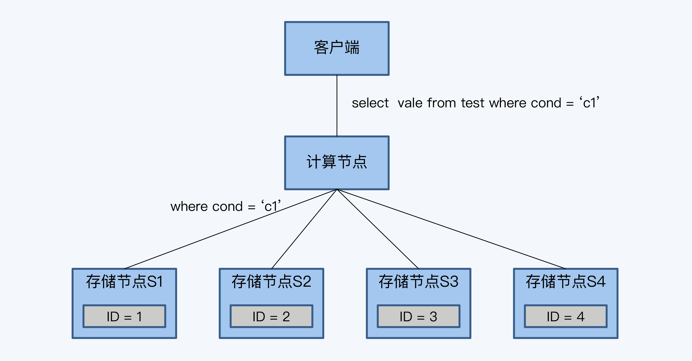
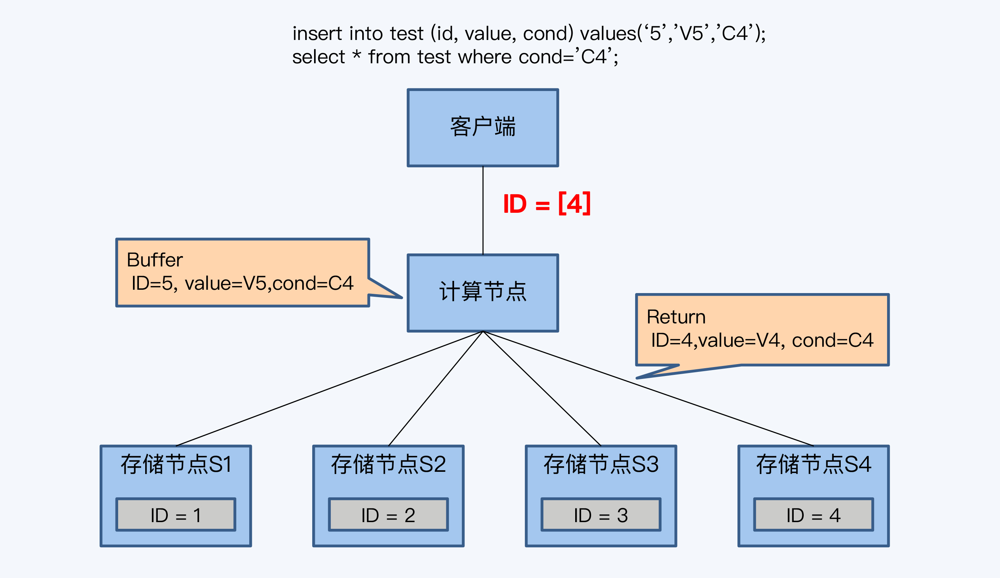
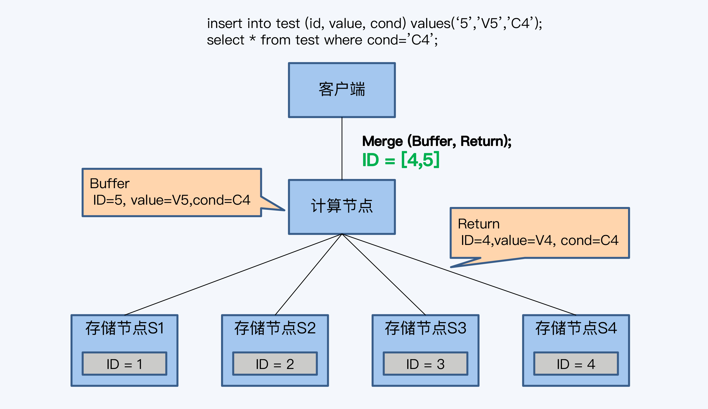
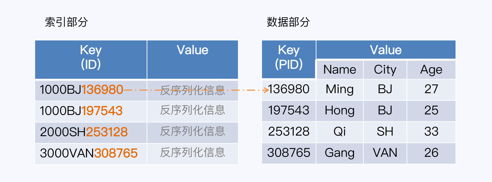
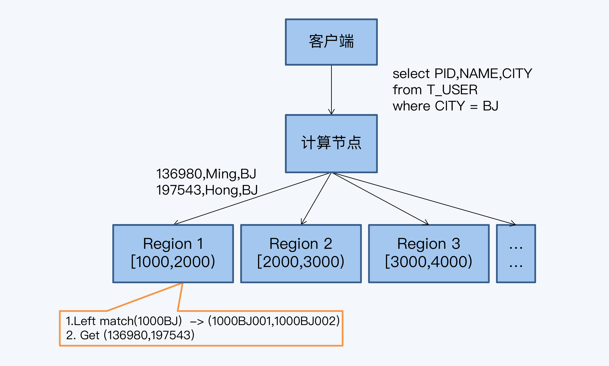
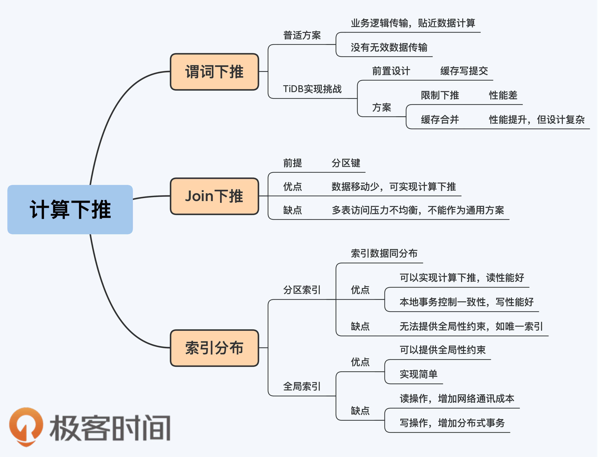

---
date: "2019-06-23"
---  
      
# 19 | 查询性能优化：计算与存储分离架构下有哪些优化思路？
你好，我是王磊，你也可以叫我Ivan。

我在[第4讲](https://time.geekbang.org/column/article/274200)介绍架构风格时曾经提到过，分布式数据库的主体架构是朝着计算和存储分离的方向发展的，这一点在NewSQL架构中体现得尤其明显。但是计算和存储是一个完整的过程，架构上的分离会带来一个问题：是应该将数据传输到计算节点\(Data Shipping\)，还是应该将计算逻辑传输到数据节点\(Code Shipping\)？

从直觉上说，肯定要选择Code Shipping，因为Code的体量远小于Data，因此它能传输得更快，让系统的整体性能表现更好。

这个将code推送到存储节点的策略被称为“计算下推”，是计算存储分离架构下普遍采用的优化方案。

## 计算下推

将计算节点的逻辑推送到存储节点执行，避免了大量的数据传输，也达到了计算并行执行的效果。这个思路还是很好理解的，我们用一个例子来具体说明下。

假如有一张数据库表test，目前有四条记录。


我们在客户端执行下面这条查询SQL。

```
    select value from test where cond=’C1’；
    

```

计算节点接到这条SQL后，会将过滤条件“cond=‘C1’“下推给所有存储节点。



存储节点S1有符合条件的记录，则返回计算节点，其他存储节点没有符合的记录，返回空。计算节点直接将S1的结果集返回给客户端。

<!-- [[[read_end]]] -->

这个过程因为采用了下推方式，网络上没有无效的数据传输，否则，就要把四个存储节点的数据都送到计算节点来过滤。

这个例子是计算下推中比较典型的“谓词下推”\(Predicate Pushdown\)，很直观地说明了下推的作用。这里的谓词下推，就是把查询相关的条件下推到数据源进行提前的过滤操作，表现形式主要是Where子句。但场景更复杂时，比如事务包含了写入操作时，对于某些分布式数据库来说，就没这么简单了。

### TiDB的挑战

下面的例子就是关于TiDB如何处理下推的，我们首先来看这组SQL。

```
    begin;
    insert into test (id, value, cond) values(‘5’,’V5’,’C4’);
    select * from test where cond=’C4’;
    

```

SQL的逻辑很简单，先插入一条记录后，再查询符合条件的所有记录。结合上一个例子中test表的数据存储情况，得到的查询结果应该是两条记录，一条是原有ID等于4的记录，另一条是刚插入的ID等于5的记录。这对单体数据库来说，是很平常的操作，但是对于TiDB来说，就是一个有挑战的事情了。

我在[第10讲](https://time.geekbang.org/column/article/279660)曾经介绍过TiDB采用了“缓存写提交”技术，就是将所有的写SQL缓存起来，直到事务commit时，再一起发送给存储节点。这意味着执行事务中的select语句时，insert的数据还没有写入存储节点，而是缓存在计算节点上的，那么select语句下推后，查询结果将只有ID为4的记录，没有ID等于5的记录。



这个结果显然是错误的。为了解决这个问题，TiDB开始的设计策略是，当计算节点没有缓存数据时，就执行下推，否则就不执行下推。

这种策略限制了下推的使用，对性能的影响很大。所以，之后TiDB又做了改进，将缓存数据也按照存储节点的方式组织成Row格式，再将缓存和存储节点返回结果进行Merge，就得到了最后的结果。这样，缓存数据就不会阻碍读请求的下推了。



### 分区键与Join下推

除了谓词下推，还有一个对下推来讲很重要的关联设计，那就是分区键。分区键是沿用单体数据库的说法，这里的分区实质是指分片，也就是在定义建表语句时，显式指定的分片对应的键值。

如果你已经学习过[第6讲](https://time.geekbang.org/column/article/275696)，一定记得不同的分片机制与架构风格直接相关。通常，在PGXC架构中是显式指定分片的，所以会出现分区键；而NewSQL主要采用Range分片，用户感受不到分片的存在，所以往往无法利用这个特性。

只要SQL的谓词条件中包含分区键，那么很多时候是可以下推到各个存储节点执行的。就算是面对多表关联的情况，只要这些表使用了相同的分区键，也是可以下推的，类似的方式在PolarDB中被称为“Join下推”，在Greenplum中被称为本地连接（Local Joins）。Join下推可以保证数据移动最少，减少网络开销。

但是，多表使用相同的分区键并不是一个通用的方法，很多时候会在性能的均衡上面临挑战。例如，我们对用户表和交易表同样使用“机构”来做分区键，这时在每个分片内用户数量和交易数量往往不成正比。这是因为少量用户贡献了多数的交易，同时这些少量用户可能又会集中在几个节点上，就会出现局部资源紧张。

最后，也不是所有计算都能下推的。比如，排序操作，业务需求往往不只是在一个分区内进行排序；还有关联查询（Join），即使关联的多张表都使用了分区键，但如果查询条件中没有包含分区键，也是很难处理。关联查询的有关内容，我在第20讲还会详细介绍。

## 索引分布

分布式数据库执行计算下推的目的就是为了加速查询。我想问问你，单体数据库的查询优化手段是什么呢？嗯，你一定会告诉我，索引优化。

的确，索引是数据库加速查询的重要手段。索引优化的基本逻辑是：索引实质是数据库表的子表，它的数据量更少，所以查询索引比查询数据表更高效。那么，先通过索引确定记录的主键后再“回表”查询，也就比直接查询数据表的速度更快。当然，在有些情况下，索引包含的数据项已经能够满足查询的需要，可以免去“回表”这个步骤，性能表现会更好。

索引优化对于分布式数据库来说仍然是重要的优化手段，并且和前面介绍的计算下推有密切的关系。

对于单体数据库，索引和数据表必然在同一节点上；而在分布式架构下，索引和数据既可能是同节点的，也可能是跨节点的，而这对于读写性能有很大影响。我们按照索引的分布情况和作用范围，可以分为全局索引和分区索引两种类型。在很多分布式数据库中都有对应实现，支持情况稍有差异。

### 分区索引

分区索引就是索引与数据在同一分区，这个分区实际就是我们之前说的分片。因为分片是最小调度单位，那就意味着在分区索引下，索引和数据是确保存储在同一物理节点。我们把索引和数据在同一个物理节点的情况称为同分布（co\_located）。

分区索引的优点很明显，那就是性能好，因为所有走索引的查询都可以下推到每个存储节点，每个节点只把有效查询结果返回给计算节点，避免了大量无效的数据传输。分区索引的实现难点在于如何保证索引与数据始终同分布。

索引与数据同分布又和分片的基本策略有关。我们在[第6讲](https://time.geekbang.org/column/article/275696)介绍了动态分片的分拆和调度，都会影响同分布。[Spanner2017论文](https://dl.acm.org/doi/10.1145/3035918.3056103)中简短地介绍了父子表模式（parent-child）的同分布策略，原理就是利用键值存储系统左前缀匹配Key区间的特性，通过设置子表记录与父表记录保持相同的前缀，来实现两者的同分布。索引作为数据的子表，也采用了类似的设计理念。

NewSQL分布式数据库的底层就是分布式键值存储系统，所以我们下面用BigTable的开源实现HBase来介绍具体实现原理。

在HBase下，每个分片都有一个不重叠的Key区间，这个区间左闭右开。当新增一个键值对（Key/Value）时，系统会先判断这个Key与哪个分片的区间匹配，而后就分配到那个匹配的分片中保存，匹配算法一般采用左前缀匹配方式。



这个场景中，我们要操作的是一张用户信息表T\_USER，它有四个字段，分别是主键PID、客户名称（Name）、城市（City）和年龄（Age）。T\_USER映射到HBase这样的键值系统后，主键PID作为Key，其他数据项构成Value。事实上，HBase的存储格式还要更复杂些，这里为了便于你理解，做了简化。


我们在“Ctiy”字段上建立索引，索引与数据行是一对一的关系。索引存储也是KV形式，Key是索引自身的主键ID，Value是反序列化信息用于解析主键内容。索引主键由三部分构成，分别是分片区间起始值、索引值和所指向数据行的主键（PID）。因为PID是唯一的，索引主键在它的基础上增加了前缀，所以也必然是唯一的。



整个查询的流程是这样的：

1.  客户端发起查询SQL。
2.  计算节点将SQL下推到各个存储节点。
3.  存储节点在每个Region上执行下推计算，取Region的起始值加上查询条件中的索引值，拼接在一起作为左前缀，扫描索引数据行。
4.  根据索引扫描结果中的PID，回表查询。
5.  存储节点将Region查询结果，反馈给计算节点。
6.  计算节点汇总结果，反馈给客户端。

实现分区索引的难点在于如何始终保持索引与数据的同分布，尤其是发生分片分裂时，这是很多索引方案没有完美解决的问题。有些方案是在分裂后重建索引，这样开销太大，而且有短暂的不一致。我在自研软件Phaors时，专门对这个处理做了设计优化，这里和你分享一下。其实，设计思想并不复杂，那就是把同分布的索引和数据装入一个更小的组织单元\(Bucket\)，而在分片分裂时要保持Bucket的完整性。这样一来，因为Bucket的粒度足够小，就不会影响分片分裂本身的目标，也就是平衡分片的数据量和访问压力，又能维持索引数据同分布。

### 全局索引

当然，分区索引也是有缺陷的。如果你期望的是一个唯一索引，那么分区索引就无法实现。因为唯一值的判定显然是一个全局性的约束，而所有全局性的约束，都无法在一个分片内完成。

唯一索引对应的方案就是全局索引。全局索引并不保持索引与数据同分布，于是就带来两个问题：

1.  读操作的通讯成本更高，计算节点要与存储节点做两轮通讯，第一次查询索引信息，第二次回表查询数据。
2.  写操作的延迟更长，因为任何情况下索引应该与数据保持一致，如果同分布，那么数据变更时可以通过本地事务保证，但在全局索引下就变成了一个分布式事务，代价当然更高了。

所以，在使用分布式数据库时，是否有必要建立全局索引，是一个非常谨慎的决定。

回到产品层面，并不是所有分布式数据库都支持了分区索引和全局索引供用户选择，比如TiDB的二级索引只支持全局索引。

## 小结

那么，今天的课程就到这里了，让我们梳理一下这一讲的要点。

1.  计算与存储分离是分布式数据库的指导思想，但容易造成数据的无效传输，降低整体性能。所以将计算逻辑推送到存储节点，是一个主要的优化方向，这个策略被称为“计算下推”。
2.  计算下推的逻辑非常简单，但并不是每个产品都能轻松实现的。比如，在TiDB中因为缓存了写操作，需要使用更复杂的机制来对冲。
3.  索引是数据优化的重要手段，在分布式数据库下具体实现包括分区索引和全局索引。分区索引可以兼容计算下推的要求，将负载分散到各个存储节点。
4.  分区索引的难点在于分片分裂时如何保持索引与数据的同分布，可以通过引入更小的数据组织单元解决这个问题。
5.  分区索引无法实现唯一索引，只能用全局索引支持。但是全局索引会带来两个问题，一是查询索引与数据是两轮通讯，延迟更长，二是索引必须与数据同步更新，这就增加了一个分布式事务，造成数据更新的代价更大。

其实，计算与存储分离架构自诞生起，就伴随着对其性能的质疑，这也推动了各种分布式数据库进行计算下推的优化，在存储节点支持更多的计算函数。但是计算下推终归要受到运算逻辑的限制，并不是所有计算都可以无冗余地下推。分区索引是计算下推的一种特殊形式，但很多分布式数据库并没支持这个特性，而是用实现起来更简单的全局索引代替，也因此增加了读、写两个方面的性能开销。



## 思考题

课程的最后，我们来看看今天的思考题。我们今天的关键词是计算下推，在课程的最后我提到一个“无冗余下推”的概念。其实，我想表达的意思是，有时候虽然可以下推但是计算量会被增大，这是因为运算逻辑无法等价地拆分成若干个子任务分散到存储节点上，那么增加出来的计算量就是一种冗余。我的问题就是，如果将“单表排序”操作进行下推，该如何设计一种有冗余的下推算法呢？

欢迎你在评论区留言和我一起讨论，我会在答疑篇和你继续讨论这个问题。如果你身边的朋友也对计算下推这个话题感兴趣，你也可以把今天这一讲分享给他，我们一起讨论。

## 学习资料

David F. Bacon et al.: [_Spanner: Becoming a SQL System_](https://dl.acm.org/doi/10.1145/3035918.3056103)