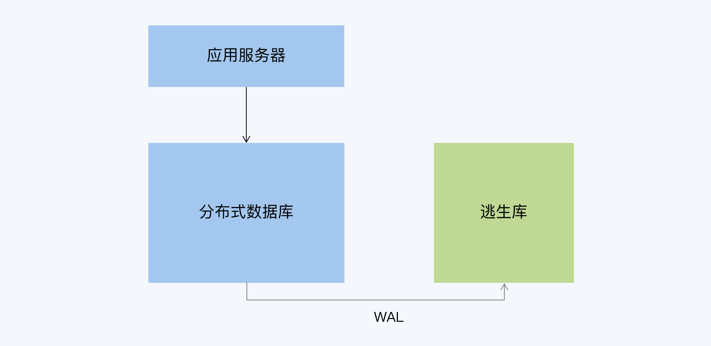
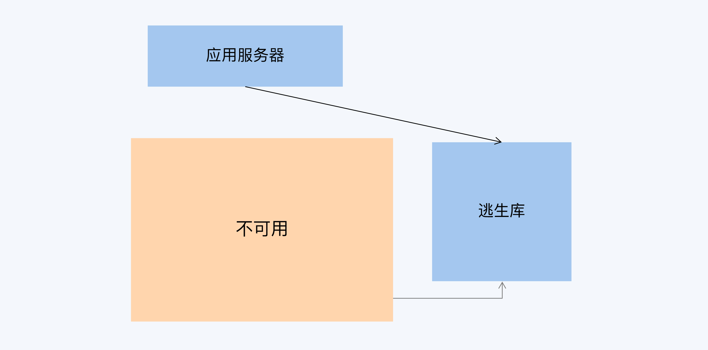
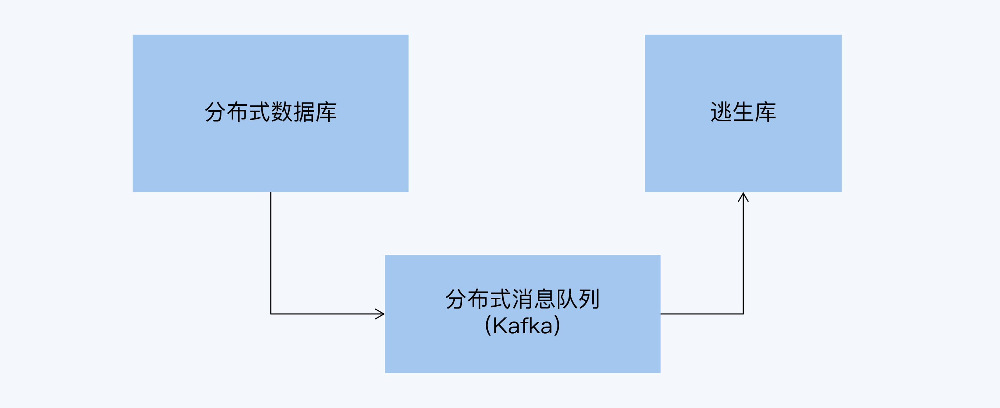
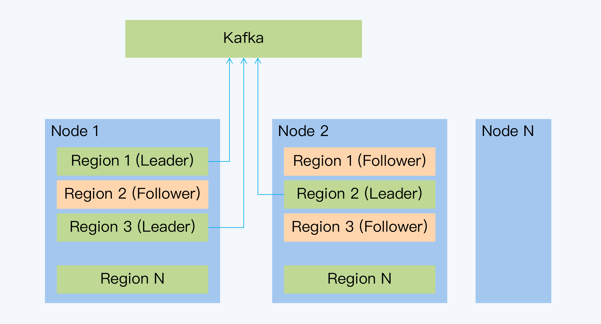
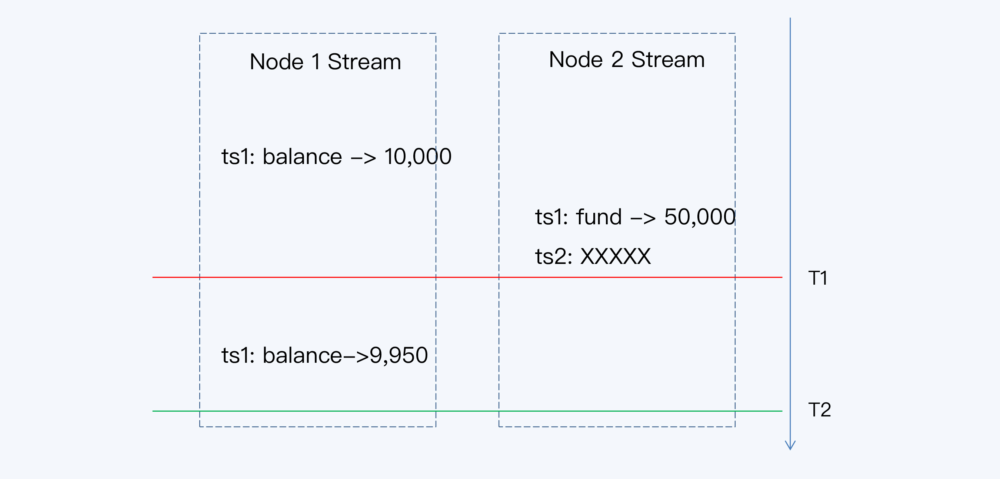
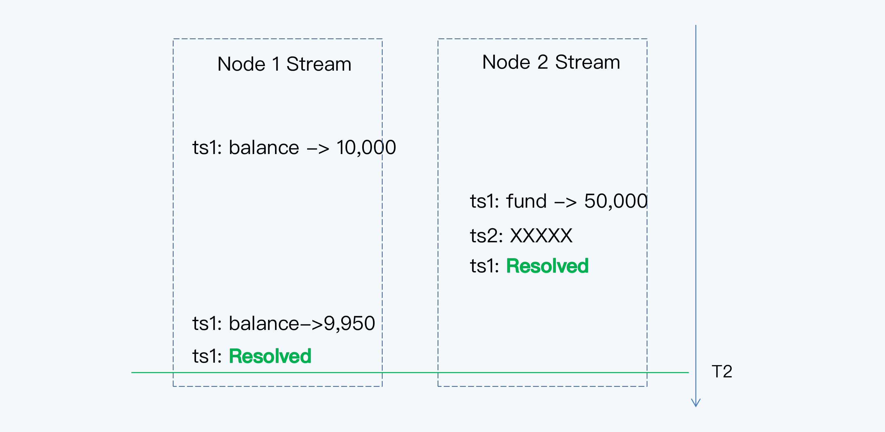
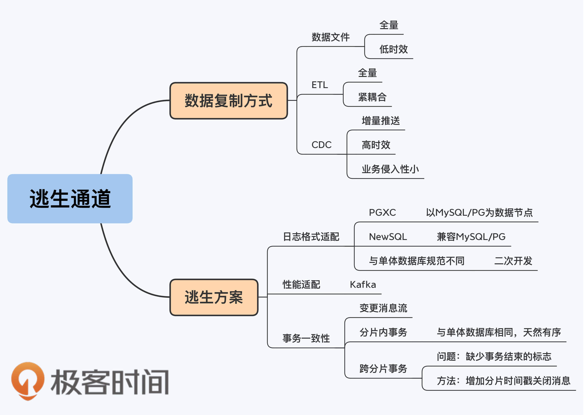

---
date: "2019-06-23"
---  
      
# 25 | 容灾与备份：如何设计逃生通道保证业务连续性？
你好，我是王磊，你也可以叫我Ivan。

我们今天的关键词是“逃生通道”。在生活中，我们去任何一个公共场所，比如火车站、商场、写字楼，都能看安全出口或者紧急疏散通道的提示，这就是逃生通道。逃生通道的作用就是人们能够快速脱离危险的地方。而在系统领域，逃生通道是指让业务能够脱离已经不可用的原有系统，在一个安全的备用系统中继续运转。

可以说逃生通道就是系统高可用的一种特殊形式。它的特别之处在于，备用系统要提供差异化的、更高级别的可靠性。为什么备用系统能够提供更高级别的可靠性呢？这是主要由于它采用了异构方案。

对于分布式数据库来说，逃生通道存在的意义应该更容易理解。作为一种新兴的技术，分布式数据库还没有足够多的实践案例来证明自身的稳定性，即使是它本身的高可用架构也不足以打消用户的顾虑。这时候就需要设计一种异构的高可用方案，采用更加稳定、可靠的数据库作为备用系统。我们通常把这个备用数据库称为“逃生库”。

在分布式数据库的实践没有成为绝对主流前，逃生通道都是一个不容忽视的用户需求。它可以降低实施风险，打消用户的顾虑，减少新技术应用中遇到的各种阻力。

## CDC

作为一个数据库的高可用方案，首先要解决的是数据恢复的完整性，也就是我们提过多次的RPO。这就需要及时将数据复制到逃生库。通常异构数据库间的数据复制有三种可选方式：

<!-- [[[read_end]]] -->

1.  数据文件
2.  ETL（Extract-Transform-Load）
3.  CDC（Change Data Capture）

数据文件是指，在数据库之间通过文件导入导出的方式同步数据。这是一种针对全量数据的批量操作，如果要实现增量加载，则需要在数据库表的结构上做特殊设计。显然，数据文件的方式速度比较慢，而且对表结构设计有侵入性，所以不是最优选择。

ETL是指包含了抽取（Extract）、转换（Transform）和加载（Load）三个阶段的数据加工过程，可以直连两端的数据库，也可以配合数据文件一起用，同样必须依赖表结构的特殊设计才能实现增量抽取，而且在两个数据库之间的耦合更加紧密。

最后，CDC其实是一个更合适的选择。CDC的功能可以直接按照字面意思理解，就是用来捕获变更数据的组件，它的工作原理是通过读取上游的 redo log 来生成 SQL 语句发送给下游。它能够捕捉所有DML的变化，比如delete和update，而且可以配合redo log的设置记录前值和后值。

相比之下，CDC的业务侵入性非常小，不改动表结构的情况下，下游系统就可以准确同步数据的增量变化。另外，CDC的时效性较好，对源端数据库的资源占用也不大，通常在5\%-10\%之间。

CDC是常规的配套工具，技术也比较成熟，在[第18讲](https://time.geekbang.org/column/article/287246)的Kappa架构中很多流式数据的源头就是CDC。CDC工具的提供者通常是源端的数据库厂商，传统数据库中知名度较高的有Oracle的OGG（Gold Gate）和DB2的Inforsphere CDC。

确定了数据同步工具后，我们再来看看如何选择逃生库以及如何搭建整体逃生方案。

## 逃生方案

对于分布式数据库来说，要选择一个更加成熟、稳定的逃生库，答案显然就是单体数据库了。那具体要选择哪种产品呢？从合理性角度来说，肯定就要选用户最熟悉、最信任、运维能力最强的单体数据库，也就是能够“兜底”的数据库。

按照这个思路，这个异构高可用方案就由分布式数据库和单体数据库共同组成，分布式数据库向单体数据库异步复制数据。使用异步复制的原因是不让单体数据库的性能拖后腿。



这样，当分布式数据库出现问题时，应用就可以切换到原来的单体数据库，继续提供服务。



这个方案看似简单，但其实还有一些具体问题要探讨。

### 1\. 日志格式适配

首先是单体数据库的日志适配问题。

逃生方案的关键设计就是数据异步复制，而载体就是日志文件。既然是异构数据库，那日志文件就有差别吧，要怎么处理呢？

还记得[第4讲](https://time.geekbang.org/column/article/274200)我介绍的两种分布式数据库风格吗？其中PGXC风格分布式数据库，它的数据节点是直接复用了MySQL和PostgreSQL单体数据库。这就意味着，如果本来你熟悉的单体数据库是MySQL，现在又恰好采用了MySQL为内核的分布式数据库，比如GoldenDB、TDSQL，那么这个方案处理起来就容易些，因为两者都是基于Binlog完成数据复制的。

而如果你选择了NewSQL分布式数据库也没关系。虽然NewSQL没有复用单体数据库，但为了与技术生态更好的融合，它们通常都会兼容某类单体数据库，大多数是在MySQL和PostgreSQL中选择一个，比如TiDB兼容MySQL，而CockroachDB兼容PostgreSQL。TiDB还扩展了日志功能，通过Binlog组件直接输出SQL，可以加载到下游的MySQL。

如果很不幸，你选择的分布式数据库并没有兼容原有的单体数据库规范，也没有提供开放性接口，那么就需要做额外的转换工作。

### 2\. 处理性能适配

第二个问题是性能匹配问题。用单体数据库来做逃生库，这里其实有一个悖论。那就是，我们选择分布式的多数原因就是单体不能满足性能需求，那么这个高可用方案要再切换回单体，那单体能够扛得住这个性能压力呢？

比如，我们用MySQL+x86来做TiDB+x86的逃生库，这个方案就显得有点奇怪。事实上，在分布式数据库出现前，性能拓展方式是垂直扩展，导致相当一部分对性能和稳定性要求更高的数据库已经切换到Oracle、DB2等商用数据库加小型机的模式上。所以，对于金融行业来说，往往需要用Oracle或DB2+小型机来做逃生库。

当然，性能问题还有缓释手段，就是增加一个分布式消息队列来缓存数据，降低逃生库的性能压力。这样就形成下面的架构。



另外，有了分布式消息队列的缓冲，我们就可以更加方便地完成异构数据的格式转换。当然，日志格式的处理是没有统一解决方案的，如果你没有能力做二次开发，就只能寄希望于产品厂商提供相应的工具。

这样，完成了日志格式的适配，增加了消息队列做性能适配，逃生方案是不是就搞定了呢？

别急，还差了那么一点点。

### 3\. 事务一致性

我们知道数据库事务中操作顺序是非常重要的，而日志中记录顺序必须与事务实际操作顺序严格一致，这样才能确保通过重放日志恢复出相同的数据库。可以说，数据库的备份恢复完全建立在日志的有序性基础上。逃生库也是一样的，要想准确的体现数据，必须得到顺序严格一致的日志，只不过这个日志不再是文件的形式，而是实时动态推送的变更消息流（Change Feed）。

如果一个单体数据库向外复制数据，这是很容易实现的，因为只要将WAL的内容对外发布就能形成了顺序严格一致的变更消息流。但对于分布式数据库来说，就是一个设计上的挑战了。

为什么这么说呢？

如果事务都在分片内完成，那么每个分片的处理逻辑和单体数据库就是完全一样的，将各自的日志信息发送给Kafka即可。

对于NewSQL来说，因为每个分片就是一个独立的Raft Group，有对应的WAL日志，所以要按分片向Kafka发送增量变化。比如，CockroachDB就是直接将每个分片Leader的Raft日志发送出去，这样处理起来最简单。



但是，分布式数据库的复杂性就在于跨分片操作，尤其是跨分片事务，也就是分布式事务。一个分布式事务往往涉及很多数据项，这些数据都可能被记录在不同的分片中，理论上可以包含集群内的所有分片。如果每个分片独立发送数据，下游收到数据的顺序就很可能与数据产生的顺序不同，那么逃生库就会看到不同的执行结果。

我们通过下面的例子来说明。

小明打算购买番茄银行的自有理财产品。之前他的银行账号有60,000元活期存款，他在了解产品的收益情况后，购买了50,000元理财并支付了50元的手续费。最后，小明账户上有50,000元的理财产品和9,950元的活期存款。

假设，番茄银行的系统通过下面这段SQL来处理相应的数据变更。

```
    begin;
    //在小明的活期账户上扣减50,000元，剩余10,000元
    update balance_num = balance_num - 50000 where id = 2234; 
    //在小明的理财产品账户上增加50,000元
    update fund_num = fund_num + 50000 = where id = 2234;
    //扣减手续费50元
    update balance_num = balance_num - 50 where id = 2234;
    //其他操作
    ……
    commit;
    

```

小明的理财记录和活期账户记录对应两个分片，这两个分片恰好分布在Node1和Node2这两个不同节点上，两个分片各自独立发送变更消息流。



在前面的课程中我们已经介绍过，同一个事务中发生变更的数据必定拥有用相同的提交时间戳，所以使用时间戳就可以回溯同一事务内的相关操作。同时，晚提交的事务一定拥有更大的时间戳。

那么按照这个规则，逃生库在T1时刻发现已经收到了时间戳为ts2的变更消息，而且ts2 > ts1，所以判断ts1事务的操作已经执行完毕。执行ts1下的所有操作，于是我们在逃生库看到小明的活期账户余额是10,000元，理财账户余额是50,000元。

但是，这个结果显然是不正确的。在保证事务一致性的前提下，其他事务看到的小明活期账户余额只可能是60,000元或9,950，这两个数值一个是在事务开始前，一个是在事务提交后。活期账户余额从60,000变更到10,000对于外部是不可见的，逃生库却暴露了这个数据，没有实现已提交读（Read Committed）隔离级别，也就是说，没有实现基本的事务一致性。

产生这个问题原因在于，变更消息中的时间戳只是标识了数据产生的时间，这并不代表逃生库能够在同一时间收到所有相同时间戳的变更消息，也就不能用更晚的时间戳来代表前一个事务的变更消息已经接受完毕。那么，要怎么知道同一时间戳的数据已经接受完毕了呢？

为了解决这个问题，CockroachDB引入了一个特殊时间戳标志“Resolved”，用来表示当前节点上这个时间戳已经关闭。结合上面的例子，它的意思就是一旦Node1发出“ts1:Resolved”消息后，则Node1就不会再发出任何时间戳小于或者等于ts1的变更消息。



在每个节点的变更消息流中增加了Resolved消息后，逃生库就可以在T2时间判断，所有ts1的变更消息已经发送完毕，可以执行整个事务操作了。

## 小结

好了，今天的课程就到这里了，让我们梳理一下这一讲的要点。

1.  分布式数据库作为一种新兴技术，往往需要提供充分可靠的备用方案，用于降低上线初期的运行风险，这种备用方案往往被称为逃生通道。逃生通道的本质是一套基于异构数据库的高可用方案。用来作为备库的数据库称为逃生库，通常会选择用户熟悉的单体数据库。

2.  整套方案要解决两个基本问题，分别是日志格式的适配和性能的适配。如果逃生库与分布式数据库本身兼容，则日志格式问题自然消除，这大多限于MySQL和PostgreSQL等开源数据库。如果日志格式不兼容，就要借助厂商工具或者用户定制开发来实现。传统企业由于大量使用商业数据库，这个问题较为突出。性能适配是因为分布式数据库的性能远高于基于x86的单体数据库，需要通过分布式消息队列来适配，缓存日志消息。

3.  因为分布式数据库的日志是每个分片独立记录，所以当发生分布式事务时，逃生库会出现数据错误。如果有严格的事务一致性要求，则需要考虑多分片之间变更消息的顺序问题。CockroachDB提供一种特殊的时间戳消息，用于标识节点上的时间戳关闭，这样在复制过程中也能保证多分片事务的一致性。

逃生通道作为一个异构高可用方案，在我们日常的系统架构中并不常见。这是因为传统数据库的高可用方案已经有足够成熟，我们对它也足够信任。所以，那些CDC工具对单体数据库来说，也是一个有点边缘化的产品，甚至很多有经验的DBA也不熟悉。

CDC的主要工作场景是为分析性系统推送准实时的数据变更，支持类似Kappa架构的整体方案。但是对于分布式数据库来说，CDC成为了逃生通道的核心组件，远远超过它在单体数据库中的重要性。目前很多分布式数据库已经推出了相关的功能或组件，例如CockroachDB、TiDB、GoldenDB等。



## 思考题

课程的最后，我们来看下思考题。今天课程中介绍的逃生通道实际上是一个异构的高可用方案。整个方案由三部分构成，除了分布式数据库和单体数据库以外，还增加了Kafka这样的分布式消息队列，通过缓存变更消息的方式适配前两者的处理性能。

我们还说到，对于单个分片来说WAL本身就是有序的，直接开放就可以提供顺序一致的变更消息。我的问题是，单分片的变更消息流在这个异构高可用方案中真的能够保证顺序一致吗？会不会出现什么问题呢？

欢迎你在评论区留言和我一起讨论，我会在答疑篇和你继续讨论这个问题。如果你身边的朋友也对逃生通道这个话题感兴趣，你也可以把今天这一讲分享给他，我们一起讨论。