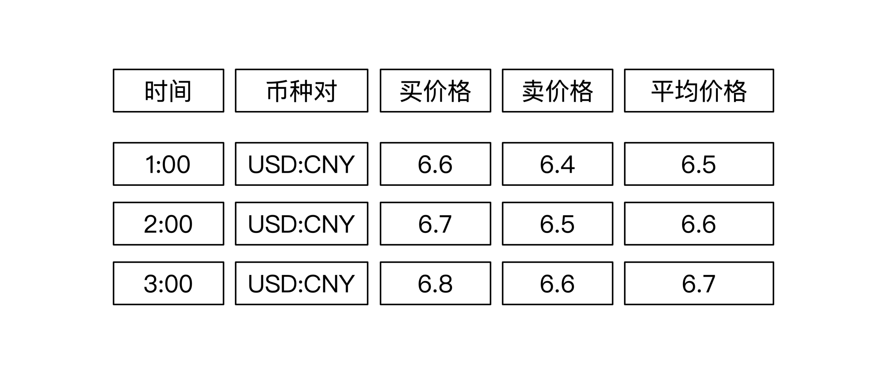
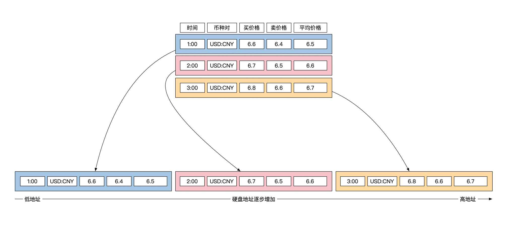
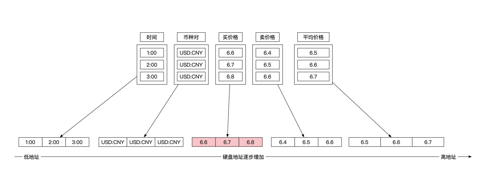
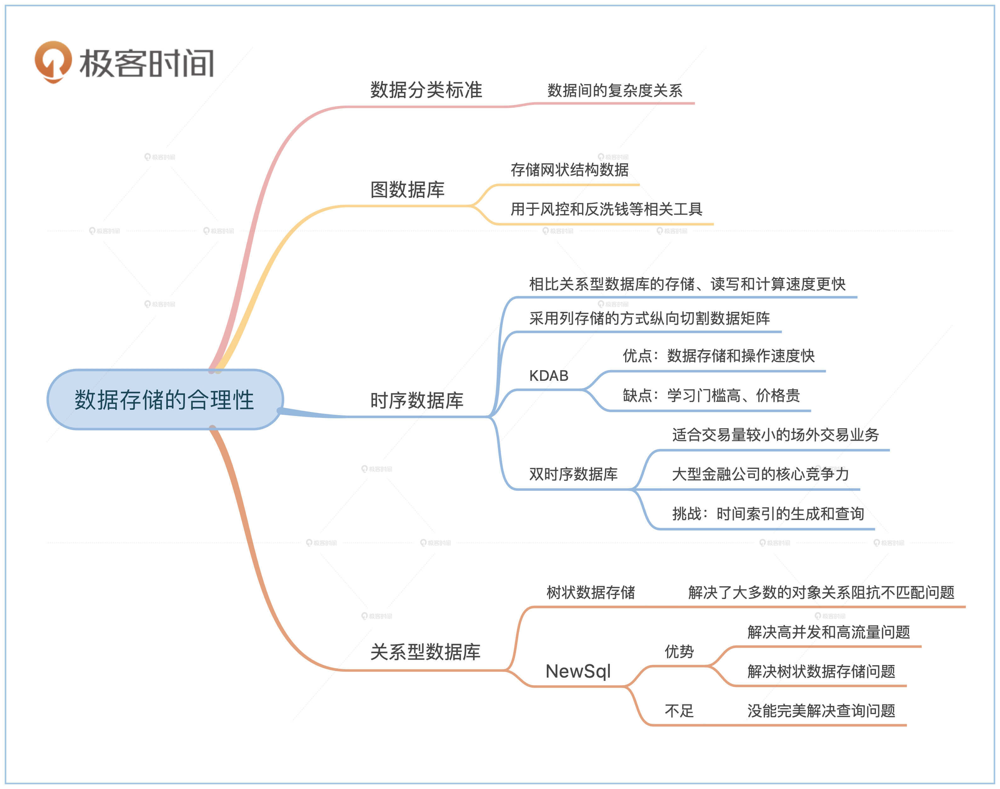

---
date: "2019-06-23"
---  
      
# 10 | 数据存储的合理性：金融业务可以不用关系型数据库吗？
你好，我是任杰。这节课我和你聊一聊金融业务应该如何选择数据存储类型。

提到金融行业的数据存储，我们的第一反应肯定是要用关系型数据库。但是如果我追问一句，为什么一定要用关系型数据库？估计很少有人能答上来。最常见的理由是别人在用，所以我也得用，但是这个并不是理由，而是借口。

其实金融行业的数据存储有很多种选择，今天我们就一起看看都有哪些。

## 数据分类

我们都知道，不同的数据对存储和使用有不同的要求，所以我们选择数据存储类型前先要分析数据有哪些特点，然后才能根据这些特点来针对性地选择适合的存储方案。

通常我们会按照数据与数据之间关系的复杂度来对数据进行分类。最简单的显然是数据之间没有什么关系，比如常见的市场数据就属于这一类。复杂一点的是数据之间有单向的关系，这些关系形成一个树状结构。最复杂的是网状结构的数据，也叫图数据类型。

虽然这些数据在金融系统里都有，但是它们的重要性和出现的频率都不一样，所以在做存储选型的时候也有不同的考量标准。

按照数据出现的频率，数据大体可以分成这样三类：图数据类型、没有关系的数据类型和树状数据类型，它们分别对应了图数据库、时序数据库和关系型数据库。接下来我们就分别看看。

## 图数据库

顾名思义，图数据库存的是图。图数据库除了提供数据的存储以外，还支持图的查询，比如常见的相邻关系查询，或者连通关系查询。

<!-- [[[read_end]]] -->

但是金融行业里很少有图这种类型的数据结构。主要是因为图是一种非结构化数据，而金融业务里处理的数据都要有非常清晰的结构，所以金融数据从本质上就不是非结构化数据类型。

虽然金融行业里图用得比较少，也不是完全没有，一般都出现那些跟数据分析相关的部门。比如在和客户进行业务往来之前先要对客户进行背景调查（KYC，Know Your Customer），或者查看用户是否存在洗钱行为（AML，Anti-Money Laundering）。这就需要分析客户的社会关系和财务状况，这时候用图来表示这些彼此关联的信息就比较合适。

## 时序数据库

不知道你有没有注意到，**金融市场数据一般都带有时间？**你可以回想一下，我们平时在新闻里听到的和金融市场相关的数据，比如大盘、汇率、指数等等，它们都是指某个特定时间点的数据。这些带有时间的数据有特殊的存储方式，叫作**时序数据库**。

关系型数据库也可以用来存储时间序列数据，但是会慢一些。为什么时序数据库会更快呢？这就要提到数据库存储数据的方式了。

### 行存储和列存储

时序数据库会更快的原因是它们普遍采用了**列存储**的方式来存储数据，而你熟悉的关系型数据库一般都用**行存储**的方式来存储。

举个例子。假设你要存储外汇信息，那至少需要处理这些数据：时间、汇率币种、买价格、卖价格和平均价格。下面这幅图展示了连续3个时间点的外汇信息：

上面这幅图从数学上说是个矩阵，有两个维度。但是存储设备只有一维的地址，不是二维的，所以我们需要把这个矩阵从二维变为一维，这样才能存储到磁盘上。

**关系型数据库采用的降维方法是将矩阵横向切割。**这样每行会作为一个整体存储下来，行与行之间挨在一起。

就像下面这幅图展示的存储方式一样，外汇信息被分为3个单位存储，每一行是一个单位：

这样存储似乎看起来也可以。问题在于在进行数据查询的时候，需要将每行作为一个整体从文件上加载到内存，这样会拖慢速度。

比如说，如果你想算一下这3个时间点对应的买入价格的平均值。虽然你只用到了整个数据的一小部分，但是你要将这3个时间点所有数据都加载到内存之后，才能完成计算。

列数据库选择了另一种存储方式。**它降维的方式是将矩阵纵向切割。**这样存储的单位就不再是一行，而是一列。还是同样的外汇信息，现在被分为5个单位存储，每一列是一个单位：

这时候你再想计算这3个时间点对应的买入价格的平均值，只需要加载上面这幅图粉红色的部分就可以了。由于大部分数据都不需加载到内存，这样就能节省大量的读取时间。很显然，对于金融市场数据来说，时序数据库是一种更加有效的存取方式。

那为什么会出现这种情况呢？这就要提到数据的业务性了。

金融市场数据和金融业务数据不一样。**市场数据一般是业务处理的结果。**比如你看到的股票价格信息是股票交易所进行了买卖撮合之后的结果，外汇信息是外汇交易之后的结果，利率、指数等等也都是这样生成的。既然市场数据是业务处理的结果，那它就不是业务问题了。

关系型数据库在最开始研发出来的时候是为了解决业务问题。业务有个共同的特点是需要对单个业务数据进行完整的读写。在关系型数据库里，一个业务一般用一行来表示，因此数据库在进行存储优化的时候，选择优化了行的整体读取能力。

而金融市场数据不是业务数据，并不太适合用关系型数据库处理，所以我们在选择存储金融市场数据的时候，会优先选择基于列存储的时序数据库。

### KDB简介

金融行业很早就知道关系型数据库不太适合市场数据的处理，所以有自己的行业解决方案。这些方案中最出类拔萃的数据库叫作KDB，我在这里也做一个简单说明。

KDB不仅仅是一个数据库，它还有自己的编程语言Q和K。其中K源自于一个编程语言叫作A+。A+是KDB作者在摩根士丹利的时候发明的一种编程语言。A+又来源于一门数学编程语言叫作A。

所有这些语言和Lisp一样，都属于函数式编程语言，所以你在使用KDB的时候会看到很多Lisp的身影。目前A+已经开源，你可以在[这里](http://www.aplusdev.org/)找到它。

先介绍一下Q这门编程语言。这个语言有几个设计特别精妙的地方。因为Q是函数式编程语言，所以它里面的数据都不允许修改，修改会返回新的结果。

另外，它也假设函数没有随机性。在数据不允许修改和函数没有随机性的情况下，每个函数就可以当作是一个Map。这个Map的键是函数的参数，Map的值是函数的返回值。这样就**让函数和Map得到了统一。**

Q的另一个设计是**统一了Map和关系型表**。表的列名是Map的键，表每一列的值是Map的值。表和Map之间的转化是通过 `flip` 操作来进行的。

讲到这里，你可能意识到KDB/Q也是个列存储的数据库。KDB确实也是按照列数据库设计的，所以它的磁盘操作非常快。

KDB不仅数据存储快，它的数据操作也快。

比如在前面讲到的例子中，3个时间点价格平均值的计算。如果是你用编程语言实现，可能会用一个循环来求和，然后求平均值。

由于KDB知道每一列的数据类型都是完全一样的，它在计算的时候会**用到CPU的向量指令**，用一个指令来完成多个数据的同时处理。这一点使得KDB在处理金融数据时有极高的处理速度，而这种效果正是KDB通过实时编译Q语言来实现的。

为了处理的速度更快，KDB采用了**单线程的运行模式**。这样就避免了线程切换和同步锁带来的开销。由于KDB在IO和CPU的速度都很快，在金融行业里对计算速度要求高的领域有广泛的应用。

那我们应该在什么时候选择KDB呢？主要还是数据量的问题。**KDB适用的数据量范围是GB～TB之间。**比如你的金融市场数据在几十G左右的话是完全没有问题的。同时，KDB会大量使用内存，因此内存尽量大一点好。

当然，KDB也不是没有缺点的。**最主要的缺点是学习门槛高。**KDB的Q和Lisp一样是函数式编程语言，市面上会的人不多，教材和文档也比较缺乏。因此需要使用者有很强的抽象能力和学习能力，很多人学着学着就半途而废了。

KDB**另一个缺点就是太贵。**它的价格非常高，一般只有顶级的金融公司才能承担得起。而且需要整个团队进行周边工具的开发，这就是一笔很高的运营成本。

不过，我们一直强调在金融行业要讲究投资回报比，而不只是价格。虽然KDB成本这么高，但是一旦学会了就能有很快的开发速度和运行速度，在每秒几千万上下的金融市场往往能有奇效。

KDB一直以来都在很专业的领域内发展，比如金融和医药等。这些年来互联网行业的列数据库也越来越成熟，比如现在风头正盛的ClickHouse，里面的技术和KDB大同小异。

行业技术的出圈和彼此融合值得我们高兴，在这里我也希望当不同行业的解决方案在进行碰撞的时候，你能够独立思考特殊的方案是如何解决行业的特殊问题，这样你才能形成自己的架构思想，而不是人云亦云。

### 双时序数据库

我们在前面[第6节课](https://time.geekbang.org/column/article/328625)里讲了双时序数据库。虽然双时序数据库的名字里也有“时序数据库”这几个字眼，但是它的实现和时序数据库完全不同，因此适用的场景也不同。

简单说一下双时序数据库的实现有哪些不同。双时序数据库由于多了一个时间维度，就不能按照列存储的方式进行存储。

其实我在第6节课的思考题里，已经给你提示了双时序数据库的存储空间复杂度和时间复杂度，这些复杂度并不低。而且，当你把内容加载到内存之后，会发现无法使用CPU的向量指令来加速运算。

这些都导致**双时序数据库不适合吞吐量特别高的业务**，比如股票和外汇业务这些高频交易类业务。但是**它比较适合交易量稍小一些的场外交易类业务**，像债券、期货、资产证券化等等。

我再说一下双时序数据库的实现。虽然这个理论提出来很早，但是市面上的通用产品不多，一般都是金融公司自己研发。

你还记得，我们在[第4节课](https://time.geekbang.org/column/article/325378)领域驱动设计中把系统组件分成了3个部分么？其中最重要的就是核心组件。核心组件代表了公司的核心竞争力，需要自己研发。**双时序数据库对于大型金融公司来说就是核心竞争力**，所以外界很少知道这个产品。

实现双时序数据库的挑战主要在时间索引的生成和查询，你可以参考第6节课思考题的方法，或者使用空间树的数据结构来实现。

## 关系型数据库

讲完了时序数据库以后，我们最后来看看关系型数据库这个最有争议的地方。

### 对象关系阻抗不匹配

关系型数据库的争议点主要集中在和面向对象编程之间的冲突。学术界甚至有个专业名词来形容这种冲突：对象关系阻抗不匹配（Object relational impedance mismatch）。

面向对象编程里的所有对象之间的关系形成了一个图，因此研究方法需要用到数学上的图论。而关系型数据库的模式（schema）是基于关系代数（Relational Algebra），是一系列同构（Homomorphic）的列表组成的集合（Set），因此用到的是数学上的集合论。

其实你将对象存储到关系型数据库的过程，就是一个将图论翻译到集合论的过程。因为这是两个关系不大的数学理论，所以你在翻译的时候会觉得很不自然。因此，这两者**不匹配的原因是图论和集合论的区别。**

除了原理不匹配之外，它们在数据封装上也有区别。你在学习面向对象编程的时候，老师一定教过你要隐藏类的实现细节，只向外界暴露行为或者接口，类与类之间通过接口来进行交互。但是关系型数据库会暴露所有的内部细节，你在数据库里看到的是所有数据最原始的表现形式。数据库的表与表之间交互是原始数据的直接交互，没有任何抽象出来的行为或者接口。

所以**面向对象编程里有对象和行为，而关系型数据库里只有数据**，这两者有本质的区别，这点你需要仔细去体会。

虽然面向对象编程和关系型数据库里都有数据，但是它们的数据并不一样。面向对象编程里的对象本身也是数据，这是一个更高级和复杂的数据。而数据库里存储的是基本数据格式。**这两者的数据抽象程度不一样**。

仔细想想，你会发现它们俩还有很多原理上就不一致的地方，比如说面向对象编程有公有和私有属性，有访问权限，还有一致性校验和继承。所有这些都不能直接反映到关系型数据库里。

所以在日常开发中我们不得不使用一些奇技淫巧来强行将业务对象存储到关系型数据库里。时间久了大家也会试着解决这个对象关系阻抗不匹配的问题，所以就有了NewSql（以前叫NoSql）这个新的概念。

### 树状数据存储

大多数情况下业务数据之间不是图的关系，而是树状结构。这颗树的根节点是业务交易，交易的对象和细节作为子节点一步一步向下展开，所以也叫这种结构为雪花（snowflake）。

NewSql在诞生的时候解决了两个问题。第一个解决的问题是高并发和高流量，我们会在[第13](https://time.geekbang.org/column/article/335994)和[14节课](https://time.geekbang.org/column/article/336686)详细给你讲解。第二个解决的问题就是树状数据的存储问题。最开始学术界主推的是XML的存储格式，但是没有流行起来，它被后来工业界推行的JSON格式取代了。

对于你来说，树状数据存储格式并不重要。重要的是在NewSql里，面向对象编程里的对象可以作为一个原子单元来存储，这样就解决了大多数在前面提到的对象关系阻抗不匹配问题。

虽然NewSql解决了对象的存储问题，但是它没有完美解决对象的查询问题。NewSql普遍采用了分布式架构设计，我们会在第14节课给你讲解，最终一致性甚至分布式事务在解决二级索引一致性上有非常大的时间开销，因此**二级索引一般会采用最终一致性的实现方式，这样会导致查询不准**。这也是金融行业对于NewSql一直采取观望态度的原因。

那查询不准有问题吗？如果你继续沿用现在关系型数据库的同步处理思路，肯定是有问题的。但是如果你是按照异步架构的思路来解决业务问题，在一些特定领域也存在应对的办法。

异步处理会增加架构难度，而关系型数据库之所以成为金融行业万金油，主要是因为事务的支持极大简化了架构难度。所以从投资回报比的角度来考虑，只有在业务量大到逼迫金融公司使用分布式数据存储方案的时候，才会升级到异步处理架构上。

## 小结

在这节课我们学习了金融业务应该如何选择数据存储类型。

在选择存储类型前先要对数据类型分类。按照数据之间关系的复杂度，我们可以把金融数据分为图数据类型、没有关系的数据类型和树状数据类型，它们分别对应了图数据库、时序数据库和关系型数据库。

因为金融业务需要准确地定义数据，所以很少用到图的数据结构。一般会在风控和反洗钱领域用到图相关的工具。

金融市场数据一般使用时序数据库。相比关系型数据库常用的行存储方式，时序数据库用了列存储的方式，这个方式在存储、读取和计算上都有很大的速度优势。KDB是金融行业的专用列存储数据库，它具有更高的执行效率。双时序数据库适合交易量稍小的场外市场业务，一般是金融公司自研。

关系型数据库和面向对象编程之间有天然的矛盾。现在的NewSql在解决对象存储方面有更多优势，但是由于NewSql普遍采用了分布式架构，在使用的时候我们需要小心处理异步处理和最终一致性等关系型数据库不存在的问题。

## 思考题

NewSql出现之后确实解决了很多问题，所以传统的关系型数据库也在大力向这方面靠拢。比如PostgreSql近期也支持了JSON作为基本数据类型。

从理论上来看，JSON一旦也作为了基本数据类型，就相当于承认基本数据类型的内部也可以有结构。过去很长一段时间内都不是这个假设。

有意思的是，在50年前Codd发表关系型数据的奠基论文——"A Relational Model of Data for Large Shared Data Banks"的时候，就提到过关系型数据库的基本类型可以有复杂的结构。Codd认为，表的值也可以是表。这样的话，关系型数据库就可以保存完整的树状结构了。你可以看看这篇论文第380页的右下角：

> So far, we have discussed examples of relations which are defined on simple domains \- domains whose elements are atomic \(nondecomposable\) values. Nonatomic values can be discussed within the relational framework. Thus, some domains may have relations as elements. These relations may, in turn, be defined on nonsimple domains, and so on.

> 到目前为止，我们已经讨论了定义在简单域上的关系的例子--其元素是原子（不可分解）值的域。非原子值可以在关系框架中讨论。因此，一些域可能有关系作为元素。这些关系又可以定义在非简单域上，以此类推。

那问题来了，现在表里可以存JSON格式的数据。你觉得从整个公司层面推广这个特性的话，有哪些需要注意的问题呢？

欢迎你在留言区和我交流。如果这节课对你有帮助，也欢迎转发给你的朋友，同事，一起学习进步。