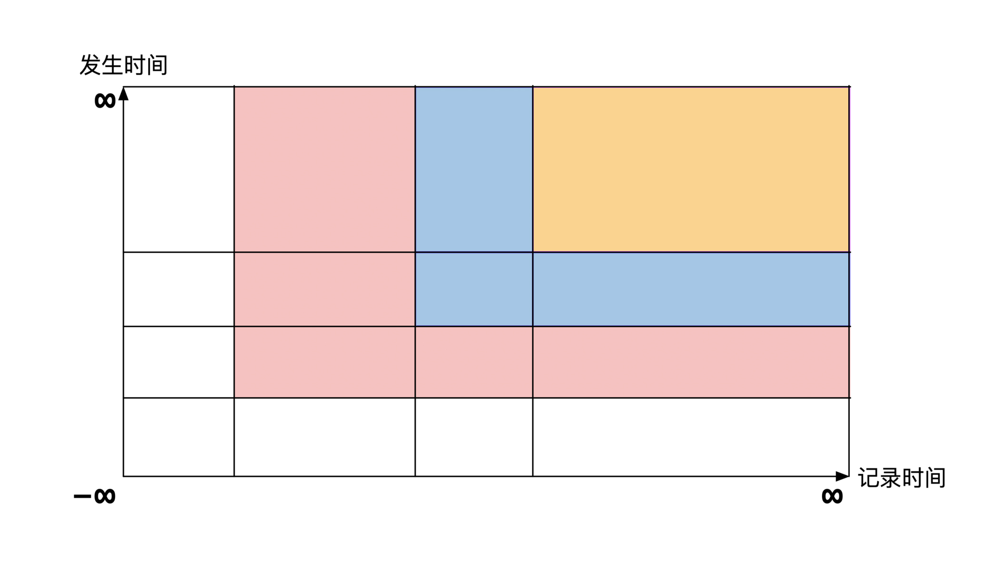
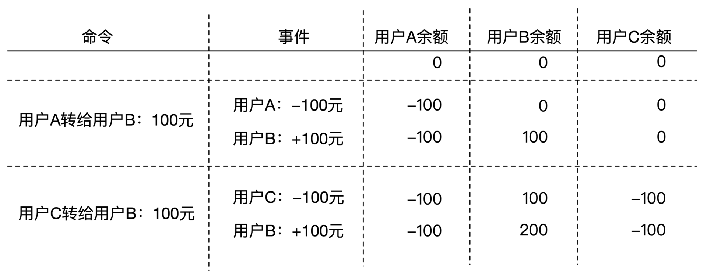
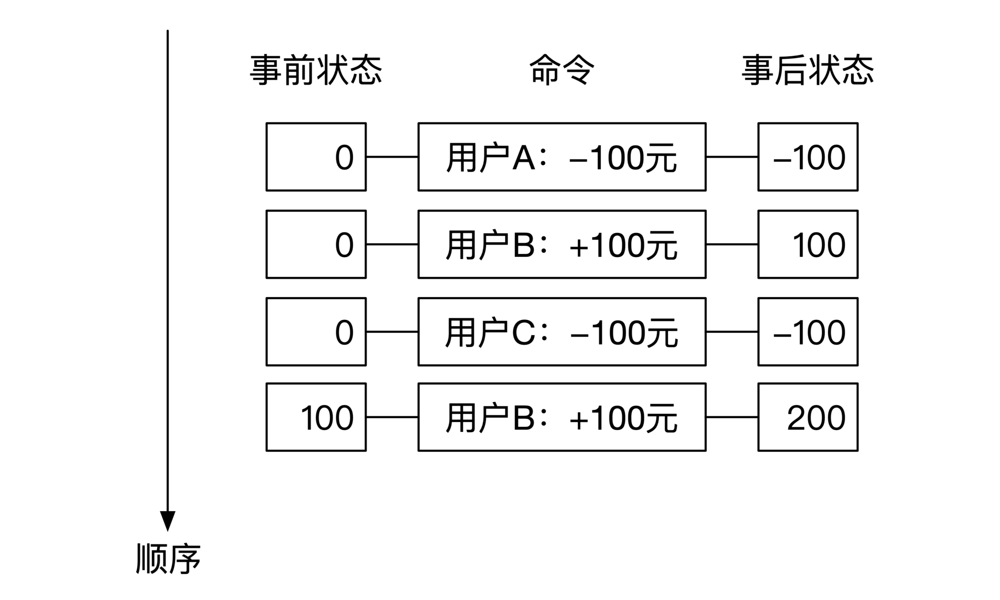

---
date: "2019-06-23"
---  
      
# 答疑集锦（二） | 思考题解析与账务系统优化
你好，我是任杰。

到今天为止，第二模块的系统正确性保障的内容就告一段落了。在专栏更新的过程中，也很开心看到同学们的留言，我要为你们认真学习、主动思考的精神点赞。

今天我为你准备了这篇加餐，把第二模块的思考题做一个系统梳理。我还是建议你先看完前面每一讲的内容，自己独立思考之后，再来看我这份参考答案。

## 思考题答案

[**第6节课**](https://time.geekbang.org/column/article/328625)

Q：双时序数据库里的一种存储方式是将坐标空间切割成尽量多的矩形，然后将这些矩形存储在数据系统内。数据库的索引建立在矩形的左下角和右上角这两个坐标点。

具体的切割做法是当坐标系内新增一个数据节点时，以这个点为中心，将整个坐标系进行水平和垂直切分。下图展示了系统中有3个数据点时的一个切割方式，3个数据点将坐标系切割成了16个矩形：

每个插入操作都会对已有的矩形进行切割。每次查询都会遍历相关的矩形。那么你能算一算这个方案的**存储空间复杂度**和**查询时间复杂度吗**？

A：存储的空间复杂度是O\(n\^2\)，查询的时间复杂度是O\(log n\)或者O\(1\)。你可以沿着这个思路，继续想想，这样的复杂度对双时序数据库的使用有怎样的影响，换句话说，就是双时序数据库适用的业务有什么特点？这个问题，你可以在第10节课找到答案。

<!-- [[[read_end]]] -->

[**第7节课**](https://time.geekbang.org/column/article/326583)

Q：我们在存储事件队列的时候需要存储两个文件。一个存储事件，另一个存储事件的索引。在现实中会出现各种异常的情况，比如机器可能会中途死机，这样有可能文件只写了一部分。

1.  这时你应该如何检测文件是否完整？

2.  这两个需要存储的文件，应该按照怎样的先后顺序存储呢？

A：我们先看看如何判断文件是否完整。一般来说，判断文件是否完整是针对于整个文件来说的。如果文件完整就继续使用，如果文件有一点点不完整就整个丢弃。

但是，对于事件溯源架构来说，一下子就丢弃到整个文件是比较可惜的，很有可能会造成容灾时的数据恢复成本过高。所以基于事件溯源的架构会尽量找出来哪些文件内容是可以用的，哪些是需要丢弃的。

事件文件和索引文件的完整性检测可以合起来做。我们计算出事件文件每一个内容的校验码，比如MD5，SHA1，HMAC。这个校验码长度是确定的，因此可以放在对应的索引文件内，这样我们就可以用索引文件来检测事件文件的完整性了。

接下来就是如何判断索引文件的完整性。对于线性写的文件，出问题只会出在文件末尾。因此我们可以先把索引文件的大小裁剪到单个索引的整数倍，然后再检验最后一个索引是否完整。如果不完整就删掉最后一个索引，然后再检查新的最后一个索引是否完整，以此类推。

那就剩下最后一个问题，如何检查单个索引内容是否正确？方法也很简单，每个索引内容的最后面是前面所有内容的校验码即可。

由于我们这种方法是用索引文件来校验事件文件，所以需要先存储事件文件，再存储索引文件。

[**第8节课**](https://time.geekbang.org/column/article/330288)

Q：我们在讲如何保证消息至多投放一次的时候，说过可以用数据库来做去重工作。不过数据库的容量一般是有限的。

假如你设计的系统预期会运行10年以上。数据库由于存储不了这么久的数据，一定会将过期不用的数据进行归档后删掉。这会造成你用来去重的数据有一部分会不见了。这样如果来了一个请求，这个请求恰好用了被删掉的ID，系统就会重复处理。那么你应该如何做呢？

> **用户“小动物”的留言回复：**  
> 感觉做不到很完美。  
> 1.数据删除时能否留下去重用的字段，因为是有限的个别字段，数据量有限，空间会小一些。但这种只增不减的数据还是会判断空间有限的问题。  
> 2.唯一ID是否可控，若可控，可带上一些规则，如时间、自增ID等。通过规则判断是否已经超过合理期限。但这个的可能性很低，因为ID是别人的，基本没法介入。  
> 3.消息中增加时间，业务发生时间。超过合理时间范围的数据不做处理。

A：我们来看看这个问题的本质是什么。问题要求我们检查一个ID是否属于已经被删掉的ID，其实这是一个如何检测元素是否存在于一个集合的问题。由于集合数目偏大，所以才造成了检测困难。

用户“小动物”的留言就是一个优化的思路。如果所有ID之间有线性关系，而且删掉的内容恰巧是一个连续区间的话，我们只需要简单判断一下，看看新来的ID是否在删掉的区间的最大和最小值以内就行。

所以接下来就是怎么让ID之间实现线性关系的问题。线性关系意味着，任何两个ID之间都可以比大小，而且大小关系具有传递性。

你再分析一下就会发现，我们需要让ID之间的大小关系遵循它们产生时的物理时间的关系，也就是说后生成的ID需要更大。我们一般把这时候的ID叫作**逻辑时间**。逻辑时间反映了事件之间的顺序关系。

所以就像用户“小动物”指出来的一样，我们可以在ID中增加时间或者自增ID，而且需要业务系统自己来保证逻辑时间的正确性。

[第9节课](https://time.geekbang.org/column/article/331395)

Q：实时数据系统的数据节点通常都是价格昂贵的机器。这些机器的处理速度极快。交易所机器运行太快了之后，会导致推送给实时用户的数据量过大，用户来不及处理。你这时候应该怎么处理这两者速度不一致导致的问题呢？

> **思考题09 tt的回答：**  
> 问题中说的速度的差异还会带来数据量的积压，所以还需要有“削峰填谷”的能力，这个正好是消息系统最主要的职责之一。

> 但是，等一下，客户来不及处理的数据真的需要放入数据的“水库”中等待用户后续处理么？这可是实时数据，也许等到客户可以处理的时候，数据的价值已经消失了，所以此时的数据已经不值得用户再去花那么多钱了。

> 所以，**用户在和交易所买席位费的时候先评估自己的需求：要么花费和交易所等量的钱去对接，要不就降低自己的层级。**

> 对交易所来说，提供的就是实时数据，**第一是不能被下游系统阻塞；第二是不必缓存没有被消费的数据，因为缓存完再提供，那提供的就不是实时数据服务了。**

> 推导来推导去，得出的结论不过是：**实时数据就是传输过程中发生丢失就不需要找回的数据。**

A：我们先来看看发送端太快会发生什么问题。发送端发送太快，接收方就来不及处理，因此就会像用户“tt”指出来的一样，接收方会发生数据积压。

一种做法是接收方主动丢弃掉积压的数据。但这样会造成一些资源的浪费，我们具体分析一下。

比较容易想到的一个浪费是接收方的CPU。CPU需要处理网络数据包，放到内存后丢弃数据。但是CPU浪费的影响还不大，影响最大的是时间的浪费。网络处理需要时间，如果网络数据处理后就直接丢弃，那么这个处理的延时就白费了。因此这个方法最大的问题是增加了有效数据的接收延时。

所以，如果发送方和接收方都是内部系统的话，我们可以做一个处理速度的协调。接收方如果处理不过来，需要丢弃数据，那么丢弃之后需要返回给发送方一个丢弃的消息。发送方这时候会降低自己的发送速度，直到接收方在一段时间内稳定住，不再丢数据。这个做法和TCP最大带宽发现的算法有些类似，你可以仔细体会。

在正式部署机器之间，公司一般都会对自己的机器做性能评估，在机器的处理能力上限和自己席位费的上限之间选择一个最小值。

[**第10节课**](https://time.geekbang.org/column/article/332304)

Q：NewSql出现之后确实解决了很多问题，所以传统的关系型数据库也在大力向这方面靠拢。比如PostgreSql近期也支持了JSON作为基本数据类型。

从理论上来看，JSON一旦也作为了基本数据类型，就相当于承认基本数据类型的内部也可以有结构。过去很长一段时间内都不是这个假设。

有意思的是，在50年前Codd发表关系型数据的奠基论文——"A Relational Model of Data for Large Shared Data Banks"的时候，就提到过关系型数据库的基本类型可以有复杂的结构。Codd认为，表的值也可以是表。这样的话，关系型数据库就可以保存完整的树状结构了。

那问题来了，现在表里可以存JSON格式的数据。你觉得从整个公司层面推广这个特性的话，有哪些需要注意的问题呢？

A：关系型数据库的表有模式（schema），限定了表的内容，相当于对数据结构做了规定，这样就能减少错误。JSON没有模式，大家可以随意定义自己的格式。而且Json的值也可以是Json，这意味着树状数据结构只有顶层有模式保护，顶层以下没有任何保护。

从公司的角度来说，需要肯定的是没有schema会加快系统开发速度，但是没有schema会增加系统的维护成本。所以是否选择这个特性就相当于，要我们在短期上限速度和长期可维护性中做一个选择。

既然是一个选择，那么你就需要根据公司的具体情况来判断。如果公司需要功能的上线速度快，而且出错了影响也不大，那就可以选择有复杂结构的基本数据类型。

如果功能的正确性要求非常严格，那么就尽量少用。如果需要使用，就需要将测试级别提高，至少要超出一般关系型数据库情况下的测试力度，这样才能保证测试之后的软件bug率没有增加。

[第11节课](https://time.geekbang.org/column/article/332958)

Q：支付系统会有一些超级大账户。这些账户的交易极其活跃，不在秒杀的情况下也会有很高的流量，那秒杀的时候系统压力就更大了。比如说一些卖低价体育类用品的网店，或者收水电煤气费用的公司，都有这些行为特征。那对于这些超大流量的账户，你应该怎么应对呢？

A：我在文稿里选取了两条回复，这两位同学的答案刚好给了我们两个可以参考的思路。

> **思考题11 tt回答节选：**  
> 这样的账户往往是入账或贷记操作比较多，即要让它可以很快地增加余额而不出错。这样可以把它分成多个子账号，每个账号分别做入账，然后日终的时候再汇总。  
> 或者把金额记录到一个科目里，由于是入账，可以没有余额的概念，这样也不会出错，这样连累加的过程也可以省掉了。而且记录的过程都是新增，可以顺序写，也可以提高性能。

> **用户luke回答：**  
> NUMA架构，线程绑定，CPU缓存，内核旁路，低延迟网卡……

如果出现了超级大账号，最直接的方案是单独给他们分一个库，这样可以直接复用现在分库分表的架构和配置文件。由于他们交易量大，对应的营收也高，所以如果对比时间成本、机器成本和收益，单独拿一个库出来也许是性价比较高的方案。

问题在于如果单个库的处理速度也不够了怎么办。这时候就可以考虑用户“tt”指出来的方法，可以将用户账户拆分，一个拆成多个。虽然用户用起来不方便，但是至少能支持业务。

用户“luke”也指出了另一个思路。如果单个库处理速度不够，那么我们也可以纵向扩容，增加单机的处理能力。

好了，第二模块的思考题解析到这里就结束了。技术的世界总是日新月异，我这里稍微闲谈一条新闻，不知道你有没有关注到，最近历时4年的分布式文件系统 JuiceFS 正式开源了，你有没有思考过，这个系统对于金融行业来说，有没有应用的可能性呢？

我们在第二个模块已经介绍过了，金融系统并不是所有部分的要求都非常高，因此我认为它一定能找到用武之地。

不过，对于金融业务最核心的交易及账务数据来说，它们的数据存储方案需要有过往的长期大规模正确性验证证据，而且对应的数据提供商需要有能力解决对应规模的问题。这就是一个留给你的问题了。

如果你是一家金融公司的CTO，系统管理了2万亿的人民币资产，每天有1亿日活，你会不会将最核心组件搭建在这个开源系统上呢？

好了，既然是加餐模块，我还想给学有余力的同学额外补充一个知识点，那就是账务系统的特殊优化。我认为，完整的软件系统并不是一蹴而就，而是逐步迭代和升级的。感兴趣的同学可以仔细体会后面的优化思路，希望可以给你带来更多启发。

## 账务系统的特殊优化

### 举例

你还记得，前面第7节课我们讲了一个账务系统的例子么？通过那个例子，我给你讲了命令和事件存储，打快照，以及读写分离的查询。不过，这些都是一般性的解决方案。因为账务系统特别简单，所以它还有特殊的优化方案。

在这里我给你简单梳理一下思路。**这些优化方法并不只局限于账务系统。如果你发现自动机的状态是K/V结构，那么很有可能这种优化都适用。**

我们先看看账务系统的初始状态。在最开始所有人的余额显然都是0，之后随着转账的发生，各个账号余额会发生变动。

假设系统最开始有2笔转账，分别是从用户A转给用户B共100元。用户C也转给用户B共100元。同时我们假设允许用户欠款（贷记账号）。这两笔转账分别对应了两个命令，他们的执行情况如下图：

### 合并存储

优化的第一个目标是优化事件的存储内容。在账务系统中，如何进行用户操作非常简单，所以我们有能力在生成事件的同时，假装执行这个事件，这样就能得到用户的最终余额情况。

这样我们在生成转账事件的同时，就能知道这笔转账执行前和执行后的用户余额情况。我们可以把事件和前后两个状态都保存在一起，像下图展示的这样：

上面这幅图可能看不出什么特点。但是如果我们稍微做一些展示上的简单修改，给每个用户一条单独的时间线，你就会发现大不一样了，就像下面这幅图展示的一样：

那现在的历史查询就变得非常简单。由于现在每个事件都有对应的前后状态，我们只需要寻找离查询时间最近的事件就可以了。找到了对应的事件，我们就可以找到对应的状态，就像下图展示的一样：

因此，采用将事件和状态变化存储放在一起的方式，可以大幅简化查询的复杂度。常用的时序数据库都支持相应的查询语句。如果你再仔细思考一下，会发现**我们其实也不用打快照了**，这样就能进一步节省系统运行的时间。

### 对账优化

将事件和状态变化存储放在一起存储，这样做的另一个好处是可以简化内部对账。账务系统有一个硬性要求是需要对账户余额和余额变动细节进行一一比对。常见的方法是用另一套系统计算所有的余额变动总和，然后和日切余额做对比。我们来看看优化后的版本应该如何处理。

我先给你交代一下，后面的优化需要用到账务系统的两个等式：

1.  前一个事件的最终余额等于下一个事件的初始余额。
2.  每个事件的最终余额等于这个事件的初始余额加上事件变动金额。

优化的思路是将每个用户所有相邻的余额变动都链接起来，同时将一个事件的前后余额也链接起来。链接之后，我们之前举的两个转账的例子，就会变成下面这幅图描述的样子：

这样对于任何一个用户的任何一个状态，我们都可以顺着链条找到所有金额变动的过程，并对这个过程进行校验。

这种链接的方式和区块链的思路很像，其实本质是完全一样的。区块链只是以非中心化共识的方式构建了这个链接关系。因为我们的主题不是区块链，所以你如果有兴趣的话可以查看相关资料。

好了，第二模块的思考题我就说到这里，希望能够给你一些启发。也欢迎你继续积极思考，畅所欲言。下节课，我们将要进入到第三个模块了，希望你再接再厉，跟上我的脚步，一起深入学习金融系统的分布式正确性及高可用内容。