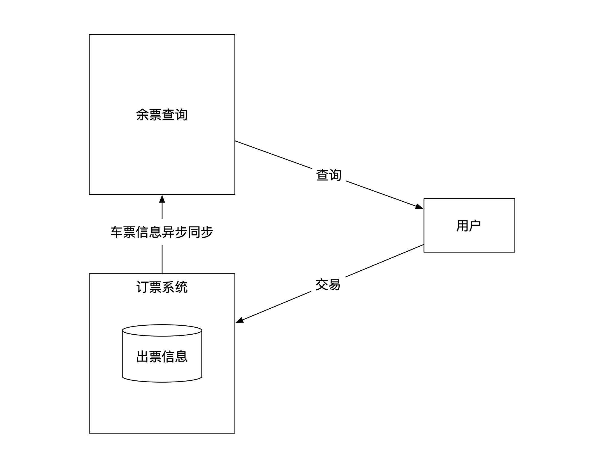
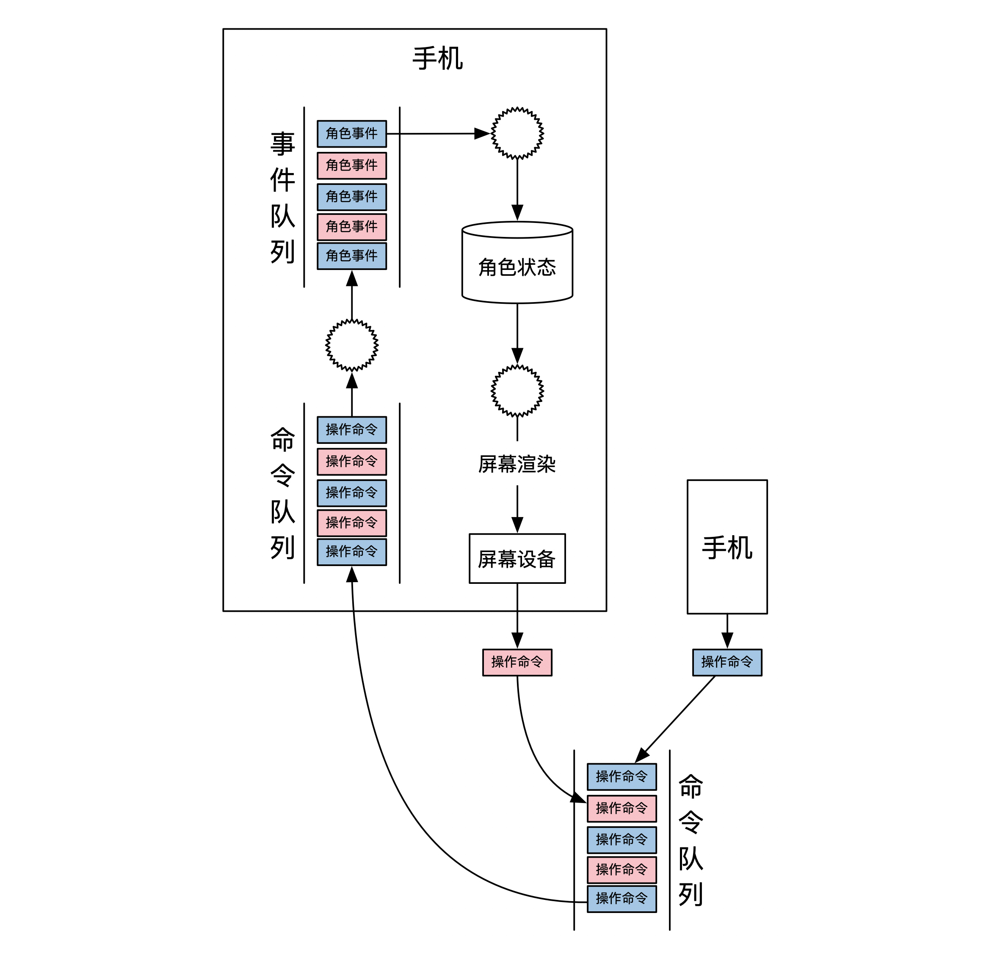

---
date: "2019-06-23"
---  
      
# 春节策划第3期 | 如何运用架构知识解读春运买票和手游案例？
你好，我是任杰。

今天是大年初六，估计你还在假期中，所以首先祝你假期愉快。不知道我在春节策划第1期留的两道主观题，你想到了怎样的方案呢？接下来，我就来公布参考答案啦，希望对你有所启发。

## 春运卖票案例分析

Q：除了支付以外，技术圈还有一个广为人知的高难度系统，那就是卖火车票（第1期的完整题干点击[这里](https://time.geekbang.org/column/article/342646)回顾）。12306有雄厚的资金，因此可以选择一些特殊的软硬件方案来解决卖票的问题。作为一个金融系统背景的人来说，你应该如何分析这个春运卖票的问题呢？

A：我们先分析一下新闻数据。

从第一个新闻可以算出来，一天累计发票1000万张，所以约等于每秒115笔交易。这个平均值并不算太高。如果考虑到峰值情况，我们大致可以估算出，网站的峰值TPS在几百到几千左右。

从第二个新闻我们可以算出来，在峰值情况下网站的QPS接近200万。新闻里也提到了淘宝的订单TPS在50万左右，因此12306峰值的QPS是淘宝峰值TPS的4倍。

这两个数据的比较并没有给我们额外的信息，因为优化TPS的架构和优化QPS的架构非常不一样，这两者没有可比性。而且TPS会更难处理，TPS值低一些很正常。

分析到这里还没完，我们还需要把这两个新闻合在一起看。春运卖票的TPS在几百，但是QPS在200万，因此它是一个查询量极其巨大，但是交易量正常的业务。

<!-- [[[read_end]]] -->

这就意味着，**我们系统架构需要优化数据的查询。**

你还记得，我们在[第7节课](https://time.geekbang.org/column/article/326583)讲事件溯源的时候，提到过一个优化查询的架构设计方案么？这个方案叫CQRS，也就是读写分离。

这里我们也可以应用这个思路，把订票和余票查询分开。订票是一个独立的系统，负责维护所有的出票信息。余票的查询是另外一个系统，负责给客户端提供查询服务。订票系统负责将出票信息异步同步给余票查询系统。这个架构示意图如下：

**读写分离的一个优点是可以对读和写分开做优化。**我们先来看看写的优化。

第二篇新闻里提到了在写入时需要维护的状态，也就是“动态的SKU”，其实就是每列车在每个站点的座位上坐的是谁。我们来初略估计一下状态数有多少。

假设全国有1万个站点，一共10万辆火车，每个火车可以装1万人，每列车每天把全国所有的铁轨跑10趟，那么数据量一共是\$10\^\{14\}\$，也就是100T。这个数据量并不大，现代数据中心里大概一个机柜用内存就能全部装下，所以**数据量大小并不是挑战**。

我们再来看看数据的操作复不复杂。我们在买票的时候有一些复杂的选项，比如是不是靠窗，几个座位是不是连在一起，是不是VIP等等，但是这些复杂度都在于查询。

真正的出票操作是在你准备支付的时候。这时候为了防止你已经选好的票被别人抢走，系统需要在你支付完成前锁定你的票。因此，**出票的操作需要对一个车次的连续几个站点的同一个座位进行上锁操作。**

所以对于数据的写入操作来说，如果我们把火车票粒度做个划分，划分成每个车在每个站点的每个座位之后，问题就变成了：1万TPS以下的多个火车票座位的上锁问题。根据第一篇新闻提供的数据，这个上锁操作在1万TPS以下，因此大部分的数据系统都能够支持。

我们再来看看读的优化，这里才是春运卖票的真正复杂度。我在前面提到过，火车票在购买的时候有多种不同的查询条件。简单一点的是按照车次和日期为查询级别，复杂一点的是按照座位的位置。粒度越小，查询的复杂度越高。

由于查询需要计算，而事务的处理只需要加锁，查询是一个更加消耗CPU和存储空间的过程。

那么读的挑战有多大呢？第二篇新闻告诉我们，大概在200万QPS。这么大的QPS，显然不能用一台机器解决，而是需要用到多台机器来处理。

我们在[第19节课](https://time.geekbang.org/column/article/341048)提到过，如果一个业务可以被拆分到两台机器上处理，那么一生二，二生三，三生万物，我们可以把业务分到任意多台机器上处理，这样只要堆机器数目就可以了。那这么做可行吗？

不知道你发现了没有，**票务查询有一个特点是任何两个查询之间不会互相影响，也就是两个读操作之间没有冲突。**没有冲突的操作可以并发执行，而不会产生任何意料之外的结果。这就是我们在[第12节课](https://time.geekbang.org/column/article/334878)提到的唯一没有冲突的情况。

接下来，我们再看看读操作分布式处理的另一个可行性原理。

不知道你有没有过抢火车票的经验。也许你也有类似的这种经历，明明你可以查到票，但是在购买的时候，系统却提示你已经卖光了？

通常来说，你这时候不会投诉12306说给了你错误的信息，而是会再查下一趟车是不是还有票。这意味着从查票的业务来讲，我们默认接受了查询信息和实际信息不一致的情况。

所以，我们可以选择将出票信息异步推送给查询系统。查询系统可以根据查询的复杂度来做更复杂的索引。**虽然查询的机器很多，数据推送需要时间，索引的建立也需要时间，但是购票的业务并没有读写事务性的要求，我们在架构选型时可以牺牲时效性来换取吞吐量。**

以上就是春运卖票的架构分析。从整个分析过程中我们可以看出，架构的真正挑战在于读的部分。而因为卖票业务不要求读写在同一个事务处理，这给了读操作极大的优化空间。

## 王者荣耀案例分析

《王者荣耀》是一款5V5手游。常见的一场游戏设置有10个客户端。每个客户端会控制自己在游戏里的角色。所**有10个角色都在同一个虚拟竞技场内交互，因此每个人都能看到其余9个角色实时的情况**，比如位置、血量、技能等等。

手机玩游戏有一个不好的地方是信号不稳定。当手机信号不好时会发生**掉线的情况**。如果你掉了线，在别的玩家眼里，你一直站着不动，在你自己的眼里，所有其他人都站着不动。

但一**旦你手机连上了线，系统马上会恢复到其他9个人当前的情况**，你还可以继续参与这场还未结束的比赛。在极端情况下，**如果游戏崩溃重启了，你会发现自己依然能进入到原来的游戏**，只是加载时间稍微长了一点而已。

**那如果按照我们前面学过的架构设计思路，你应该怎么设计游戏的前端和后端呢？**

A：我们在第7节课讲事件溯源架构的时候，就给你举过一个游戏的例子。这里我们也这样做假设：用事件溯源的方式来解决游戏掉线的问题。

事件溯源架构需要定义好命令、事件和状态。那我们来看看，对于手机游戏来说，怎么分析命令、事件和状态。

按照命令的定义，命令指的是外部的指令。对于手机游戏来说，唯一的外部指令就是你在手机上的操作，比如你在某个时间点击了屏幕的某个位置。但是这个命令过于粗放，不同的手机类型不一样，屏幕大小也不一样，这个位置信息不具有通用性。

因此手机App需要把你的物理命令解析成在游戏中的逻辑命令。比如说，你在屏幕上点了一下，这个是物理的操作。而游戏可以把这个操作翻译成让角色往右走。

有了命令之后，接下来就需要分析什么是事件和状态了。这两者紧密地结合在一起，因此我们一起分析会比较好。

游戏状态就是10个角色和整个竞技场当前的情况，比如角色的位置、血量、技能等信息。事件就是能改变这些状态的、已经发生过的事情。比如说角色已经往右走了一步，或者释放了一个技能等等。

到这里还没有结束，我们还忽略了一个重要的信息，那就是玩游戏的10个人，怎么才能让他们看到其他人的情况呢？这意味着有一个方法能将玩家们所有的命令和事件都集中在一起。这就是游戏服务器需要处理的事情。

因此，所有10个人的命令会先发给游戏服务器，游戏服务器会将所有的命令进行排序，这样就能知道玩家们操作的先后顺序。然后就生成事件，更新状态。

这里又出现了一个新的问题，那就是状态存储在哪里。一个选项是将状态存储在服务器端，另一个选项是将状态存储在手机端。接下来，我们分情况做个讨论。

如果将状态放在服务器端，那么服务器用自动机计算好状态后，需要将状态传送给10个手机用户。如果是将状态放在手机端，那么手机需要实现自动机。由于自动机也负责将命令变为事件，这意味着事件的生成也需要放在手机端完成。

这两个选择的依据在于数据量的大小。**手机游戏用的是手机信号，吞吐量并不大，因此数据量传输得越少越好。所以合理的选择是将自动机放在手机端。**

下图展示了一个可能的游戏架构图。在这个架构里，服务器只负责接受所有的命令，以及对命令进行排序。手机端负责所有命令的处理和状态的更新：

由于这个游戏架构采用了事件溯源的设计，因此也具有了事件溯源提供的时光机，读模式节点等等所有能力。其中，时光机可以用来实现掉线之后重连，读模式节点可以让解说员也能实时看到游戏进度。你可以再思考一下，还有哪些游戏的使用场景也用到了时光机。

在这里我想说明的是，事件溯源的这些能力有一个假设，那就是自动机不能具有任何随机性。但是手机有很多种型号的CPU，这些CPU处理浮点数的精度不一样，因此游戏公司通常都需要在App端实现跨平台的浮点数计算中间件。

好了，主观题我就给你分析到这里。不知道你有没有发现，复杂的系统总是在宏观上类似，在细节的地方各有千秋。

我之所以选择两个金融行业之外的案例，是想提醒你，架构的核心知识其实是通用的，关键是我们作为开发人员怎样合理去使用。

春节策划的内容到这里就全部结束了，我们下期再见！