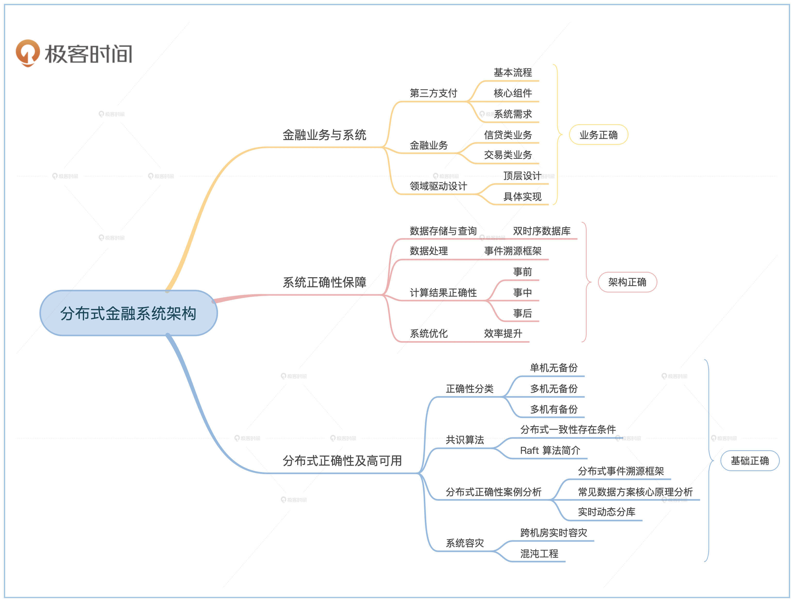

---
date: "2019-06-23"
---  
      
# 结束语 | 金融之道，与你同行，虽远尤欣
你好，我是任杰。

时光荏苒，转眼间就到了我们专栏的最后一讲，感谢你的一路相伴。这个专栏自夏蝉构思，于冬雪完稿。我们常说温故而知新，因此借着最后一课，我想再给你分享一下我自己学习分布式金融系统的思路。你可以把它当作一种思维方式去借鉴，也可以作为本专栏的学习指南。

作品都需要有一条主线，专栏也不例外。乍一看，你也许觉得这个专栏内容十分繁杂。开始从金融业务切入，几讲之后便过渡到软件工程，随后是平时我们很少见到的事件溯源架构和双时序数据库，最后还补充了一些看上去和金融无关的分布式系统知识。

其实每个部分深入下去都可以有精彩之处，但我每当此时便戛然而止，马上转入下一个话题，所以这个专栏难免有一种浅尝辄止的嫌疑。其实不然。金融系统强调的是正确性，这个问题我们在专栏最初就讨论过，而正确性的定义可大可小。这个专栏虽然内容繁多，但是如果**顺着正确性从大到小**的主线来看，一切存在便都合理了。

还记得我们在开篇词给到的**分布式金融系统全景图**么？这三个部分，分别对应的是**业务正确**、**架构正确**以及**基础正确**这三个维度。

往小了说，金融系统的每一行代码都需完成应尽之责，恰如其分，不多不少。代码构成的组件也应该完成组件应有的功能。这些组件之间的交互在一台机器的情况下，应该具有合适的正确性。而多台机器之间的交互，也应该具有一定的正确性。那么这些基础组件的正确性如何衡量，如何实现、如何选择、如何验证，便成了一个问题。这就是基础正确。

<!-- [[[read_end]]] -->

进一步说，正确的基础工具也需要有正确的用法，否则就如烧琴煮鹤，对花啜茶。用的方式各有千秋，但也不外乎事前、事中与事后三个阶段。事前须认真遴选数据，仔细斟酌数据的时间。事中处理要处处留痕，步步小心。事后要勇于自我怀疑，三省吾身。**组件于系统之中，犹如人于社会之中，需要往来交互彬彬有礼，应答有方。**这就是架构正确。

往大了说，正确地做事不如做正确的事。金融系统赋能于金融业务，系统为辅，业务为主。良相贤臣的辅佐不能只是一味的阿谀奉承，而是要既知晓熙熙攘攘，又心怀诗和远方。金融业务虽纷繁复杂，但金钱如水，来往之中不生不灭，不垢不净，不增不减。金钱的融通抽象出来就是信息的传递，因此信息系统的规律需要和金融业务的规律相互契合。这就是业务正确。

总结来说，金融业务纷繁复杂，因此学习金融架构须庖丁解牛。先识大体，从复杂业务中抓取脉络。再将业务脉络变为架构原则，做到神形兼备。最后仔细雕塑，以匠人之艺成百年之业。

正是这样的思路主导，所以我在讲解过程中，有意避免过于深陷细节。内容过深，容易只见树木不见森林，在吹毛求疵的过程中慢慢迷失正确的方向。因此专栏尝试立于核心的金融业务之上，鸟瞰金融软件架构。此为其一。

计算机是一门实践科学，讲求知行合一。而近世互联网的发展逐速而不守格，但欲速则不达，知其然也知所以然方为正道。再则金融关系国计民生，可大可小。根基不稳，大厦必倾。因此斟酌再三，行文兼顾实践同时，亦重底层逻辑。此为其二。

一二之选决定了这个专栏的行文考量。若有语焉不详之处，还望指摘。**金融之道，形单影只，与尔同行，虽远犹欣。**

最后，我给你准备了一份[毕业问卷](https://jinshuju.net/f/Zoh1Mo)，希望你能花两分钟填一下。非常期待你对这个专栏的评价与建议。