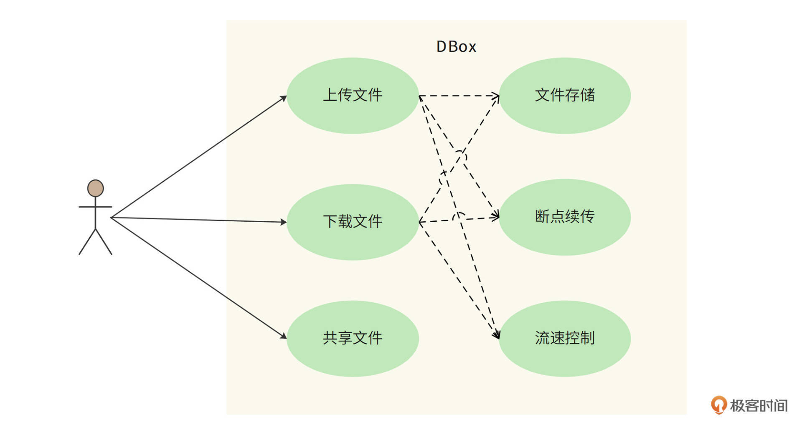
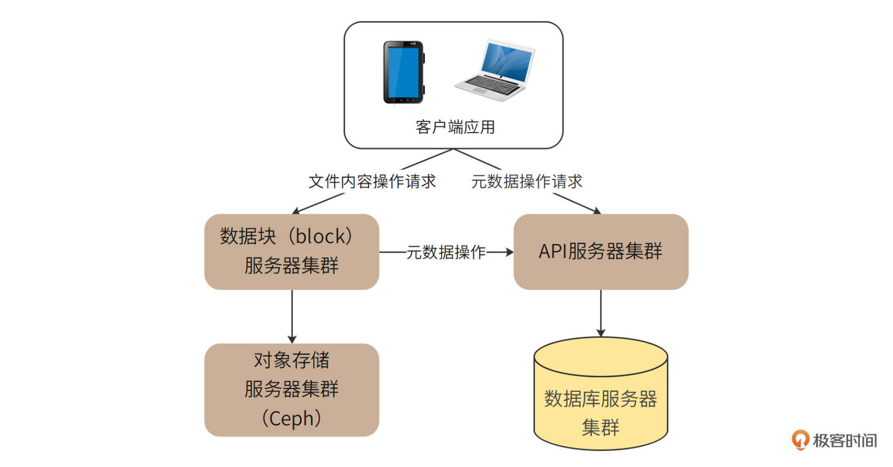
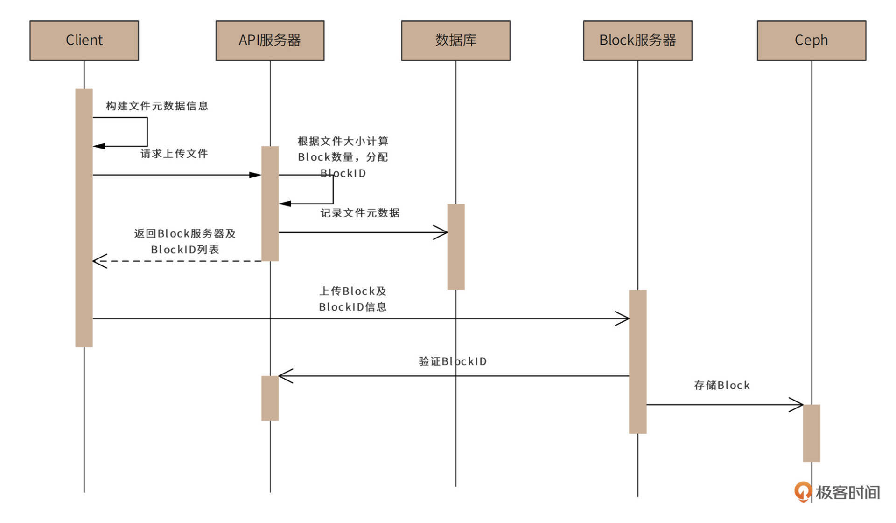
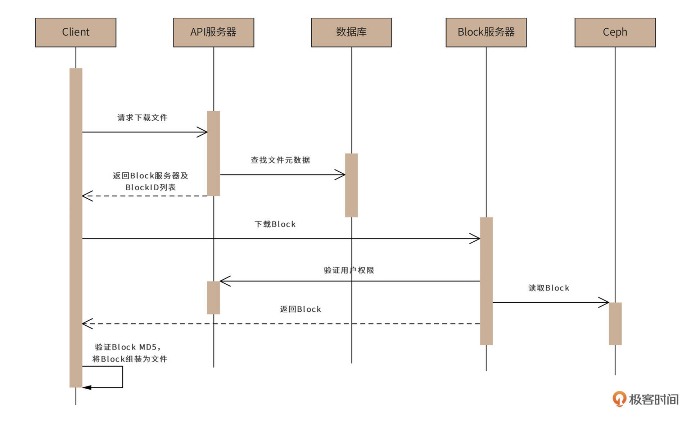
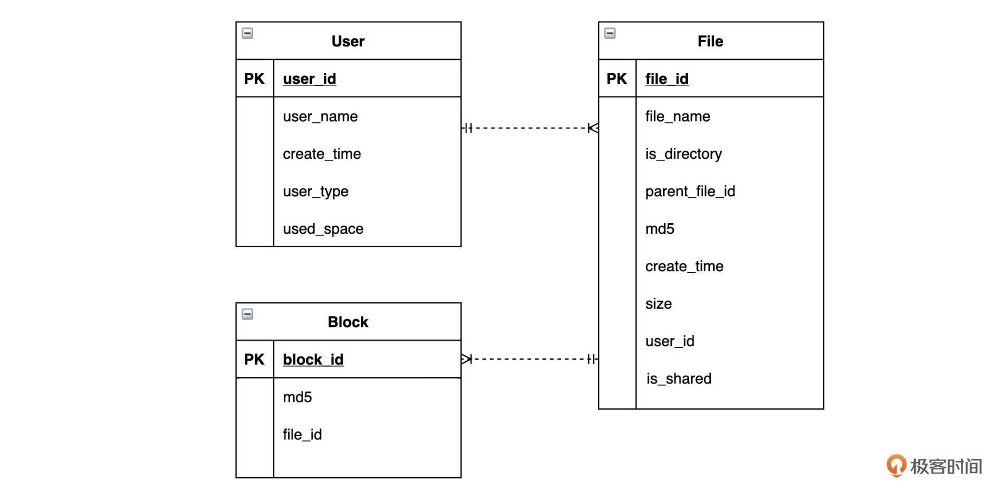
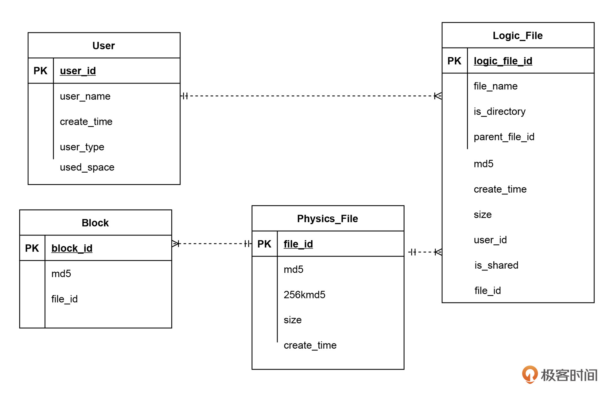

---
date: "2019-06-23"
---  
      
# 05 | 网盘系统设计：万亿 GB 网盘如何实现秒传与限速？
你好，我是李智慧。

网盘，又称云盘，是提供文件托管和文件上传、下载服务的网站（File hosting service）。人们通过网盘保管自己拍摄的照片、视频，通过网盘和他人共享文件，已经成为了一种习惯。我们准备开发一个自己的网盘应用系统，应用名称为“DBox”。

十几年前曾经有个段子，技术人员对老板说：您不能在公司电脑打开您家里电脑的文件，再贵的电脑也不能。事实上，随着网盘技术的成熟，段子中老板的需求已经成为现实：网盘可以自动将家里电脑的文件同步到公司电脑，老板可以在公司的电脑打开家里电脑的文件了。

网盘的主要技术挑战是**海量数据的高并发读写访问****。**用户上传的海量数据如何存储？如何避免部分用户频繁读写文件，消耗太多资源，而导致其他的用户体验不佳？我们看下DBox的技术架构以及如何解决这些问题。

## 需求分析

DBox的核心功能是提供文件上传和下载服务。基于核心功能，DBox需要在服务器端保存这些文件，并在下载和上传过程中实现断点续传。也就是说，如果上传或下载过程被中断了，恢复之后，还能从中断的地方重新上传或者下载，而不是从头再来。

DBox还需要实现文件共享的需求。使用DBox的不同用户之间可以共享文件，一个用户上传的文件共享给其他用户后，其他用户也可以下载这个文件。

<!-- [[[read_end]]] -->

此外，网盘是一个存储和网络密集型的应用，用户文件占据大量**硬盘资源**，上传、下载需要占用大量网络带宽，并因此产生较高的运营成本。所以用户体验需要向付费用户倾斜，DBox需要对上传和下载进行**流速控制**，保证付费用户得到更多的网络资源。DBox用例图如下。

#### 负载指标估算

DBox的设计目标是支持10亿用户注册使用，免费用户最大可拥有1TB存储空间。预计日活用户占总用户的20\%，即2亿用户。每个活跃用户平均每天上传、下载4个文件。

DBox的**存储量**、**吞吐量**、**带宽负载**估算如下。

* **总存储量**  
  理论上，总存储空间估算为10亿TB，即1万亿GB。

\$\\small 10亿\\times1TB=10亿TB\$

但考虑到大多数用户并不会完全用掉这个空间，还有很多用户存储的文件其实是和别人重复的（电影、电子书、软件安装包等），真正需要的存储空间大约是这个估算值的10\%，即1亿TB。

* **QPS**  
  系统需要满足的平均QPS约为10000。

\$\\small 2亿\\times4\\div（24\\times60\\times60）\\approx1万\$

高峰期QPS约为平均QPS的两倍，即2万。

* **带宽负载**  
  每次上传下载文件平均大小1MB，所以需要网络带宽负载10GB/s，即80Gb/s。

\$\\small 1万\\times1MB=10GB/s=80Gb/s\$

同样，高峰期带宽负载为160Gb/s。

#### 非功能需求

1.  大数据量存储：10亿注册用户，1000亿个文件，约1亿TB的存储空间。
2.  高并发访问：平均1万QPS，高峰期2万QPS。
3.  大流量负载：平均网络带宽负载80Gb/S，高峰期带宽负载160Gb/s。
4.  高可靠存储：文件不丢失，持久存储可靠性达到99.9999\% ，即100万个文件最多丢失（或损坏）1个文件。
5.  高可用服务：用户正常上传、下载服务可用性在99.99\%以上，即一年最多53分钟不可用。
6.  数据安全性：文件需要加密存储，用户本人及共享文件外，其他人不能查看文件内容。
7.  不重复上传：相同文件内容不重复上传，也就是说，如果用户上传的文件内容已经被其他用户上传过了，该用户不需要再上传一次文件内容，进而实现“秒传”功能。从用户视角来看，不到一秒就可以完成一个大文件的上传。

## 概要设计

网盘设计的关键是**元数据与文件内容的分离存储与管理**。所谓文件元数据就是文件所有者、文件属性、访问控制这些文件的基础信息，事实上，传统文件系统也是元数据与文件内容分离管理的，比如Linux的文件元数据记录在文件控制块FCB中，Windows的文件元数据记录在文件分配表FAB中，Hadoop分布式文件系统HDFS的元数据记录在NameNode中。

而DBox是将元信息存储在数据库中，文件内容则使用另外专门的存储体系。但是由于DBox是一个互联网应用，出于安全和访问管理的目的，并不适合由客户端直接访问存储元数据的数据库和存储文件内容的存储集群，而是通过API服务器集群和数据块服务器集群分别进行访问管理。整体架构如下图。

对于大文件，DBox不会上传、存储一整个的文件，而是将这个文件进行切分，变成一个个单独的Block，再将它们分别上传并存储起来。

这样做的核心原因是，DBox采用对象存储作为最终的文件存储方案，而对象存储不适合存储大文件，需要进行切分。而大文件进行切分还带来其他的好处：可以**以Block为单位进行上传和下载，提高文件传输速度**；客户端或者网络故障导致文件传输失败，也只需要重新传输失败的Block就可以，进而实现**断点续传**功能。

Block服务器就是负责Block上传和管理的。客户端应用程序根据API服务器的返回指令，将文件切分成一些Block，然后将这些Block分别发送给Block服务器，Block服务器再调用对象存储服务器集群，将Block存储在对象存储服务器中（DBox选择Ceph作为对象存储）。

用户上传文件的时序图如下。

用户上传文件时，客户端应用程序收集文件元数据，包括文件名、文件内容MD5、文件大小等等，并根据文件大小计算Block的数量（DBox设定每个block大小4MB），以及每个Block的MD5值。

然后客户端应用程序将全部元数据（包括所有Block的MD5值列表）发送给API服务器。API服务器收到文件元数据后，为每个Block分配全局唯一的BlockID（BlockID为严格递增的64位正整数，总可记录数据大小\$\\small 2\^\{64\}\\times4MB=180亿PB\$，足以满足DBox的应用场景）。

下一步，API服务器将文件元数据与BlockID记录在数据库中，并将BlockID列表和应用程序可以连接的Block服务器列表返回客户端。客户端连接Block服务器请求上传Block，Block服务器连接API服务器进行权限和文件元数据验证。验证通过后，客户端上传Block数据，Block服务器再次验证Block数据的MD5值，确认数据完整后，将BlockID和Block数据保存到对象存储集群Ceph中。

类似的，用户下载文件的时序图如下。

客户端程序访问API服务器，请求下载文件。然后API服务器会查找数据库，获得文件的元数据信息，再将元数据信息中的文件BlockID列表及可以访问的Block服务器列表返回给客户端。

下一步，客户端访问Block服务器，请求下载Block。Block服务器验证用户权限后，从Ceph中读取Block数据，返回给客户端，客户端再将返回的Block组装为文件。

## 详细设计

为解决网盘的三个重要问题：元数据如何管理？网络资源如何向付费用户倾斜？如何做到不重复上传？DBox详细设计将关注元数据库、上传下载限速、秒传的设计实现。

#### 元数据库设计

元数据库表结构设计如下。

从图中可以看出，元数据库表结构中主要包括三个表，分别是User用户表、File文件表和Block数据块表，表的用途和包含的主要字段如下：

1.  User用户表记录用户基本信息：用户名、创建时间、用户类型（免费、VIP）、用户已用空间、电话号码、头像等等。
2.  File文件表记录文件元信息：文件名、是否为文件夹、上级文件夹、文件MD5、创建时间、文件大小、文件所属用户、是否为共享文件等。
3.  Block数据块表记录Block数据，包括BlockID、Block MD5、对应文件等。

其中，User表和File表为一对多的关系，File表和Block表也是一对多的关系。

这3种表的记录数都是百亿级以上，所以元数据表采用**分片的关系数据库**存储。

因为查询的主要场景是根据用户ID查找用户信息和文件信息，以及根据文件ID查询block信息，所以User和File表都采用user\_id作为分片键，Block表采用file\_id作为分片键。

#### 限速

DBox根据用户付费类型决定用户的上传、下载速度。而要控制上传、下载速度，可以通过限制并发Block服务器数目，以及限制Block服务器内的线程数来实现。

具体过程是，客户端程序访问API服务器，请求上传、下载文件的时候，API服务器可以根据用户类型，决定分配的Block服务器数目和Block服务器内的服务线程数，以及每个线程的上传、下载速率。

Block服务器会根据API服务器的返回值，来控制客户端能够同时上传、下载的Block数量以及传输速率，以此对不同用户进行限速。

#### 秒传

秒传是用户快速上传文件的一种功能。

事实上，网盘保存的很多文件，内容其实是重复的，比如电影、电子书等等。一方面，重复上传这些文件会加大网盘的存储负载压力；另一方面，每次都要重新上传重复的内容，会导致用户网络带宽的浪费和用户等待时间过长的问题。

所以，在设计中，物理上相同的文件，DBox只会保存一份。用户每次上传文件时，DBox都会先在客户端计算文件的MD5值，再根据MD5值判断该文件是否已经存在。对于已经存在的文件，只需要建立用户文件和该物理文件的关联即可，并不需要用户真正上传该文件，这样就可以实现秒传的功能。

但是，计算MD5可能会发生Hash冲突，也就是不同文件算出来的MD5值是相同的，这样会导致DBox误判，将本不相同的文件关联到一个物理文件上。不但会使上传者丢失自己的文件，还会被黑客利用：上传一个和目标文件MD5相同的文件，然后就可以下载目标文件了。

所以，DBox需要通过更多信息判断文件是否相同：**只有文件长度、文件开头256KB的MD5值、文件的MD5值，三个值都相同，才会认为文件相同**。当文件长度小于256KB，则直接上传文件，不启用秒传功能。

为此，我们需要将上面的元数据库表结构进行一些改动，将原来的File表拆分成物理文件表Physics\_File和逻辑文件表Logic\_File。其中，Logic\_File记录用户文件的元数据，并和物理文件表Physics\_File建立多对1关联关系，而Block表关联的则是Physics\_File表，如下。

Physics\_File中字段md5和256kmd5字段分别记录了文件MD5和文件头256KB的MD5数据，而size记录了文件长度，只有这三个字段都相同才会启用秒传。

## 小结

我们在需求分析中讨论过，DBox需要支持大数据量存储、高并发访问、高可用服务、高可靠存储等非功能需求。事实上，对于网盘应用而言，元数据API服务其实和一般的高并发互联网系统网关没有太大差别。真正有挑战的是海量文件的高可用存储，而这一挑战，在DBox中，被委托给了分布式对象存储Ceph来完成。而Ceph本身设计就是支持大数据量存储、高并发访问、高可用服务、高可靠存储的。

架构师按照职责，可以分成两种，一种是**应用系统架构师**，负责设计、开发类似网盘、爬虫这样的应用系统；另一种是**基础设施架构师**，负责设计、开发类似Ceph、HDFS这样的基础设施系统。

应用架构师需要掌握的技术栈更加**广泛**，要能够掌握各种基础设施技术的特性，并能根据业务特点选择最合适的方案；而基础设施架构师需要的技术栈更加**深入**，需要掌握计算机软硬件更深入的知识，才能开发出一个稳定的基础技术产品。

当然，最好的架构师应该是技术栈既广泛又深入，既能灵活应用各种基础设施来开发应用系统，也能在需要的时候自己动手开发新的基础设施系统。

我们专栏大部分案例都是关于应用的，但是也不乏关于编程框架、限流器、安全防火墙、区块链等基础设施的案例。你也可以在学习的过程中，感受下这两种系统的设计方案和技术关键点的不同。

## 思考题

网盘元数据存储采用分片的关系数据库方案，查询目录和文件都比较简单，但是性能也比较差。而且文件表按用户ID分片，如果某个用户创建大量文件，还会导致分片不均衡，你有什么优化的手段和方法吗？

欢迎在评论区分享你的思考，或者提出对这个设计文档的评审意见，我们共同进步。