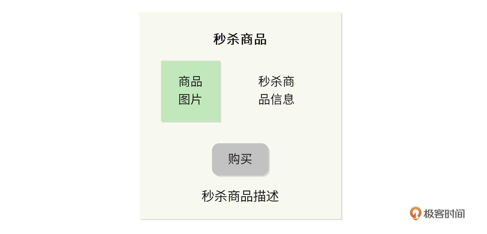
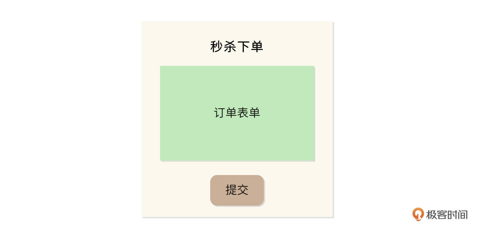
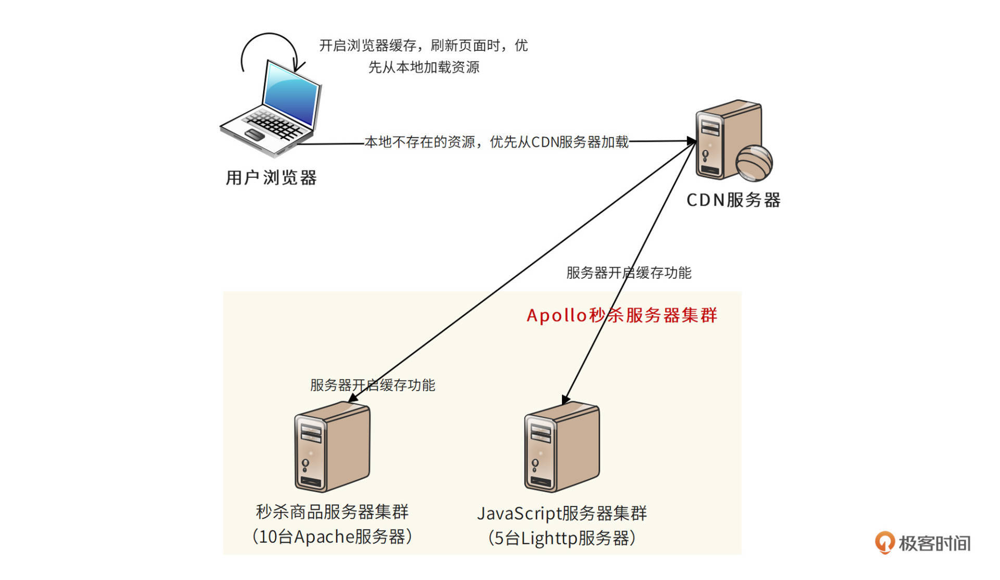
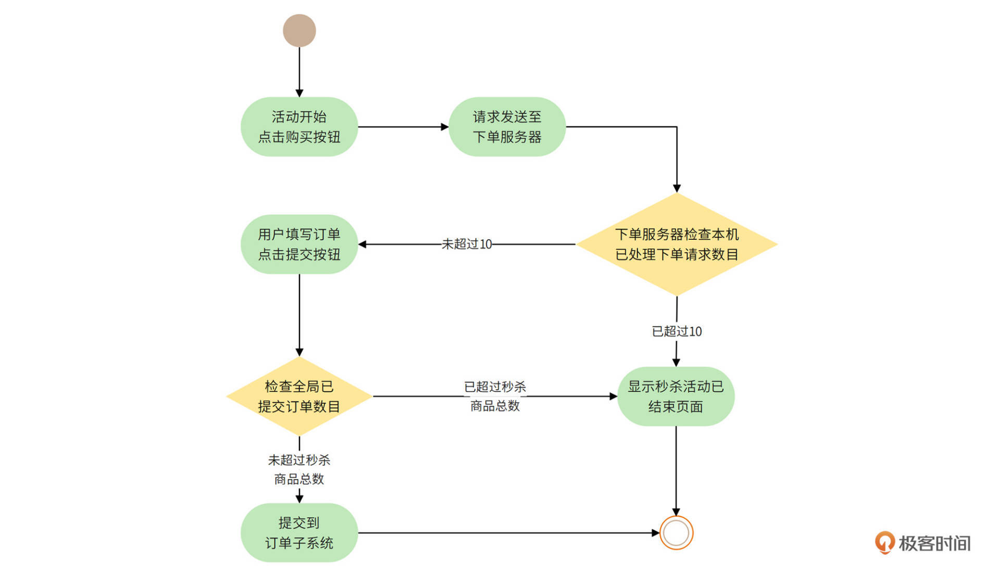
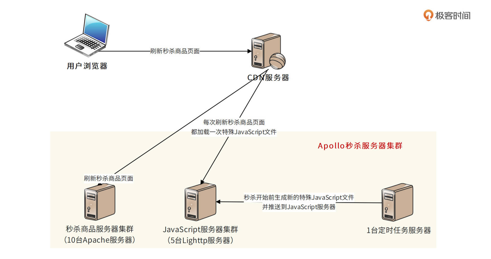
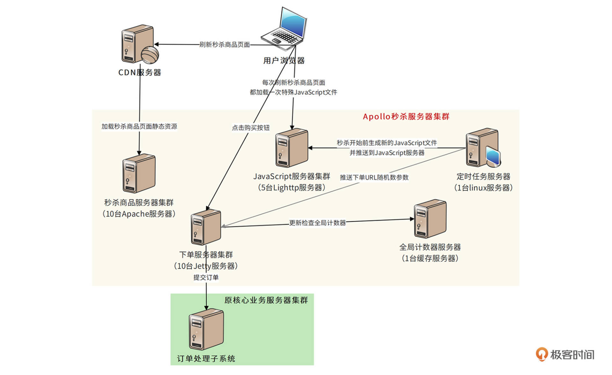

---
date: "2019-06-23"
---  
      
# 08 | 秒杀系统设计：你的系统可以应对万人抢购盛况吗？
你好，我是李智慧。

秒杀是电子商务应用常见的一种营销手段：将少量商品（常常只有一件）以极低的价格，在特定的时间点出售。比如，周日晚上8点整，开售1部1元钱的手机。 因为商品价格诱人，而且数量有限，所以用户趋之若鹜，在秒杀活动开始前涌入系统， 等到秒杀活动开始的一瞬间，点下购买按钮（在此之前购买按钮为灰色，不可以点击），抢购商品。

秒杀虽然对应用推广有很多好处，但是对系统技术却是极大的挑战：系统是为正常运营设计的，而秒杀活动带来的并发访问用户却是平时的数百倍甚至上千倍。也就是说，秒杀的时候，系统需要承受比平时多得多的负载压力。

为了应对这种比较特殊的营销活动，我们启动了一个专门的秒杀项目，项目代号是“Apollo”。Apollo的核心挑战是：如何应对突然出现的数百倍高并发访问压力，并保证用户只有在秒杀开始时才能下单购买秒杀商品？接下来我们就看看Apollo的需求与技术架构吧。

## 需求分析

Apollo的需求主要有两点。

* **独立开发部署秒杀系统，避免影响现有系统和业务**

秒杀活动只是网站营销的一个附加活动，这个活动具有时间短、瞬间并发访问量大的特点，如果和网站原有应用部署在一起，必然会对现有业务造成冲击，稍有不慎可能导致整个系统瘫痪。

<!-- [[[read_end]]] -->

而且由于秒杀时的最高并发访问量巨大，整个电商系统需要部署比平常运营多好几倍的服务器，而这些服务器在绝大部分时候都是用不着的，浪费惊人。所以秒杀业务不能使用正常的电商业务流程，也不能和正常的网站交易业务共用服务器，甚至域名也需要使用自己独立的域名。总之，我们需要设计部署专门的秒杀系统，进行专门应对。

* **防止跳过秒杀页面直接下单**

秒杀的游戏规则是：到了秒杀时间才能开始对商品下单购买。在此时间点之前，只能浏览商品信息，不能下单。而下单页面也是一个普通的 URL，如果得到这个 URL，不用等到秒杀开始就可以下单了。秒杀系统 Apollo 必须避免这种情况。

## 概要设计

Apollo要解决的核心问题有：

1.  如何设计一个独立于原有电子商务系统的秒杀系统，并独立部署。
2.  这个秒杀系统如何承受比正常情况高数百倍的高并发访问压力。
3.  如何防止跳过秒杀页面获得下单URL。  
    我们将讨论这三个问题的解决方案，并设计秒杀系统部署模型。

#### 独立秒杀系统页面设计

秒杀系统为秒杀而设计，不同于一般的网购行为，参与秒杀活动的用户更关心的是如何能快速刷新商品页面，在秒杀开始的时候抢先进入下单页面，而不是精细的商品描述等用户体验细节，因此秒杀系统的页面设计应尽可能简单。秒杀商品页面如图。

商品页面中的购买按钮只有在秒杀活动开始时才变亮，在此之前以及秒杀商品卖出后，该按钮都是灰色的，不可以点击。 秒杀时间到，购买按钮点亮，点击后进入下单页面，如图。

下单表单也尽可能简单，购买数量只能是一个且不可以修改，送货地址和付款方式都使用用户默认设置，没有默认也可以不填，允许等订单提交后修改；只有第一个提交的订单发送给订单子系统，才能成功创建订单，其余用户提交订单后只能看到秒杀结束页面。

秒杀系统只需要设计购买和下单两个页面就可以了，因为不管有多少用户来参与秒杀，只有第一个提交下单的用户才能秒杀成功，因此提交订单并创单成功的用户只有一个，这个时候就没有什么高并发了。所以订单管理、支付以及其他业务都可以使用原来的系统和功能。

#### 秒杀系统的流量控制

高并发的用户请求会给系统带来巨大的负载压力，严重的可能会导致系统崩溃。虽然我们设计并

部署了独立的秒杀系统，秒杀时的高并发访问压力只会由秒杀系统承担，不会影响到主站的电子商务核心系统，但是秒杀系统的高并发压力依然不容小觑。

此外，秒杀系统为了提高用户参与度和可玩性，秒杀开始的时候，浏览器或App并不会自动点亮购买按钮，而是要求用户不停刷新页面，使用户保持一个高度活跃的状态。但是这样一来，用户在秒杀快要开始的时候拼命刷新页面，会给系统带来更大的高并发压力。

我们知道，**缓存是提高响应速度、降低服务器负载压力的重要手段**。所以，控制访问流量、降低系统负载压力的第一个设计方案就是使用缓存。Apollo采用多级缓存方案，可以更有效地降低服务器的负载压力。

首先，浏览器尽可能在本地缓存当前页面，页面本身的HTML、JavaScript、CSS、图片等内容全部开启浏览器缓存，刷新页面的时候，浏览器事实上不会向服务器提交请求，这样就避免了服务器的访问负载压力。

其次，秒杀系统还使用CDN缓存。CDN即内容分发网络，是由网络运营服务商就近为用户提供的一种缓存服务。秒杀相关的HTML、JavaScript、CSS、图片都可以缓存到CDN中，秒杀开始前，即使有部分用户新打开浏览器，也可以通过CDN加载到这些静态资源，不会访问服务器，又一次避免了服务器的访问负载压力。

同样，秒杀系统中提供HTML、JavaScript、CSS、图片的静态资源服务器和提供商品浏览的秒杀商品服务器也要在本地开启缓存功能，进一步降低服务器的负载压力。

使用多级缓存的秒杀系统部署图如下。

以上是针对秒杀开始前，缓存可以降低用户频繁刷新给服务器造成的流量压力。但是秒杀开始后，用户购买和下单的并发请求就不能使用缓存了，但我们仍然需要对高并发的请求流量进行控制。因此，秒杀开始后，秒杀系统会使用一个**计数器**对并发请求进行限流处理，如下图。

因为最终成功秒杀到商品的用户只有一个，所以需要在用户提交订单时，检查是否已经有其他用户提交订单。事实上，为了减轻下单页面服务器的负载压力，可以控制进入下单页面的入口，只有少数用户能进入下单页面，其他用户则直接进入秒杀结束页面。假设下单服务器集群有 10 台服务器，每台服务器只接受最多10个下单请求，这样整个系统只需要承受100并发就可以了，而秒杀成功的用户也只能出现在这100并发请求中。

事实上，限流是一种非常常用的高并发设计方案，我们会在下个模块专门设计一个通用的限流器。通过缓存和限流这两种设计方案，已经可以应对绝大多数情况下秒杀带来的高并发压力。

#### 秒杀商品页面购买按钮点亮方案设计与下单URL下发

前面说过，购买按钮只有在秒杀活动开始时才能点亮，在此之前是灰色的。如果该页面是动态生成的，当然可以在服务器端构造响应页面输出，控制该按钮是灰色还是点亮。但是在前面的设计中，为了减轻服务器端负载压力，更好地利用CDN、反向代理等性能优化手段，该页面被设计成了静态页面，缓存在 CDN、秒杀商品服务器，甚至用户浏览器上。秒杀开始时，用户刷新页面，请求根本不会到达应用服务器。

因此，我们需要在秒杀商品静态页面中加入一个特殊的 JavaScript 文件，这个JavaScript 文件设置为不被任何地方缓存。秒杀未开始时，该JavaScript文件内容为空。当秒杀开始时，定时任务会生成新的 JavaScript 文件内容，并推送到JavaScript服务器。

新的JavaScript文件包含了秒杀是否开始的标志和下单页面 URL 的随机数参数。当用户刷新页面时，新JavaScript文件会被用户浏览器加载，根据JavaScript中的参数控制秒杀按钮的点亮。当用户点击按钮时，提交表单的URL参数也来自这个JavaScript文件，如图。

这个JavaScript文件还有一个优点，那就是它本身非常小，即使每次浏览器刷新都访问 JavaScript 文件服务器，也不会对服务器集群和网络带宽造成太大压力。

#### 秒杀系统部署模型

综上设计方案，Apollo 系统整体部署模型如下。

用户在浏览器打开秒杀商品页面，浏览器检查本地是否有缓存该商品信息。如果没有，就通过CDN加载，如果CDN也没有，就访问秒杀商品服务器集群。

用户刷新页面时，除了特殊JavaScript文件，其他页面和资源文件都可以通过缓存获得，秒杀没开始的时候，特殊JavaScript文件内容是空的，所以即使高并发也没有什么负载和带宽访问压力。秒杀开始时，定时任务服务器会推送一个包含点亮按钮指令和下单URL内容的新JavaScript文件，用来替代原来的空文件。用户这时候再刷新就会加载该新的JavaScript文件，使购买按钮点亮，并能进入下单页面。

下单URL中会包含一个随机数，这个随机数也会由定时任务推送给下单服务器，下单服务器收到用户请求的时候，检查请求中包含的随机数是否正确，即检查该请求是否是伪造的。

进入下单服务器的请求会被服务器进行限流处理，每台服务器超过10个的请求会被重定向到秒杀结束页面。只有前十个请求返回下单页面。用户填写下单页面并提交到下单服务器后，需要通过全局计数器进行计数。全局计数器会根据秒杀商品库存数量，确定允许创单的请求个数，超过这个数目的请求也将重定向到秒杀结束页面。最终只有有限的几个用户能够秒杀成功，进入订单处理子系统，完成交易。

## 小结

这个文档是根据某互联网大厂真实案例改编的。当年该厂为了配合品牌升级，搞了一次大规模的营销活动，秒杀是整个营销活动的一部分。运营团队在投放了大量广告并确定了秒杀活动的开始时间后才通知技术部：我们准备在一周后搞一个秒杀活动，预计参加秒杀的人数是正常访问人数的几百倍。

当时参加会议的架构师们面面相觑，时间太短，并发量太高，谁也不敢贸然接手。最后有个架构师站出来接手了这个项目，并最终完成了秒杀活动。此后，这名架构师成了公司的红人，短短几年晋升为集团副总裁，负责一个有十多亿用户、几乎所有中国人都耳熟能详的互联网应用。

我们现在重新把这个设计拿出来复盘，看起来技术含量也不过如此。那么如果把你放到当时的会议现场，你是否有勇气站出来说：“我来。”

对一个架构师而言，精通技术是重要的，而用技术建立起自己的信心，在关键时刻有勇气面对挑战更重要。**人生的道路虽然漫长，但是紧要处可能只有几秒**。这几秒是秒杀系统高并发访问高峰的那几秒，也是面对挑战迎难而上站出来的那几秒。

## 思考题

Apollo秒杀系统针对的是大量用户在短时间购买极少数商品的情况，通过限流器拦截大量用户请求，进而降低系统负载压力的设计思路。那么对于大量用户在短时间购买大量商品的情况，比如双十一这种电商大促场景，设计方案又非常不同，你有什么样的设计思路呢？

欢迎在评论区分享你的思考，或者提出对这个设计文档的评审意见，我们共同进步。