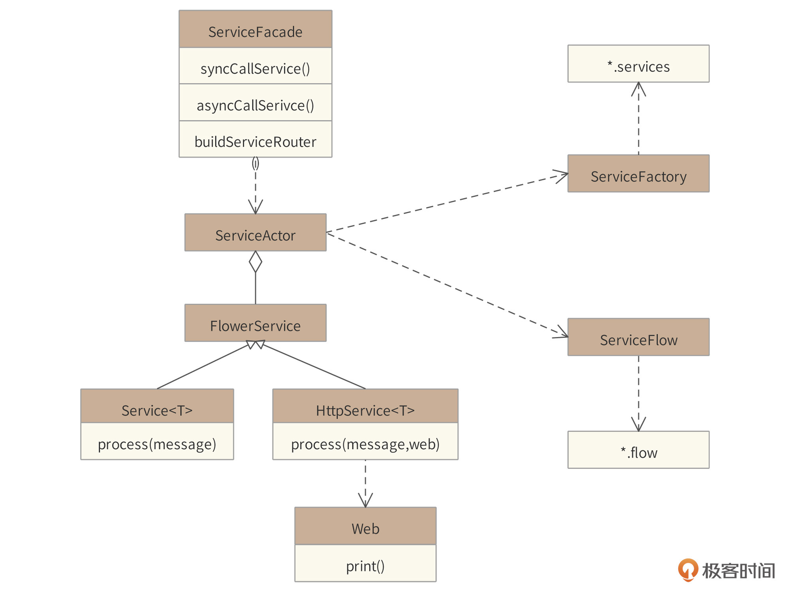
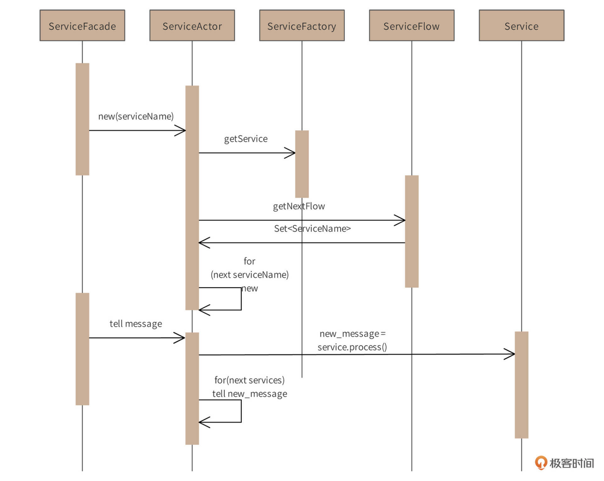

---
date: "2019-06-23"
---  
      
# 11 | 反应式编程框架设计：如何使方法调用无阻塞等待？
你好，我是李智慧。

反应式编程本质上是一种异步编程方案，在多线程（协程）、异步方法调用、异步I/O访问等技术基础之上，提供了一整套与异步调用相匹配的编程模型，从而实现程序调用非阻塞、即时响应等特性，即开发出一个反应式的系统，以应对编程领域越来越高的并发处理需求。

反应式系统应该具备如下的4个特质。

* **即时响应**：应用的调用者可以即时得到响应，无需等到整个应用程序执行完毕。也就是说应用调用是非阻塞的。
* **回弹性**：当应用程序部分功能失效的时候，应用系统本身能够进行自我修复，保证正常运行，保证响应，不会出现系统崩溃和宕机的情况。
* **弹性**：系统能够对应用负载压力做出响应，能够自动伸缩以适应应用负载压力，根据压力自动调整自身的处理能力，或者根据自身的处理能力，调整进入系统中的访问请求数量。
* **消息驱动**：功能模块之间、服务之间通过消息进行驱动，以完成服务的流程。

目前主流的反应式编程框架有RxJava、Reactor等，它们的主要特点是基于**观察者设计模式**的异步编程方案，编程模型采用函数式编程。

观察者模式和函数式编程有自己的优势，但是反应式编程并不是必须用观察者模式和函数式编程。我们准备开发一个纯消息驱动，完全异步，支持命令式编程的反应式编程框架，框架名称为“Flower”。

<!-- [[[read_end]]] -->

## 需求分析

互联网及物联网场景下的应用系统开发，基本上都是高并发系统开发。也就是说，在同一个时刻，会有大量的用户或设备请求到达系统，进行计算处理。但是传统的编程模型都是阻塞式编程，阻塞式编程有什么特点，会产生什么问题呢？我们来看一段代码示例。

```
    void a(){
      ....
      int x = m();
      int y = n();
      return x + y;
    }
    

```

在方法a中调用了方法m，那么在方法m返回之前，就不会调用方法n，即方法a被方法m阻塞了。这种编程模型下，方法m和方法n不能同时执行，系统的运行速度就不会快，并发处理能力就不会很高。

还有更严重的情况。服务器通常为每个用户请求创建一个线程，而创建的总线程数是有限的，每台服务器通常几百个。如果方法m是一个远程调用，处理比较慢，当方法a调用方法m时，执行方法a的线程就会被长期挂起，无法释放。如果所有线程都因为方法m而无法释放，导致服务器线程耗尽，就会使服务器陷入假死状态，外部表现就是服务器宕机，失去响应，系统严重故障。

Flower框架应该满足如下典型Web应用的线程特性。


当并发用户请求到达应用服务器时，Web容器线程不需要执行应用程序代码，它只是将用户的HTTP请求变为请求对象，将请求对象异步交给Flower框架的Service去处理，而Web容器线程自身立刻就返回。

如果是传统的阻塞式编程，Web容器线程要完成全部的请求处理操作，直到返回响应结果才能释放线程，所以需要很多Web容器线程。但使用Flower框架只需要极少的容器线程就可以处理较多的并发用户请求，而且容器线程不会阻塞。

同样，在Flower框架中，用户请求交给业务Service对象以后，Service之间依然是使用异步消息通讯而非阻塞式的调用。一个Service完成业务逻辑处理计算以后，会返回一个处理结果，这个结果会以消息的方式异步发送给下一个Service。

## 概要设计

Flower框架实现异步无阻塞，一方面是利用了Java Web容器的异步特性，主要是Servlet3.0以后提供的AsyncContext，快速释放容器线程；另一方面则利用了异步的数据库驱动和异步的网络通信，主要是HttpAsyncClient等异步通信组件。而Flower框架内，核心应用代码之间的异步无阻塞调用，则是利用了Akka 的Actor模型。

Akka Actor的异步消息驱动实现如下。


一个Actor向另一个Actor发起通讯时，当前Actor就是一个消息的发送者Sender，它需要获得另一个Actor的ActorRef，也就是一个引用，通过引用进行消息通信。而ActorRef收到消息以后，会将这个消息放到目标Actor的Mailbox里面，然后就立即返回了。

也就是说，一个Actor向另一个Actor发送消息时，不需要等待对方真正地处理这个消息，只需要将消息发送到目标Actor的Mailbox里面就可以了。Sender不会被阻塞，可以继续执行自己的其他操作。而目标Actor检查自己的Mailbox中是否有消息，如果有，则从Mailbox里面获取消息，并进行异步的处理。而所有的Actor会共享线程，这些线程不会有任何的阻塞。

但是Actor编程模型无法满足人们日常的编程习惯以及Flower的命令式编程需求，所以我们需要将Akka Actor封装到一个Flower的编程框架中，并通过Flower提供一个新的编程模型。

Flower基于Akka的Actor进行开发，将Service封装到Actor里面，并且将Actor收到的消息作为参数传入Service进行调用。

Flower框架的主要元素包括：Flower Service（服务）、Flower 流程和Flower容器。其中，Service实现一个细粒度的服务功能，Service之间会通过Message关联，前一个Service的返回值（Message），必须是后一个Service的输入参数（Message）。而Flower容器就负责在Service间传递Massage，从而使Service按照业务逻辑编辑成一个Flow（流程）。

在Flower内部，消息是一等公民，基于Flower开发的应用系统是面向消息的应用系统。消息由Service产生，是Service的返回值；同时消息也是Service的输入。前一个Service的返回消息是下一个Service的输入消息，**没有耦合**的Service正是通过消息关联起来，组成一个Service流程，并最终构建出一个拥有完整处理能力的应用系统。流程举例：

```
    // -> service1 -> service2 -> service5 -> service4
    //      ^      |             ^              |
    //      |       -> service3 -|              |
    //      |___________________________________|
    

```

## 详细设计

Flower核心类图如下。



Flower框架核心关键类及其职责如下：

1.  Service以及HttpService接口是框架的编程核心，开发者开发的Service需要实现Service或者HttpService接口。HttpService与Service的不同在于HttpService在接口方法中传递Web参数，开发者利用Web接口可以将计算结果直接print到HTTP客户端；
2.  ServiceFactory负责用户以及框架内置的service实例管理（加载\*.services文件）；
3.  ServiceFlow负责流程管理（加载\*.flow文件）；
4.  ServiceActor将Service封装到Actor。

Flower初始化及调用时序图如下。



图中包含两个过程，第一个过程是**服务流程初始化**过程。首先，开发者通过ServiceFacade调用已经定义好的服务流程。然后，ServiceFacade根据传入的flow名和service名，创建第一个ServiceActor。这个ServiceActor将通过ServiceFactory来装载Service实例，并通过ServiceFlow获得当前Service在流程中所配置的后续Service（可能有多个）。依此递归，创建后续Service的ServiceActor，并记录其对应的ActorRef。

时序图中的第二个过程是**消息流处理**过程。调用者发送给ServiceFacade的消息，会被flow流程中的第一个ServiceActor处理，这个ServiceActor会调用对应的Service实例，并将Service实例的返回值作为消息发送给流程定义的后续ServiceActor。

使用Flower框架开发应用程序，就是开发各种Service，开发服务Service类必须实现Flower框架的Service接口或者HTTP接口，在process方法内完成服务业务逻辑处理。Service代码示例如下。

```
    public class UserServiceA implements Service<User, User> {
      static final Logger logger = LoggerFactory.getLogger(UserServiceA.class);
      @Override
      public User process(User message, ServiceContext context) throws Throwable {
        message.setDesc(message.getDesc() + " --> " + getClass().getSimpleName());
        message.setAge(message.getAge() + 1);
        logger.info("结束处理消息, message : {}", message);
        return message;
      }
    }
    

```

#### 服务注册

开发者开发的服务需要在Flower中注册才可以调用，Flower提供两种服务注册方式：配置文件方式和编程方式。

编程方式示例如下。

```
     ServiceFactory serviceFactory = flowerFactory.getServiceFactory();
     serviceFactory.registerService(UserServiceA.class.getSimpleName(), UserServiceA.class);
     serviceFactory.registerService(UserServiceB.class.getSimpleName(), UserServiceB.class);
     serviceFactory.registerService(UserServiceC1.class.getSimpleName(), UserServiceC1.class);
    

```

配置文件方式支持用配置文件进行注册，服务定义配置文件扩展名: .services，放在classpath下，Flower框架自动加载注册，比如flower\_test.services。配置文件内容如下。

```
    UserServiceA = com.ly.train.flower.base.service.user.UserServiceA
    UserServiceB = com.ly.train.flower.base.service.user.UserServiceB
    UserServiceC1 = com.ly.train.flower.base.service.user.UserServiceC1
    

```

#### 流程编排

在Flower中，服务之间的依赖关系不能通过传统的服务之间依赖调用实现，如开头的方法a调用方法m那样。而需要通过流程编排方式，实现服务间依赖。服务编排方式也有两种，配置文件方式和编程方式。

下面的例子演示的是以**编程方式**编排流程。

```
    // UserServiceA -> UserServiceB -> UserServiceC1
    final String flowName = "flower_test";
    ServiceFlow serviceFlow = serviceFactory.getOrCreateServiceFlow(flowName);
    serviceFlow.buildFlow(UserServiceA.class, UserServiceB.class);
    serviceFlow.buildFlow(UserServiceB.class, UserServiceC1.class);
    serviceFlow.build();
    

```

而流程**配置文件方式**则使用扩展名: .flow，放在classpath下，Flower框架会自动加载编排流程。 比如flower\_test.flow，文件名flower\_test就是流程的名字，流程执行时需要指定流程名。配置文件内容示例如下。

```
    UserServiceA -> UserServiceB
    UserServiceB -> UserServiceC1
    

```

我们将服务Service代码开发好，注册到了Flower框架中，并通过流程编排的方式编排了这几个Service的依赖关系，后面就可以用流程名称进行调用了。调用代码示例如下，其中flowName是流程的名字，user是流程中的一个Service名，是流程开始的Service。

```
    final FlowRouter flowRouter = flowerFactory.buildFlowRouter(flowName, 16);
    flowRouter.asyncCallService(user);
    

```

Flower框架源代码及更多资料可参考 <https://github.com/zhihuili/flower>。

## 小结

架构师是一个技术权威，他应该是团队中最有技术影响力的那个人。所以，架构师需要具备卓越的代码能力，否则就会沦为PPT架构师。PPT架构师可以一时成为团队的焦点，但是无法长远让大家信服。

那么架构师应该写什么样的代码？架构师如果写的代码和其他开发工程师的代码一样，又何以保持自己的技术权威，实现技术领导？简单来说，代码可以分成两种，一种代码是给最终用户使用的，处理用户请求，产生用户需要的结果；另一种是给开发工程师使用的，各种编程语言、数据库、编译器、编程框架、技术工具等等。

编程语言、数据库这些是业界通用的，但是编程框架、技术工具，每个公司都可以依据自身的业务特点，开发自己的框架和工具。而架构师应该是开发框架的那个人，每个开发工程师都使用架构师的开发框架以及约定的编程规范开发代码。架构师通过这种方式落地自己的架构设计，保持自己的技术影响。

也许你的开发中不会用到反应式编程，你可能也不需要深入学习Flower框架如何设计、如何使用。但是希望你能通过本文学习到如何设计一个编程框架，结合你所在公司的业务场景，将来开发一个你自己的编程框架。

## 思考题

Flower纯消息驱动、异步无阻塞的优良特点，适合许多对并发处理要求高，需要快速、及时响应的场景，你能想到的现实应用场景有哪些呢？

欢迎在评论区分享你的思考，我们共同进步。