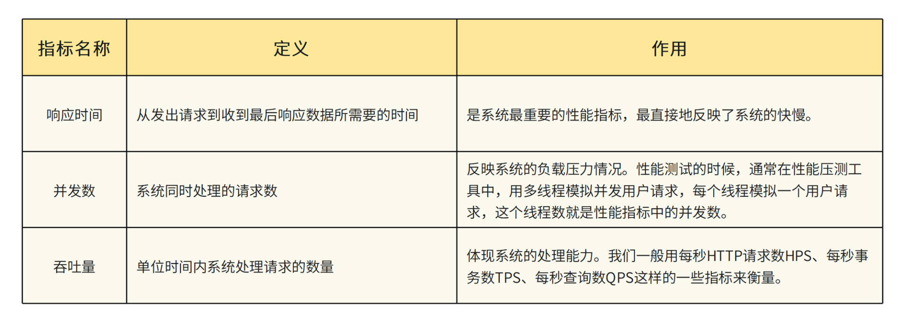
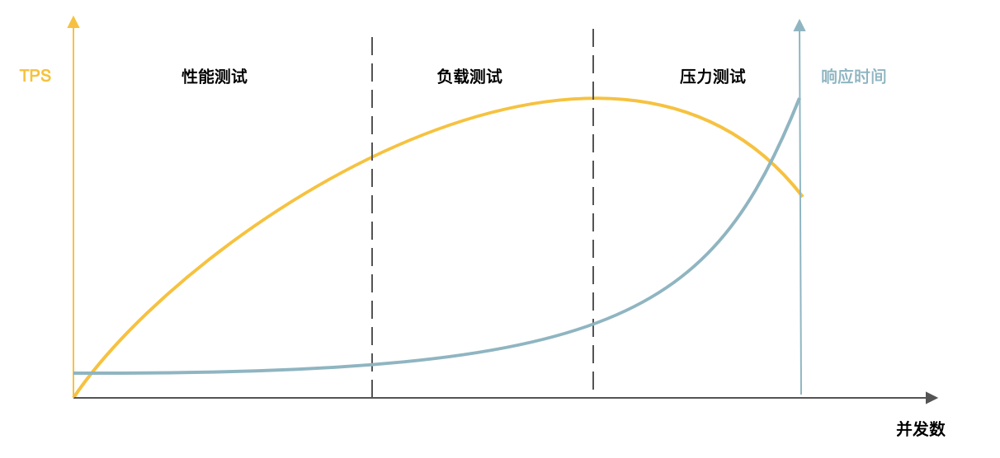
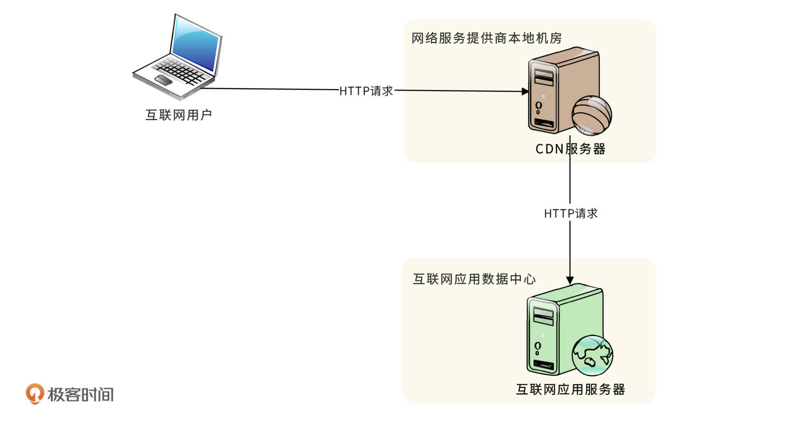
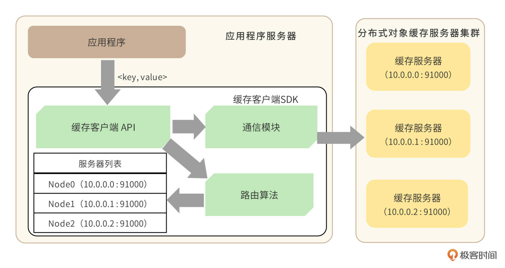

---
date: "2019-06-23"
---  
      
# 12 | 高性能架构的三板斧：分析系统性能问题从哪里入手？
你好，我是李智慧。

我们在讨论高性能架构之前，需要先聊聊什么叫高性能，以及如何量化地测试系统的性能。在[02讲](https://time.geekbang.org/column/article/487665)中，我们讨论了一些和并发相关的指标。事实上，并发数正是系统性能的核心指标之一，因为高并发会引起系统资源短缺，来不及处理用户请求，就会导致系统性能下降。

除了系统并发数，一般说来，和系统性能相关的量化指标还有响应时间和吞吐量。在前面的案例分析中，我们也多次估算过响应时间和吞吐量。我们再重新回顾下这几个指标的定义。

吞吐量、响应时间和并发数三者之间是有关联性的。\$\\small 吞吐量 = 并发数\\div响应时间\$。并发数不变，响应时间足够快，那么单位时间的吞吐量就会相应地提高。

以上这些性能指标，我们可以在系统运行期通过监控系统获取，也可以在系统上线前通过性能测试来获取，以此来了解我们系统的性能特性，以及判断系统能否承受预期的高并发压力。

## 性能测试

性能测试就是使用性能测试工具，通过多线程模拟用户请求，对系统施加高并发的访问压力，得到以上这些性能指标。事实上，随着请求线程数，即并发数逐渐增加，系统的吞吐量和响应时间会呈现出不同的性能特性。具体说来，整个测试过程又可细分为性能测试、负载测试、压力测试三个阶段。

<!-- [[[read_end]]] -->

**性能测试**是以系统设计初期规划的性能指标为预期目标，对系统不断施加压力，验证系统在资源可接受的范围内是否达到了性能预期目标。这个过程中，随着并发数的增加，吞吐量也在增加，但是响应时间变化不大。系统正常情况下的并发访问压力应该都在这个范围内。

**负载测试**则是对系统不断施加并发请求，增加系统的压力，直到系统的某项或多项指标达到安全临界值。这个过程中，随着并发数的增加，吞吐量只有小幅的增加，达到最大值后，吞吐量还会下降，而响应时间则会不断增加。

**压力测试**是指在超过安全负载的情况下，增加并发请求数，对系统继续施加压力，直到系统崩溃或不再处理任何请求，此时的并发数就是系统的最大压力承受能力。这个过程中，吞吐量迅速下降，响应时间迅速增加。到了系统崩溃点，吞吐量为0，响应时间无穷大。

性能压测工具不断增加并发请求线程数，持续对系统进行性能测试、负载测试、压力测试，得到对应的TPS和响应时间，将这些指标画在一个坐标系里，就得到系统的性能特性曲线。

上图中，横轴是系统并发数，左侧黄色纵轴为吞吐量TPS，对应图中黄色曲线。可以看到，随着并发数增加，系统负载压力也不断增加，系统吞吐量是先上升后下降；右侧蓝色纵轴为响应时间，对应图中蓝色曲线，随着并发负载压力的不断增加，系统响应时间先是缓慢增长，到了某个点后，响应时间急剧增加。

通过性能测试，如果发现系统的性能特性并不能满足我们的预期，就需要对系统进行性能优化。架构方面核心的优化思路有三个：**通过分布式集群扩展系统的服务器，降低单一服务器的负载压力；通过缓存的方式降低系统的读负载压力；通过消息队列降低系统的写负载压力**。对应的技术方案分别是：负载均衡、分布式缓存、消息队列，我称之为高性能架构的三板斧。

## 负载均衡

所谓负载均衡，就是将高并发的用户请求分发到多台应用服务器组成的一个服务器集群上，利用更多的服务器资源处理高并发下的计算压力，提升整体的性能指标。下图是比较常用的应用层负载均衡。

用户的HTTP请求先到达应用层负载均衡服务器，负载均衡服务器从应用服务器集群中选择一台服务器的IP地址\(10.0.0.3\)，然后将HTTP请求转发给该服务器。该服务器处理完成后，将响应内容返回给负载均衡服务器，再由负载均衡服务器返回给用户。

不同用户并发提交访问请求的时候，负载均衡服务器就会将这些请求分发到不同的应用服务器上，每台应用服务器处理的用户请求并发量都不是很高，而这样构成的一个应用服务器集群却可以承受较高的并发访问压力。

但是，这种应用层负载均衡有个比较大的问题，就是所有请求、响应HTTP通信都需要通过负载均衡服务器，而HTTP协议又是一个比较重的应用层协议，协议的处理需要消耗比较多的计算资源。也就是说，应用层负载均衡服务器将会是整个应用服务器集群的瓶颈。

因此，**应用层负载均衡通常用在规模比较小的集群上**，而对于大规模的应用服务器集群，我们使用IP层负载均衡或者链路层负载均衡。

IP层是网络通讯协议的网络层，所以有时候IP层负载均衡也叫网络层负载均衡。它的主要工作原理是用户的请求到达负载均衡服务器后，负载均衡服务器会对网络层数据包的IP地址进行转换，将其修改为应用服务器的IP地址，然后把数据包重新发送出去，请求数据就会到达应用服务器。如下图。

IP负载均衡不需要在HTTP协议层工作，可以在操作系统内核直接修改IP数据包的地址，所以效率比应用层负载均衡高得多。但不管是请求还是响应的数据包，都要通过负载均衡服务器进行IP地址转换，而响应的数据通常都会比较大，甚至会超过IP负载均衡服务器网卡带宽。因此对于大规模的应用服务器集群，IP层负载均衡服务器还是会成为响应的流量瓶颈。

优化的方案就是采用**链路层负载均衡**。链路层负载均衡服务器并不修改请求数据包的IP地址，而是修改数据链路层里的网卡mac地址，在数据链路层实现负载均衡。应用服务器返回响应数据的时候，因为IP地址没有修改过，所以这个响应会直接到达用户的设备，而不会再经过负载均衡服务器。如下图。

链路层负载均衡避免响应数据再经过负载均衡服务器，因而可以承受较大的数据传输压力，目前大型互联网应用大多使用链路层负载均衡。

## 分布式缓存

负载均衡可以降低单服务器的并发负载压力，但是需要更多的服务器，同时也无法降低数据库的负载压力。为了弥补这些缺陷，我们还需要使用缓存优化系统性能。所谓缓存，就是将要多次读取的数据暂存起来，这样应用程序就不必从数据源重复加载数据了，以此降低数据源的计算负载压力，提高数据响应速度。

高并发架构中常见的分布式缓存有三种：CDN、反向代理和分布式对象缓存。

**CDN**（Content Delivery Network）即内容分发网络。我们上网的时候，App或者浏览器想要连接到互联网应用的服务器，需要移动、电信这样的网络服务商为我们提供网络服务，建立网络连接才可以上网。而这些服务商需要在全国范围内部署骨干网络、交换机机房，才能完成网络连接服务。

因为这些交换机机房可能会离用户非常近，所以我们自然想到了，互联网应用能不能在这些交换机机房中部署缓存服务器呢？这样的话，用户就可以近距离获得自己需要的数据，既提高了响应速度，又节约了网络带宽和服务器资源。

答案是当然可以。这个部署在网络服务商机房中的缓存就是CDN，因为距离用户非常近，又被称作网络连接的第一跳。目前很多互联网应用大约80\%以上的网络流量都是通过CDN返回的。

我们有时候需要通过代理上网，这个代理是代理我们的客户端上网设备。而**反向代理**则是代理服务器，所有的网络请求都需要通过反向代理才能到达应用程序服务器。那么在这里加一个缓存，尽快将数据返回给用户，而不是发送给应用服务器，这就是反向代理缓存。

用户请求到达反向代理缓存服务器，反向代理检查本地是否有需要的数据，如果有就直接返回；如果没有，就请求应用服务器，得到需要的数据后缓存在本地，然后返回给用户。同时，只要将后面的应用服务器部署为一个集群，反向代理服务器在请求后面的应用服务器的时候，进行负载均衡选择，那么这个反向代理缓存服务器也就同时成为了前面讨论的应用层负载均衡服务器。也就是说，一台服务器，既做反向代理服务器，也做负载均衡服务器。

CDN和反向代理缓存对应用程序是透明的，通常被当做系统前端的一部分。而应用程序如果要使用缓存，就需要**分布式对象缓存**。分布式对象缓存访问架构如下图。

多台缓存服务器构成一个缓存集群，缓存数据存储在每台服务器的内存中。每个程序需要依赖一个缓存客户端SDK，通过SDK的API来访问缓存服务器。应用程序先调用API，由API调用SDK的路由算法，路由算法根据缓存的key值，计算这个key应该访问哪台缓存服务器。路由算法计算得到目标服务器的IP地址和端口号后，API再调用SDK的通信模块，将\<key, value>值以及缓存操作命令发送给具体的某台缓存服务器，最终由这台服务器完成缓存操作。

使用缓存架构可以减少不必要的计算，快速响应用户请求。但是缓存只能改善系统的读操作性能，对于写操作，缓存是无能为力的。我们不能把用户提交的数据直接写入缓存中，因为缓存通常被认为是一种不可靠的存储。

## 消息队列

优化写操作性能的主要手段是使用消息队列，将写操作异步化。典型的应用程序写数据的方式如下图。

应用服务器收到用户写操作请求后，调用数据库操作接口，完成数据写入数据库的操作。但是数据库处理速度比较慢，同时又对并发压力比较敏感。大量操作请求同时提交到数据库，可能会导致数据库负载压力太大而崩溃。

使用消息队列将写操作异步化如下图。

应用服务器收到用户写操作请求后，不是直接调用数据库，而是将写操作请求发送给消息队列服务器，再由消息消费者服务器从消息队列服务器消费消息，完成对数据库的写操作。

这样会带来两个好处。一方面，用户请求发送给消息队列就可以直接返回响应给用户了，而消息队列服务器的处理速度要远远快于数据库，用户端的响应时间可以极大缩短；另一方面，消息队列写数据库的时候，可以根据数据库的负载能力控制写入的速度，即使用户请求并发很高，也不会导致数据库崩溃，消息队列可以使系统运行在一个性能最优的负载压力范围内。

这种在用户请求高并发的时候控制处理速度，在用户请求低谷的时候，继续处理请求的方式叫做“削峰填谷”，如下图。

消息队列将直接调用的高峰访问压力推迟到访问低谷的时候处理，使系统保持在性能最优的状态下运行。

## 小结

这节课的三种高性能架构是最常用的架构性能优化手段，可以解决大多数系统架构性能问题。但是性能优化是一个系统的工程，不问青红皂白，不管三七二十一，上来就是三板斧，那做架构师也未免太容易了些。

性能优化必须有的放矢，必须要了解系统的关键技术设计，以及当前的系统性能指标，然后才能寻找到最合适的性能优化方式。所以性能优化需要从性能测试开始，具体过程可以总结为以下几步：

1.  进行性能测试，了解系统当前性能指标，发现哪些指标不符合性能需求。
2.  分析系统架构设计与关键技术实现，发现导致性能瓶颈的地方。
3.  进行架构以及代码优化，消除性能瓶颈。
4.  进行性能测试，分析优化是否达到目标。

而且性能优化也并不是只能优化架构和代码。对于一个全球用户访问的系统，在全球各地部署多个数据中心，就近为用户服务可以极大降低网络传输的延迟，提升性能；对于一些少量而重要的数据计算，使用更好的CPU、更大的内存、更快的硬盘，也就是说，进行垂直伸缩，也可以极大改善性能；而对操作系统、虚拟机进行参数优化，对使用的第三方软件包进行升级改造，有时候也会对性能实现成倍的提升。

## 思考题

在你的工作实践中，曾经遇到过怎样的性能问题，最后如何解决？欢迎分享出来，我们一起讨论，一起学习。