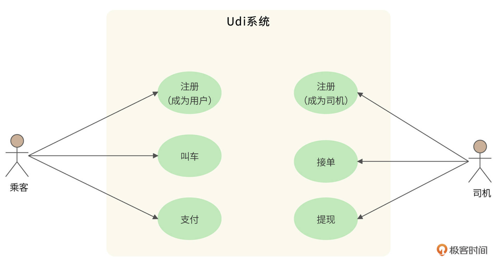
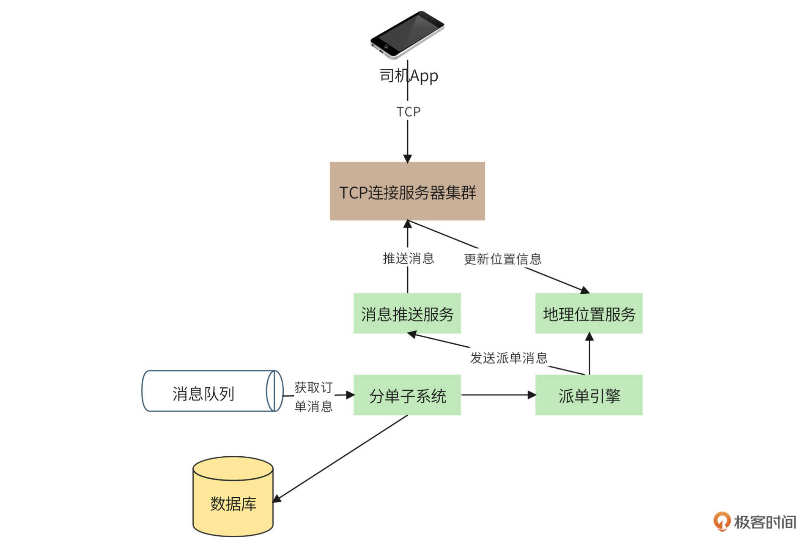
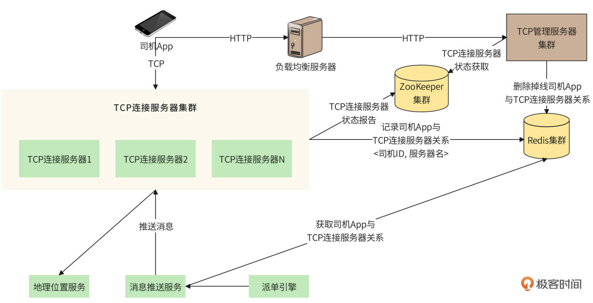
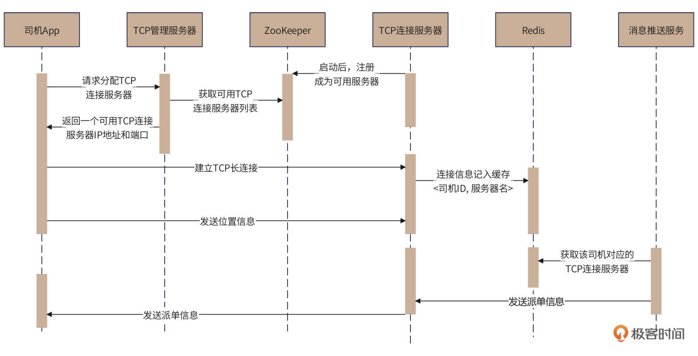

---
date: "2019-06-23"
---  
      
# 20 | 网约车系统设计：怎样设计一个日赚 5 亿的网约车系统？
你好，我是李智慧。

网约车的官方定义是：“以互联网技术为依托，构建服务平台，整合供需信息，使用符合条件的车辆和驾驶员，提供非巡游的预约出租汽车服务的经营活动。”通俗地说就是：利用互联网技术平台，将乘客的乘车信息发送给合适的司机，由司机完成接送乘客的服务。网约车包含专车、快车、拼车等多种形式。

中国目前网约车用户规模约5亿，我们准备开发一个可支撑目前全部中国用户使用的网约车平台，应用名称为“Udi”。

## 需求分析

Udi是一个网约车平台，核心功能是将乘客的叫车订单发送给附近的网约车司机，司机接单后，到上车点接乘客并送往目的地，到达后，乘客支付订单。根据平台的分成比例，司机提取一部分金额作为收益，用例图如下：

Udi平台预计注册乘客5亿，日活用户5千万，平均每个乘客1.2个订单，日订单量6千万。平均客单价30元，平台每日总营收18亿元。平台和司机按3：7的比例进行分成，那么平台每天可赚5.4亿元。

另外，平台预计注册司机5千万，日活司机2千万。

## 概要设计

网约车平台是共享经济的一种，目的就是要将乘客和司机撮合起来，所以需要开发两个App应用，一个是给乘客的，用来叫车；一个是给司机的，用来接单。Udi整体架构如下图：

<!-- [[[read_end]]] -->

相应的，Udi的系统也可以分成两个部分，一个部分是面向乘客的。乘客通过手机App注册成为用户，然后就可以在手机上选择出发地和目的地，进行叫车了。乘客叫车的HTTP请求首先通过一个负载均衡服务器集群，到达网关集群，再由网关集群调用相关的微服务，完成请求处理，如下图：

网关处理叫车请求的过程是：网关首先调用订单微服务，为用户的叫车请求创建一个订单，订单微服务将订单记录到数据库中，并将订单状态设置为“创建”。然后网关调用叫车微服务，叫车微服务将用户信息、出发地、目的地等数据封装成一个消息，发送到消息队列，等待系统为订单分配司机。

Udi系统的另一部分是面向司机的，司机需要不停将自己的位置信息发送给平台，同时，还需要随时接收来自平台的指令。因此，不同于用户通过HTTP发送请求给平台，司机App需要通过TCP长连接和平台服务器保持通信，如下图：

Udi司机App每3秒向平台发送一次当前的位置信息，包括当前车辆经纬度，车头朝向等。位置信息通过TCP连接到达平台的TCP连接服务器集群，TCP连接服务器集群的作用类似网关，只不过是以TCP长连接的方式向App端提供接入服务。TCP连接服务器将司机的位置信息更新到地理位置服务。

对于前面已经写入到消息队列的乘客叫车订单信息，分单子系统作为消息消费者，从消息队列中获取并处理。分单子系统首先将数据库中的订单状态修改为“派单中”，然后调用派单引擎进行派单。派单引擎根据用户的上车出发地点，以及司机上传的地理位置信息进行匹配，选择最合适的司机进行派单。派单消息通过一个专门的消息推送服务进行发送，消息推送服务利用TCP长连接服务器，将消息发送给匹配到的司机，同时分单子系统更新数据库订单状态为“已派单”。

## 详细设计

关于Udi的详细设计，我们将关注网约车平台一些独有的技术特点：长连接管理、派单算法、距离计算。此外，因为订单状态模型是所有交易类应用都非常重要的一个模型，所以我们也会在这里讨论Udi的订单状态模型。

#### 长连接管理

因为司机App需要不断向Udi系统发送当前位置信息，以及实时接收Udi推送的派单请求，所以司机App需要和Udi系统保持长连接。因此，我们选择让司机App和Udi系统直接通过TCP协议进行长连接。

TCP连接和HTTP连接不同。HTTP是无状态的，每次HTTP请求都可以通过负载均衡服务器，被分发到不同的网关服务器进行处理，正如乘客App和服务器的连接那样。也就是说，HTTP在发起请求的时候，无需知道自己要连接的服务器是哪一台。

而TCP是长连接，一旦建立了连接，连接通道就需要长期保持，**不管是司机App发送位置信息给服务器，还是服务器推送派单信息给司机App，都需要使用这个特定的连接通道**。也就是说，司机App和服务器的连接是特定的，司机App需要知道自己连接的服务器是哪一台，而Udi给司机App推送消息的时候，也需要知道要通过哪一台服务器才能完成推送。

所以，司机端的TCP长连接需要进行专门管理，处理司机App和服务器的连接信息，具体架构如下图。

**处理长连接的核心是TCP管理服务器集群**。司机App会在启动时通过负载均衡服务器，与TCP管理服务器集群通信，请求分配一个TCP长连接服务器。

TCP管理服务器检查ZooKeeper服务器，获取当前可以服务的TCP连接服务器列表，然后从这些服务器中选择一个，返回其IP地址和通信端口给司机App。这样，司机App就可以直接和这台TCP连接服务器建立长连接，并发送位置信息了。

TCP连接服务器启动的时候，会和ZooKeeper集群通信，报告自己的状态，便于TCP管理服务器为其分配连接。司机App和TCP连接服务器建立长连接后，TCP连接服务器需要向Redis集群记录这个长连接关系，记录的键值对是\<司机ID, 服务器名>。

当Udi系统收到用户订单，派单引擎选择了合适的司机进行派单时，系统就可以通过消息推送服务给该司机发送派单消息。消息推送服务器通过Redis获取该司机App长连接对应的TCP服务器，然后消息推送服务器就可以通过该TCP服务器的长连接，将派单消息推送给司机App了。

长连接管理的主要时序图如下：

如果TCP服务器宕机，那么司机App和它的长连接也就丢失了。司机App需要重新通过HTTP来请求TCP管理服务器为它分配新的TCP服务器。TCP管理服务器收到请求后，一方面返回新的TCP服务器的IP地址和通信端口，一方面需要从Redis中删除原有的\<司机ID, 服务器名>键值对，保证消息推送服务不会使用一个错误的连接线路推送消息。

#### 距离计算

乘客发起一个叫车请求时，Udi需要为其寻找合适的司机并进行派单，所谓合适的司机，最主要的因素就是距离。在[第9讲](https://time.geekbang.org/column/article/492306)的交友系统设计中，我们已经讨论过GeoHash算法，Udi就是直接使用Redis的GeoHash进行邻近计算。司机的位置信息实时更新到Redis中，并直接调用Redis的GeoHash命令georadius计算乘客的邻近司机。

但是Redis使用跳表存储GeoHash，Udi日活司机两千万，每3秒更新一次位置信息，平均每秒就需要对跳表做将近7百万次的更新，如此高并发地在一个跳表上更新，是系统不能承受的。所以，我们需要将司机以及跳表的粒度拆得更小。

Udi以城市作为地理位置的基本单位，也就是说，每个城市在Redis中建立一个GeoHash的key，这样，一个城市范围内的司机存储在一个跳表中。对于北京这样的超级城市，还可以更进一步，以城区作为key，进一步降低跳表的大小和单个跳表上的并发量。

#### 派单算法

前面说过，派单就是寻找合适的司机，而合适的主要因素就是距离，所以最简单的派单算法就是直接通过Redis获取距离乘客上车点最近的空闲网约车即可。

但是这种算法效果非常差，因为Redis计算的是两个点之间的空间距离，但是司机必须沿道路行驶过来，在复杂的城市路况下，也许几十米的空间距离行驶十几分钟也未可知。

因此，我们必须用行驶距离代替空间距离，即Udi必须要依赖一个地理系统，对司机当前位置和上车点进行路径规划，计算司机到达上车点的距离和时间。事实上，我们主要关注的是时间，也就是说，派单算法需要从Redis中获取多个邻近用户上车点的空闲司机，然后通过地理系统来计算每个司机到达乘客上车点的时间，最后将订单分配给花费时间最少的司机。

如果附近只有一个乘客，那么为其分配到达时间最快的司机就可以了。但如果附近有多个乘客，那么就需要考虑所有人的等待时间了。比如附近有乘客1和乘客2，以及司机X和司机Y。司机X接乘客1的时间是2分钟，接乘客2的时间是3分钟；司机Y接乘客1的时间是3分钟，接乘客2的时间是5分钟。

如果按照单个乘客最短时间选择，给乘客1分配司机X，那么乘客2只能分配司机Y了，乘客总的等待时间就是7分钟。如果给乘客1分配司机Y，乘客2分配司机X，乘客总等待时间就是6分钟。司机的时间就是平台的金钱，显然，后者这样的派单更节约所有司机的整体时间，也能为公司带来更多营收，同时也为整体用户带来更好的体验。

这样，我们就不能一个订单一个订单地分别分配司机，我们需要将一批订单聚合在一起，统一进行派单，如下图：

分单子系统收到用户的叫车订单后，不是直接发送给派单引擎进行派单，而是发给一个订单聚合池，订单聚合池里有一些订单聚合桶。订单写完一个聚合桶，就把这个聚合桶内的全部订单推送给派单引擎，由派单引擎根据整体时间最小化原则进行派单。

这里的“写完一个聚合桶”，有两种实现方式，一种是间隔一段时间算写完一个桶，一种是达到一定数量算写完一个桶。最后Udi选择间隔3秒写一个桶。

这里需要关注的是，派单的时候需要依赖地理系统进行路径规划。事实上，乘客到达时间和金额预估、行驶过程导航、订单结算与投诉处理，都需要依赖地理系统。Udi初期会使用第三方地理系统进行路径规划，但是将来必须要建设自己的地理系统。

#### 订单状态模型

对于交易型系统而言，订单是其最核心的数据，主要业务逻辑也是围绕订单展开。在订单的生命周期里，订单状态会多次变化，每次变化都是由于核心的业务状态发生了改变，也因此在前面设计的多个地方都提到订单状态。但是这种散乱的订单状态变化无法统一描述订单的完整生命周期，因此我们设计了订单状态模型，如下图：

用户叫车后，系统即为其创建一个订单，订单进入“创单”状态。然后该订单通过消息队列进入分单子系统，分单子系统调用派单引擎为其派单，订单状态进入“派单中”。派单引擎分配到司机，一方面发送消息给司机，一方面修改订单状态为“已派单”。

如果司机去接到乘客，订单状态就改为“行程中”；如果司机拒绝接单，就需要为乘客重新派单，订单重新进入消息队列，同时订单状态也改回为“派单中”；如果司机到达上车点，但是联系不到乘客，没有接到乘客，那么订单就会标记为“已取消”。如果在派单中，乘客自己选择取消叫车，订单也进入“已取消”状态。“已取消”是订单的一种最终状态，订单无法再转变为其他状态。

司机到达目的地后，通过App确认送达，订单进入“待支付”状态，等待用户支付订单金额。用户支付后，完成订单生命周期，订单状态为“已完成”。

订单状态模型可以帮助我们总览核心业务流程，在设计阶段，可以通过状态图发现业务流程不完备的地方，在开发阶段，可以帮助开发者确认流程实现是否有遗漏。

## 小结

在软件设计开发中，会涉及两类知识。一类是和具体业务无关的，比如编程语言、编程框架这些技术和具体业务无关，消息队列、分布式缓存这些技术也和具体业务无关。这一类技术更具有通用性，技术人员不管跳槽到哪家公司，几乎都会用到这些技术。

还有一类技术是和具体业务相关的，比如电商业务、金融业务、包括本文的网约车业务等等，这些业务如何用最合适的技术方案实现。这些和具体业务相关的技术经验主要适用于相关的业务领域。

技术人员在职业生涯的早期，需要更多地去关注和学习通用性的技术。而随着年龄增加，应该在业务相关的技术上获得更多沉淀，成为一个领域的专家，才能使自己在职场上获得更强的竞争力。

下一节我们将讨论如何使用领域驱动设计的技术方法解决业务上的问题，带你体会技术人员如何在业务上获得更多沉淀。

## 思考题

网约车在进行派单的时候，还需要考虑哪些因素，如何实现？

欢迎在评论区分享你的思考，我们共同进步。

> 【编辑温馨提示】4月10日12点前，提交[期中测试](http://https://time.geekbang.org/column/article/495175)作业，有机会获得老师精心准备的奖励哦\~