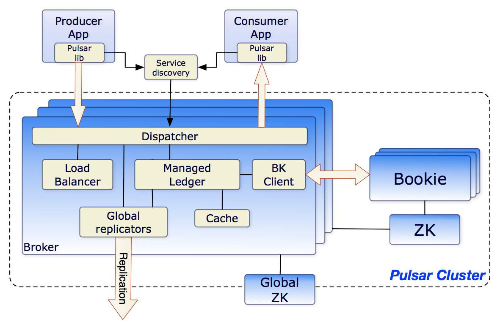

---
date: "2019-06-23"
---  
      
# 27 | Pulsar的存储计算分离设计：全新的消息队列设计思路
你好，我是李玥。

之前的课程，我们大部分时间都在以RocketMQ、Kafka和RabbitMQ为例，通过分析源码的方式，来讲解消息队列的实现原理。原因是，这三种消息队列在国内的受众群体非常庞大，大家在工作中会经常用到。这节课，我给你介绍一个不太一样的开源消息队列产品：Apache Pulsar。

Pulsar也是一个开源的分布式消息队列产品，最早是由Yahoo开发，现在是Apache基金会旗下的开源项目。你可能会觉得好奇，我们的课程中为什么要花一节课来讲Pulsar这个产品呢？原因是，Pulsar在架构设计上，和其他的消息队列产品有非常显著的区别。我个人的观点是，Pulsar的这种全新的架构设计，很可能是消息队列这类中间件产品未来架构的发展方向。

接下来我们一起看一下，Pulsar到底有什么不同？

## Pulsar的架构和其他消息队列有什么不同？

我们知道，无论是RocketMQ、RabbitMQ还是Kafka，消息都是存储在Broker的磁盘或者内存中。客户端在访问某个主题分区之前，必须先找到这个分区所在Broker，然后连接到这个Broker上进行生产和消费。

在集群模式下，为了避免单点故障导致丢消息，Broker在保存消息的时候，必须也把消息复制到其他的Broker上。当某个Broker节点故障的时候，并不是集群中任意一个节点都能替代这个故障的节点，只有那些“和这个故障节点拥有相同数据的节点”才能替代这个故障的节点。原因就是，每一个Broker存储的消息数据是不一样的，或者说，每个节点上都存储了状态（数据）。这种节点称为“有状态的节点（Stateful Node）”。

<!-- [[[read_end]]] -->

Pulsar与其他消息队列在架构上，最大的不同在于，它的Broker是无状态的（Stateless）。也就是说，**在Pulsar的Broker中既不保存元数据，也不存储消息**。那Pulsar的消息存储在哪儿呢？我们来看一下Pulsar的架构是什么样的。

这张Pulsar的架构图来自Pulsar的官方文档，如果你想了解这张架构图的细节，可以去看官方文档中的[Architecture Overview](https://pulsar.apache.org/docs/en/concepts-architecture-overview/)。我来给你解读一下这张图中我们感兴趣的重点内容。

先来看图中右侧的Bookie和ZK这两个方框，这两个方框分别代表了BookKeeper集群和ZooKeeper集群。ZooKeeper集群的作用，我在《[24 | Kafka的协调服务ZooKeeper：实现分布式系统的“瑞士军刀](https://time.geekbang.org/column/article/137655)》这节课中专门讲过，在Pulsar中，ZooKeeper集群的作用和在Kafka中是一样的，都是被用来存储元数据。BookKeeper集群则被用来存储消息数据。

那这个BookKeeper又是什么呢？BookKeeper有点儿类似HDFS，是一个分布式的存储集群，只不过它的存储单元和HDFS不一样，在HDFS中存储单元就是文件，这个很好理解。而BookKeeper的存储单元是Ledger。这个Ledger又是什么呢？

这里再次吐槽一下国外程序员喜欢发明概念、增加学习成本这个坏习惯。其实Ledger就是一段WAL（Write Ahead Log），或者你可以简单地理解为某个主题队列的一段，它包含了连续的若干条消息，消息在Ledger中称为Entry。为了保证Ledger中的Entry的严格顺序，Pulsar为Ledger增加一次性的写入限制，Broker创建一个Ledger后，只有这个Broker可以往Ledger中写入Entry，一旦Ledger关闭后，无论是Broker主动关闭，还是因为Broker宕机异常关闭，这个Ledger就永远只能读取不能写入了。如果需要继续写入Entry，只能新建另外一个Ledger。

请你注意一下，这种“一次性写入”的设计，它的主要目的是为了解决并发写入控制的问题，我在之前课程中讲过，对于共享资源数据的并发写一般都是需要加锁的，否则很难保证数据的一致性。对于分布式存储来说，就需要加“分布式锁”。

但我们知道，分布式锁本身就很难实现，使用分布式锁对性能也会有比较大的损失。这种“一次性写入”的设计，只有创建Ledger的进程可以写入数据，Ledger这个资源不共享，也就不需要加锁，是一种很巧妙的设计，你在遇到类似场景的时候可以借鉴。

消息数据由BookKeeper集群负责存储，元数据由ZooKeeper集群负责存储，Pulsar的Broker上就不需要存储任何数据了，这样Broker就成为了无状态的节点。

虽然Broker是无状态的，不存储任何的数据，但是，在一个特定的时刻，每一个主题的分区，还是要落在某个具体的Broker上。不能说多个Broker同时读写同一个分区，因为这样是没有办法保证消息的顺序的，也没有办法来管理消费位置。

再来看图中左侧最大的那个Broker方框，在Broker中包含了几个重要的模块。Load Balancer负责动态的分配，哪些Broker管理哪些主题分区。Managed Ledger这个模块负责管理本节点需要用到的那些Ledger，当然这些Ledger都是保存在BookKeeper集群中的。为了提升性能，Pulsar同样采用用了一个Cache模块，来缓存一部分Ledger。

Pulsar的客户端要读写某个主题分区上的数据之前，依然要在元数据中找到分区当前所在的那个Broker，这一点是和其他消息队列的实现是一样的。不一样的地方是，其他的消息队列，分区与Broker的对应关系是相对稳定的，只要不发生故障，这个关系是不会变的。而在Pulsar中，这个对应关系是动态的，它可以根据Broker的负载情况进行动态调整，而且由于Broker是无状态的，分区可以调整到集群中任意一个Broker上，这个负载均衡策略就可以做得非常简单并且灵活。如果某一个Broker发生故障，可以立即用任何一个Broker来替代它。

那在这种架构下，Pulsar又是如何来完成消息收发的呢？客户端在收发消息之前，需要先连接Service Discovery模块，获取当前主题分区与Broker的对应关系，然后再连接到相应Broker上进行消息收发。客户端收发消息的整体流程，和其他的消息队列是差不多的。比较显著的一个区别就是，消息是保存在BookKeeper集群中的，而不是本机上。数据的可靠性保证也是BookKeeper集群提供的，所以Broker就不需要再往其他的Broker上复制消息了。

图中的Global replicators模块虽然也会复制消息，但是复制的目的是为了在不同的集群之间共享数据，而不是为了保证数据的可靠性。集群间数据复制是Pulsar提供的一个特色功能，具体可以看一下Pulsar文档中的[geo-replication](https://pulsar.apache.org/docs/en/administration-geo/)这部分。

## 存储计算分离的设计有哪些优点？

在Pulsar这种架构下，消息数据保存在BookKeeper中，元数据保存在ZooKeeper中，Broker的数据存储的职责被完全被剥离出去，只保留了处理收发消息等计算的职责，这就是一个非常典型的“存储计算分离”的设计。

什么是存储计算分离呢？顾名思义，就是将系统的存储职责和计算职责分离开，存储节点只负责数据存储，而计算节点只负责计算，也就是执行业务逻辑。这样一种设计，称为存储计算分离。存储计算分离设计并不新鲜，它的应用其实是非常广泛的。

比如说，所有的大数据系统，包括Map Reduce这种传统的批量计算，和现在比较流行的Spark、Flink这种流计算，它们都采用的存储计算分离设计。数据保存在HDFS中，也就是说HDFS负责存储，而负责计算的节点，无论是用YARN调度还是Kubernetes调度，都只负责“读取-计算-写入”这样一种通用的计算逻辑，不保存任何数据。

更普遍的，**我们每天都在开发的各种Web应用和微服务应用，绝大多数也采用的是存储计算分离的设计**。数据保存在数据库中，微服务节点只负责响应请求，执行业务逻辑。也就是说，数据库负责存储，微服务节点负责计算。

那存储计算分离有什么优点呢？我们分两方面来看。

对于计算节点来说，它不需要存储数据，节点就变成了无状态的（Stateless）节点。一个由无状态节点组成的集群，管理、调度都变得非常简单了。集群中每个节点都是一样的，天然就支持水平扩展。任意一个请求都可以路由到集群中任意一个节点上，负载均衡策略可以做得非常灵活，可以随机分配，可以轮询，也可以根据节点负载动态分配等等。故障转移（Failover）也更加简单快速，如果某个节点故障了，直接把请求分配给其他节点就可以了。

对比一下，像ZooKeeper这样存储计算不分离的系统，它们的故障转移就非常麻烦，一般需要用复杂的选举算法，选出新的leader，提供服务之前，可能还需要进行数据同步，确保新的节点上的数据和故障节点是完全一致之后，才可以继续提供服务。这个过程是非常复杂而且漫长的。

对于计算节点的开发者来说，可以专注于计算业务逻辑开发，而不需要关注像数据一致性、数据可靠性、故障恢复和数据读写性能等等这些比较麻烦的存储问题，极大地降低了开发难度，提升了开发效率。

而对于存储系统来说，它需要实现的功能就很简单，系统的开发者只需要专注于解决一件事就可以了，那就是“如何安全高效地存储数据？”并且，存储系统的功能是非常稳定的，比如像ZooKeeper、HDFS、MySQL这些存储系统，从它们诞生到现在，功能几乎就没有变过。每次升级都是在优化存储引擎，提升性能、数据可靠性、可用性等等。

接下来说存储计算分离这种设计的缺点。

俗话说，背着抱着一样沉。对于一个系统来说，无论存储和计算是不是分离的，它需要完成的功能和解决的问题是一样的。就像我刚刚讲到的，Pulsar的Broker相比于其他消息队列的Broker，各方面都变的很简单。这并不是说，存储计算分离的设计能把系统面临的各种复杂的问题都解决了，其实一个问题都没解决，只是把这些问题转移到了BookKeeper这个存储集群上了而已。

**BookKeeper依然要解决数据一致性、节点故障转移、选举、数据复制等等这些问题。**并且，存储计算分离之后，原来一个集群变成了两个集群，整个系统其实变得更加复杂了。

另外，存储计算分离之后，系统的性能也会有一些损失。比如，从Pulsar的Broker上消费一条消息，Broker还需要去请求BookKeeper集群读取数据，然后返回给客户端，这个过程至少增加了一次网络传输和n次内存拷贝。相比于直接读本地磁盘，性能肯定是要差一些的。

不过，对于业务系统来说，采用存储计算分离的设计，它并不需要自己开发一个数据库或者HDFS，只要用现有的成熟的存储系统就可以了，所以相当于系统的复杂度还是降低了。相比于存储计算分离带来的各种优点，损失一些性能也是可以接受的。

因此，对于大部分业务系统来说，采用存储计算分离设计，都是非常划算的。

## 小结

这节课我们一起分析了Apache Pulsar的架构，然后一起学习了一下存储计算分离的这种设计思想。

Pulsar和其他消息队列最大的区别是，它采用了存储计算分离的设计。存储消息的职责从Broker中分离出来，交给专门的BookKeeper存储集群。这样Broker就变成了无状态的节点，在集群调度和故障恢复方面更加简单灵活。

存储计算分离是一种设计思想，它将系统的存储职责和计算职责分离开，存储节点只负责数据存储，而计算节点只负责计算，计算节点是无状态的。无状态的计算节点，具有易于开发、调度灵活的优点，故障转移和恢复也更加简单快速。这种设计的缺点是，系统总体的复杂度更高，性能也更差。不过对于大部分分布式的业务系统来说，由于它不需要自己开发存储系统，采用存储计算分离的设计，既可以充分利用这种设计的优点，整个系统也不会因此变得过于复杂，综合评估优缺点，利大于弊，更加划算。

## 思考题

课后请你想一下，既然存储计算分离这种设计有这么多的优点，那为什么除了Pulsar以外，大多数的消息队列都没有采用存储计算分离的设计呢？欢迎在评论区留言，写下你的想法。

感谢阅读，如果你觉得这篇文章对你有一些启发，也欢迎把它分享给你的朋友。