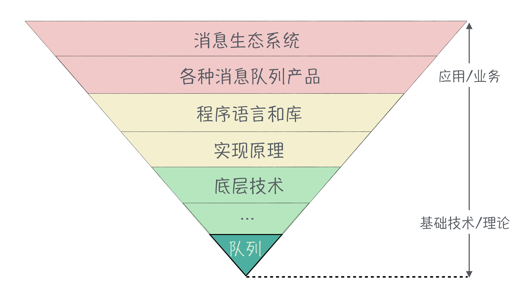
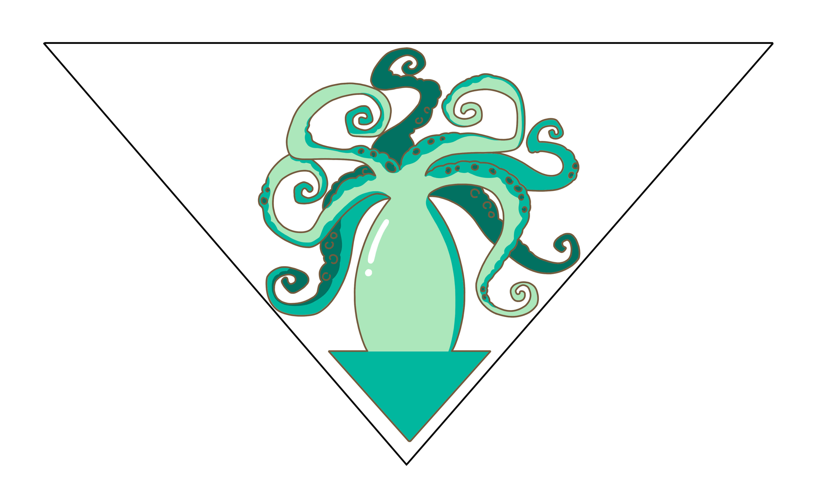

---
date: "2019-06-23"
---  
      
# 结束语 | 程序员如何构建知识体系？
你好，我是李玥。

在课程即将结束的时候，我们不聊技术本身，我想坐下来，跟你聊聊怎么来构建个人的技术知识体系。

现在做技术的人普遍都有一种焦虑，相信你也或多或少有一点，焦虑什么呢？总是感觉，自己不懂的技术太多了。虽然你不停地去学习，拼命地扩充自己的技术栈，但是面对不断出现的新技术，学习的速度永远赶不上新技术发展的速度，就会感觉自己不会的东西越来越多，这其实就是一种技术焦虑。

焦虑的来源是什么？焦虑，其实是对某些不好的事情过度担心而产生的一种烦躁情绪。这种担心更多来源于“看不清”或者说是“未知”，人的本能就是对未知的事物会有莫名的恐惧。比如，我小时候考试考得不好，拿着成绩单回家的路上是最焦虑的时候，因为我不知道我爸妈看到成绩之后会不会给我一顿胖揍。成绩单交给爸妈之后，即使被揍了，也不再焦虑了，当然屁股痛是另外一回事儿。

对于技术焦虑来说，你所担心的“不好的事情”，其实就是担心自己技术成长跟不上技术环境的发展速度。就像一场赛跑，赛道是无数条路，所有人都在不同的路上拼命地往前跑，你不知道别人跑到哪儿了，也不知道还有多远才能终点，不焦虑才怪。解决焦虑的办法是，给你一个导航，你能看到自己处在什么位置，前面的路是什么样的，应该怎么来走，焦虑也就解除了。

<!-- [[[read_end]]] -->

缓解技术焦虑的“导航”是什么？如果你能跳出来，看清整个技术体系全貌，知道你自己的技术栈在这个技术体系中的位置，了解自己的长处和短板，也就不再焦虑了。

我们可以把整个技术体系理解为一个超大的倒立的锥形体，上大下小。这个锥形，**越靠上越偏重于应用，或者说偏重于业务，越靠下，越偏重于基础技术和理论。**整个技术知识结构是这样的模式，组成这个技术模型的每个技术点也呈现这样的状态。比如消息队列，就是整个技术体系中的一小块，它也是一个倒立的锥形。

最上层是消息队列相关的生态系统，这个里面涉及到的技术就非常多了，包括怎么和流计算配合，怎么和微服务配合，怎么来实现云原生等等。再往下一层，是各种消息队列产品，这里面任何一种消息队列产品，你要想把它学到精通，都需要花很多精力。

这个锥形越往下层，涉及到的技术就越少。比如说，消息队列的实现原理，我们这一整门课也就差不多讲全了。它用到的底层技术，就是异步、并发、锁等。直到这个锥形的尖尖，就一个数据结构，也是所有消息队列的理论基础：“队列”这个数据结构。

在回到宏观层面来看这个大锥形，虽然它越来越大，但是，新增的部分都在哪儿？都在上面是不是？也就是说，这个大锥形它上面的大饼越摊越大，但是底下的部分，其实变化很少。虽然计算机相关的科学也只有几十年的历史，但是，**近二十几年，基础理论方面几乎没有任何突破性的进展**，也即是说这个大锥形的尖尖，二十年没变过。我十几年前大学本科学的课程，和现在在校大学生学的课程相比，基本没什么变化，还是编译原理、图论这些课。

看清了技术体系的整体，再来看你自身这个个体。对于整个技术体系这个超大的锥形体，我们每个人能掌握的，也就是你个人的技术栈，也就只有其中很小的一部分。

你可能学了很多技术，包括大学里面教的基础理论知识、工作主要用的编程语言和一些框架等、为了面试，刷了好多的架构和算法题。你是不是感觉，这三部分完全没有任何关系？大学的课程早就忘得差不多了，因为工作中基本用不上；工作中每天用到的就是这点儿框架和增删改查，做得很熟练了，也没什么挑战；刷题的那些算法也仅仅是用来面试而已。

原因是什么？因为你的技术栈还没有打通形成体系，是断层的。这些知识其实是有联系的，无论你开发的是什么应用，使用什么编程语言，都免不了要使用一些基础组件或者存储系统，实现这些基础组件必然会用到一些设计模式、各种算法，那这些模式和算法，它的理论基础就是你在大学中学习的那些图论、计算机组成原理等等这些课中涉及的知识。所以说，并不是这些知识你用不到，而是你的知识体系没有建立起来。

那一个好的、成体系的技术栈应该是什么样的呢？应该是，“**基础深厚，涉猎广泛，融汇贯通**”。

把你个人的技术栈放到大锥形体中，应该像一个头向下倒立的鱿鱼。我们都知道，鱿鱼脑袋又大又尖，须子又多又长。把鱿鱼倒过来，它脑袋要尽量塞满这个大锥形的底部，也就是说，底层的大部分基础知识你要掌握。

向上延伸的很多触手，代表整个技术体系的最上层的众多领域中，其中的几个领域你也是要掌握的。并且，自上而下，最好不要有断层，上层你掌握的技术不能只是浮于表面，而是要足够的深入，**深入到与你掌握的底层技术连通起来**，代表你的知识体系是贯通的。

举个例子，比如你写了一段代码，往数据库中写了一条数据。你编写的程序，它在运行时是怎么存储和传输这条数据的？数据是如何从你的程序传递给数据库的？数据在数据库中是如何处理并存储的？数据库又是怎么把数据保存到磁盘上的？数据在磁盘上是以什么形式保存的？如果你可以回答出这些问题，那代表在这方面你的知识体系自上而下已经打通了。

这样的个人技术体系它有什么好处呢？你已经掌握的每项应用技术，都是你实际工作中最常用的东西，你掌握的足够深入，设计出来的技术方案或者写出来的代码质量就更高，遇到相关的疑难问题也不至于难倒你。有一个非常好的基础，你学习新的应用技术也会非常快，因为你只要学习它上层那部分就可以了，底层的技术很多是相通的。

就像《消息队列高手课》专栏，我们用30节课的时间，讲了从消息队列的应用到实现原理、再到底层技术。然后，我们在实践篇来开发RPC框架的时候，你会发现它和消息队列用到的很多底层技术就是一样的，那你学起来就会很容易很快。对于RPC框架这个知识体系，很多底层基础技术你都已经掌握了，你真正需要学习的，新的知识相对就会少一些。

那么，我们应该怎么样来构建自己的技术知识体系呢？这里我给你一些建议。

我们大部分程序员的成长轨迹都是差不多的。大学学习的那些计算机专业课，除了你学的那门编程语言以外，其他的专业课毕业之后大概率是用不到的。原因是，这些技术在整个技术体系中，基本上处于最底层。而我们毕业后，无论是做Web开发、做APP开发还是搞机器学习等等，在技术锥形结构中都是最上层的应用技术，距离底层的技术太远，联系不上。

这个阶段我给你的建议是，在一个技术领域内尽量扩展你的技术广度。比如，你是做Web开发的，你可以尝试多学多用相关的各种技术，像各种Web框架、HTTP协议、JSON、数据库应用、相关的各种中间件和组件。你不要今天学了Spring，明天又去学机器学习，后天再去学安卓，这样跨度太大很难建立体系。

当你在某个技术领域的技术广度足够了，达到一个什么程度呢？这个领域内常用的技术你都会使用，随便一个技术，你都知道，或者即使你不知道，简单看一下也能很快明白，了解这个技术在这个技术领域内是哪一类的，至少你知道的某个技术和它是类似的。

这个时候，你就可以去深入的，有目的的去找领域内最核心的几个技术，去深入地学习它的实现原理和底层技术。比如，你是做Web开发的，你可以去学习某个Web框架的实现原理，学习Web容器的工作原理、学习数据库的存储结构等等。当你把这个技术领域内的大部分技术研究到足够深入，能够联系起来，你在这个技术领域内的个人技术体系就建好了，你的第一条“小鱿鱼”就形成了。

所谓万事开头难，这一步其实是最难的，但是只要迈过这个门槛，后面的过程就相对简单了。你这个小鱿鱼可能个头很小，须子也不多，头扎的也不够深，但是没关系，只要是建立起了知识体系，这些问题都不是关键问题，都可以通过不断的学习来逐步成长。

建立起第一个小鱿鱼之后，你可以选择继续扩展你知识体系的广度和深度，养肥养大这条小鱿鱼。也可以换一个新的技术方向，再养一条新的小鱿鱼。随着你涉猎的技术广度和深度逐步增加，这些孤立的小鱿鱼，总会在底层的某个地方连通起来，变成一条大鱿鱼。当你个人的技术体系足够丰满了之后，大部分新技术对你来说不过都是一根儿鱿鱼须子而已。你了解了技术全景，再构建起你个人的技术体系，自然就不再焦虑了。

所谓，“大道至简，知易行难”。道理总是听起来很简单，真正能理解道理，落到实践中去，还是非常难的。在实践的过程中，可能有很多繁琐的、琐碎的问题都需要你去解决。希望你在构建自己的知识体系过程中，能沉下心，坚持去学习、练习和试错。勤勉之道无他，在有恒而已，愿你我共勉。

“送君千里，终有一别”，我们的《消息队列高手课》也该说再见了。在专栏开始更新时，我曾鼓励你立Flag，不知道在这三个月的时间里，你是否坚持学习了每一节课？有没有离当初的目标更近一些？希望你能坚定不移地朝自己的目标走去，无悔初心。

感谢你的一路支持，专栏虽然更新结束，但我们依旧可以在留言区继续交流技术！最后，也祝福你不仅能成为消息队列的高手，还可以通过对消息队列的学习，打通任督二脉，不仅能在职场上披荆斩棘，更能实现你的技术梦想！