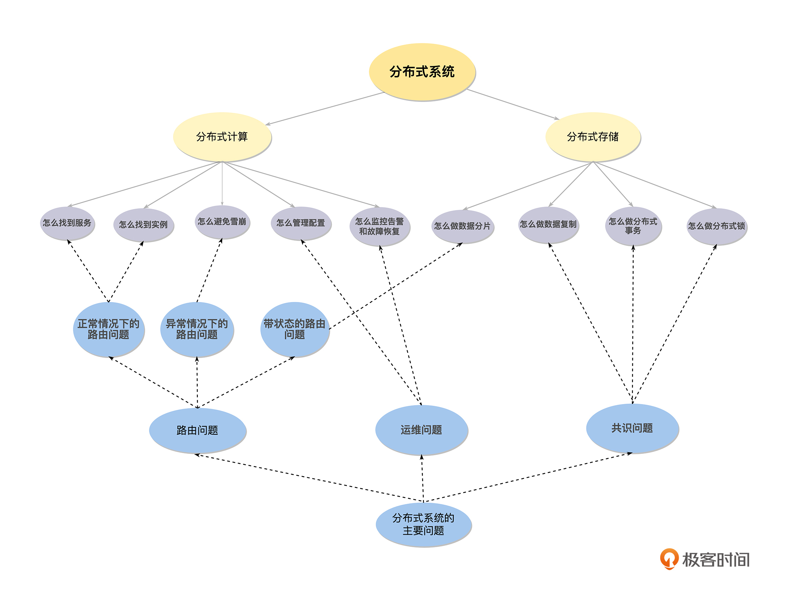

---
date: "2019-06-23"
---  
      
# 01｜导读：以前因后果为脉络，串起网状知识体系
你好，我是陈现麟。

在我们正式学习整个专栏之前，我特别设计了这个导读环节，让你在正式学习之前先拿到一份导航地图。

在开篇词里，我提到了我曾经参加过知乎圆桌会议，回答了“如何系统性地学习分布式系统”这个问题。在这节课的导读内容里，我会结合知乎中的回答，进一步提炼出分布式系统前因后果中的核心问题，帮你追本溯源，理清这个专栏的设计思路，总结深入学习的方法和路径。

学完这节课以后，你不仅能对课程思路心中有数，还能知道如何推导出一门技术的脉络，学会将零散的知识点连成网状的知识体系。

## 前因：分布式系统解决了什么问题

学习一个知识之前，我觉得比较好的方式是先理解它的前因后果：前因就是这个知识产生的过程中，它解决了什么问题，怎么样解决的。后果就是它的出现又带来了哪些新的问题，这样我们才能比较好地抓到它的脉络和关键点，不会一开始就迷失在细节中。

所以，学习分布式之前，**我们要解决的第一个问题就是：分布式系统解决了什么问题，怎么样解决的**？分布式系统的出现主要解决的是单体系统方面的不足，下面我们就具体来分析一下。

首先，分布式系统解决了单机性能瓶颈导致的成本问题。由于摩尔定律失效，廉价 PC 机的性能瓶颈无法继续突破，虽然小型机和大型机能实现更高的单机性能，但是成本太高，一般的公司很难承受。

<!-- [[[read_end]]] -->

比如 2008 年，阿里巴巴发起的“去 IOE ”运动（在 IT 建设过程中，去除 IBM 小型机、Oracle 数据库及 EMC 存储设备）的一个关键原因，就是这些商用小型机和存储设备的成本实在太高了。

然后，解决了用户量和数据量爆炸性地增大导致的成本问题。进入互联网时代，用户量爆炸性地增大，用户产生的数据量也随之增大。在 2015 年，全球数据总量达到 6 ZB（1 ZB 等于 1 万亿 GB），在 2020 年，全球数据总量已经达到了 44 ZB ，预计到 2030 年，全球数据总量将超过 2,500 ZB。

即使在这种情况下，单个用户或单条数据的价值，也是比软件时代（比如银行用户）的价值低很多的，所以人们必须寻找更经济的方案来处理和存储这些数据。并且，在用户量和数据量，大到一定程度之后，在单机系统的范围内，即使不计成本，可能也找不到好的解决方案。

接着，满足了业务高可用的要求。互联网产品基本都要求 7 \* 24 小时提供服务，对于停止服务等故障是无法容忍的。如果想要提供高可用的服务，唯一的方式就是通过增加冗余来完成。那么就算是单机系统可以支撑的服务，因为要满足高可用的要求，也会变成一个分布式系统。

最后，分布式系统解决了大规模软件系统的迭代效率和成本的问题。如果一个大规模的软件系统是一个单体系统，那么大量的开发人员就只能将一个大规模软件，整体进行编译、测试和发布，这样一来开发语言和生态都比较单一，系统的迭代效率就会非常低。同时，对于系统的各个部分，我们也不能有针对性地进行成本优化，这会产生非常大的成本问题。

根据上面的四个原因，我们可以总结出**在互联网时代，单机系统是无法解决成本、效率和高可用问题的**，但是这三个问题，对所有的公司来说都是非常关键的问题，所以分布式系统就这样应运而生了，你也会发现，从单机系统到分布式系统的发展，是无法阻挡的技术大潮流。

那么，分布式系统又是怎么解决单机系统面临的成本、效率和高可用的问题呢？

其实很容易想到，就是将一些廉价的 PC 机，通过网络连接起来共同完成工作，并且在系统中提供冗余，来解决高可用的问题。其实我们从分布式系统的定义中，也能找到这个方法，分布式系统指的是由一组通过网络进行通信，为了完成共同的任务，而协调工作的计算机节点组成的系统。在这个定义中，可以看出分布式系统是通过多工作节点，来解决单机系统面临的成本、效率和高可用问题的。

刚才我们讨论了分布式系统解决了什么问题，怎么样解决的，由此得出，分布式系统的发展是无法阻挡的技术大潮流。下面我再进一步解释一下，如何理解分布式系统的出现，以及分布式系统在不同业务场景中的表现形式。

“旧时王谢堂前燕，飞入寻常百姓家”，用来形容 IT 技术最合适不过了。由于互联网的爆发性发展， IT 技术不再是实验室、科研机构和金融等相对前沿行业的专属技术，它快速地平民化了。如果一项技术能够平民化，那么一定是在成本、效率和稳定性方面都有非常突出的表现，也就是说必须物美价廉，**所以我们可以把分布式系统看成是单体系统的平民化和物美价廉的版本**。

目前分布式系统依然还在快速发展中，它不停地掀起一波又一波的浪潮，快速地席卷着 IT 技术的方方面面。我们可以看到它在不同的业务场景中有着不同的表现形式，比如流量路由策略加多副本部署（微服务是其中的一种架构形式）是无状态服务的分布式架构方案， Redis Cluster 和 Codis 等方案实现了缓存的分布式化，而 Kubernetes 则完成了操作系统的分布式进化。

NoSQL 掀起了数据库分布式化的第一波浪潮，而 NewSQL 则推动着支持 ACID 的关系数据库的分布式化，这是数据库分布式化的第二波浪潮，由此可见，分布式系统确实是无法避免的技术大潮流。

## 后果：如何思考和处理分布式系统引入的新问题

我们在上文中，分析了分布式系统的前因，知道了分布式系统是通过多工作节点，来解决单机系统面临的成本、效率和高可用问题的。但是有利就会有弊，它的出现也引入了分布式系统内部工作节点的协调问题，主要体现在分布式系统内部组件、实例之间，通过异步网络进行通信和协调的问题上。

所以在后果部分，**我们主要来解决第二个问题：针对内部工作节点的协调问题，分布式系统是怎么做的**？

我们先从简单的情况入手，对于**分布式计算（无状态）**的情况，系统内部的协调需要做哪些工作，我们围绕7个子问题进行思考。

其一，怎么找到服务？在分布式系统内部，会有不同的服务（角色），服务 A 怎么找到服务 B 是需要解决的问题。一般来说，服务注册与发现机制是常用的思路，所以，我们可以了解一下服务注册发现机制的实现原理，并且思考一下服务注册发现，是选择做成 AP 系统还是 CP 系统更合理。

其二，怎么找到实例？在找到服务之后，当前的请求应该发往服务的哪一个实例呢？一般来说，如果同一个服务的实例是完全对等的（无状态），那么按负载均衡的策略来处理就足够（轮询、权重、Hash、一致性Hash，FAIR 等各种策略的适用场景）。

如果同一个服务的实例不对等（有状态），那么就需要通过路由服务（元数据服务等）先确定，当前要访问的请求数据做到哪一个实例上，然后再进行访问。

其三，怎么管理配置？在分布式系统内部，会有不同的服务（角色），每一个服务都有多个实例，并且还可能自动扩容和缩容。在这样的情况下，通过配置文件的方式，来管理配置是低效、易出错的，对于这个问题，一般的思路是通过一个中心化的存储来统一管理系统的配置，即配置中心。

其四，怎么进行协同？在单体系统中，所有的功能模块都在一个进程中，系统内部进行协同非常简单， 直接调用系统的API 加锁就可以了。但是在分布式系统中，由于不同的功能模块已经拆分为不同的服务，并且一般都运行在不同的机器上，这个时候系统中加锁相关 API 就不能使用了。对于这个问题，我们可以通过一个跨进程与机器的分布式锁来解决。

其五，怎么确保请求只执行一次？在分布式系统中，各个模块之间通过网络进行连接。如果出现了网络抖动等情况，会导致模块之间的调用失败，而调用失败就有可能触发重试策略，使得程序可能出现没有执行或者多次执行的情况。一般来说，重试加上幂等是分布式系统中，确保请求只执行一次的方法。

其六，怎么避免雪崩？系统雪崩是指由于正反馈循序导致不断扩大规则的故障。一次雪崩通常是由于整个系统中，一个很小的部分出现故障而引发，进而导致系统的其他部分也出现故障。比如，系统中某一个服务的一个实例出现故障，导致负载均衡将该实例摘除，从而引起其他实例负载升高，最终导致该服务的所有实例像多米诺骨牌一样，一个一个全部出现故障。

避免雪崩的策略比较简单，主要是两个思路，一个是**快速失败和降级机制**（熔断、降级、限流等），通过快速减少系统负载来避免雪崩的发生；另一个是**弹性扩容机制**，通过快速增加系统的服务能力来避免雪崩的发生。我们可以根据不同的场景做出不同的选择，或者两个策略都使用。

一般来说，快速失败会导致部分的请求失败，如果分布式系统内部，对一致性要求很高的话，快速失败会带来系统数据不一致的问题。这种情况下，弹性扩容会是一个比较好的选择，但是弹性扩容的实现成本比快速失败要大，响应时间也更长。

其七，怎么监控告警和故障恢复？对于一个分布式系统来说，如果我们不能清楚地了解内部的状态，那么系统的稳定性是没有办法完全保障的。所以我们一定要完善分布式系统的监控（比如接口的时延和可用性等信息），分布式追踪 Trace ，模拟故障的混沌工程以及相关的告警等机制。同时做好故障恢复预案，确保在故障发生的时候，能够快速恢复故障。

接下来，我们再来围绕4个子问题思考一下，**分布式存储（有状态）**的内部协调是怎么做的，因为，前面介绍的分布式计算的协调方式在分布式存储中同样适用，就不再重复了。

首先，在 CAP 及其相关理论与权衡方面，需要了解 ACID 、 BASE 和 CAP 理论这三个主题。我推荐你阅读一篇文章以及文章后面相关的参考文献，读完后你就能很好地理解 CAP 理论中的取舍了，这是英文版本：<https://www.infoq.com/articles/cap-twelve-years-later-how-the-rules-have-changed/> ，这是中文版本：<https://www.infoq.cn/article/cap-twelve-years-later-how-the-rules-have-changed/> 。

然后，我们来思考怎么做数据分片。单机系统是不可能存储所有数据的，所以需要解决怎么将数据按一定的规则，分别存储到不同的机器上这个问题，目前使用较多的方案是：Hash 和 Region 分片的策略，但是要注意了解一下它们的优缺点和各自的应用场景。

接着，我们讨论一下怎么做数据复制这方面。为了满足系统的高可用要求，需要对数据做冗余处理，目前的方案主要为：中心化方案（主从复制、一致性协议，比如 Raft 和 Paxos 等）和去中心化的方案（ Quorum 和 Vector Clock），我们需要了解它们的优缺点，各自的应用场景，以及对系统外部表现出来的数据一致性级别（线性一致性、顺序一致性、最终一致性等）。

最后，我们来看看怎么做分布式事务。对于分布式系统来说，要实现事务，首先需要对并发事务进行排序的能力，这样在事务冲突的时候，就可以确认哪个事务提交成功，哪个事务提交失败。

在单机系统中，这完全不是问题，简单地通过时间戳加序号的方式就可以实现了。但是对于分布式系统来说，系统中机器的时间不能完全同步，并且单台机器的序号也没有全局意义，所以，按时间戳加序号的方式是不行的。

如果整个系统选一台机器，按照单机的模式生产事务 ID 是可以的，同城多中心和短距离的异地多中心也都没有问题。但是想做成全球分布式系统的话，每一次事务都要去一个节点获取事务ID的成本太高（比如中国杭州到美国东部的 RTT 为 200+ ms），我们可以**参考 Google 的 Spanner ，它是通过 GPS 和原子钟，实现 TrueTime API 来解决这个问题，从而实现全球分布式数据库的**。

有了事务 ID 后，通过 2PC 或者 3PC 协议来实现分布式事务的原子性，其他部分和单机事务差别不大，就不再细说了。

到这里，我们已经对分布式系统的脉络有了基本的概念，接下来就可以进入**细节学习**的阶段了，对分布式系统的理解深入与否，细节的深入度是很重要的评价指标，毕竟“魔鬼在细节”，所以这也是非常辛苦的阶段。这里我们可以从两个方面进行系统地学习：

首先**从实践出发**，研究目前比较常用的分布式系统的设计，HDFS 或者 GFS（分布式文件系统）、Kafka 和 Pulsar（分布式消息队列），Redis Cluster 和 Codis（分布式缓存），MySQL 的分库分表（传统关系型数据库的分布式方案），MongoDB 的 Replica Set 和 Sharing 机制集（NoSQL 数据库），TiDB（NewSQL）以及一些微服务框架等。

然后**从理论出发**，研究分布式相关的论文，这里推荐一本书“ Designing Data-Intensive Applications ”（中文版本：数据密集型应用系统设计），推荐你先把书整体看一遍，然后找到比较感兴趣的章节，再仔细读一读该章节中涉及的相关参考文献。

最后，为了让你更好地理解，如何处理分布式系统引入的，内部工作节点的协调问题，我把它们总结为下面三类问题。

首先是**路由问题**，分布式系统由单体系统拆分而来，必然会导致分布式系统内部，出现复杂的路由问题。路由问题主要是解决分布式系统内部各服务和实例之间的通信，我们可以将“怎么找到服务”和“怎么找到实例”等服务注册发现和负载均衡的问题，理解为正常情况下的路由问题，将“怎么做数据分片”的问题，理解为带状态的路由问题，将“怎么避免雪崩”涉及的熔断、降级等快速失败和降级机制，理解为异常情况下的路由问题。

接下来是**共识问题**，分布式系统的各个组件是运行在不同机器上的不同进程，因为程序总是需要按一定的逻辑有序地执行，所以需要一个办法，来协调分布式系统内部，已经各自为政的服务和实例，而共识就是讨论并解决这一类问题的，例如“怎么做数据复制”、“怎么做分布式事务”和“怎么做分布式锁”里，都会涉及共识问题。

最后是**运维问题**，分布式系统相对于单体系统是非常碎片化的，如果还依靠人肉运维，在效率上是完全行不通的，所以催生了一系列自动化运维的工具和平台来解决这一类问题，例如“怎么管理配置”和“怎么监控告警和故障恢复”都涉及运维的问题。

## 总结

通过这样一篇导读，我想告诉你，在学习新知识的时候，只学点状的知识是非常容易忘记的，而只学线状的知识又很难触类旁通，只有点、线结合，形成网状的知识体系，如下图这样，才能举一反三、融会贯通。  
  
所以，在这个专栏中，我会**以分布式系统的前因后果为脉络，打造一条由浅入深、从简单到复杂的学习路径**，并且会从路由问题、共识问题和运维问题这三大角度，对分布式系统的知识点进行交叉串讲。当你按照这条线性的路径完成学习后，将会得到一个网状的知识体系。

在课程导读中，我分享了如何学习、思考分布式技术原理的方法和路径，最后我想特别邀请你也来分享一下自己学习分布式系统的好方法，或者你也可以说说你在学习、工作中遇到的具体问题和困惑，非常期待你的留言。如果这节课对你有帮助，也推荐你分享给更多的同事、朋友。