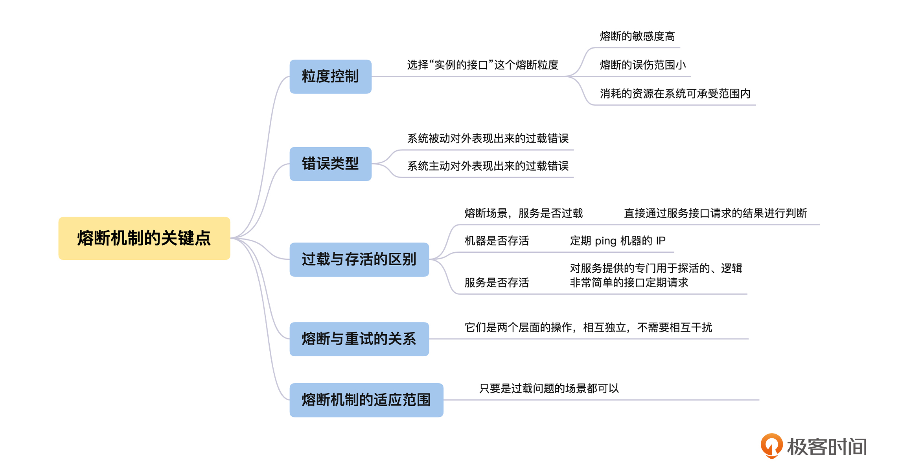

---
date: "2019-06-23"
---  
      
# 09 | 雪崩（一）：熔断，让故障自适应地恢复
你好，我是陈现麟。

通过学习重试幂等的内容，让我们在网络故障和部分失败的分布式系统中，也有办法确保程序之间的调用实现 Exactly-once 的效果，这样当系统出现临时故障的时候，用户依然能正常购买，我们的系统又健壮了一点。

在日常运维极客时间服务端系统的过程中，你一定碰到过大规模故障的情况，可是事后复盘时，却发现故障的起因，大多都是一些局部的小问题引起的，比如因为一个接口响应时间变长，使相关实例的协程或线程数暴涨，让系统的负载进一步增加，最终导致实例所有接口的响应时间都变长，这就从一个接口的局部故障演变成了一个全局的故障。

在一个分布式系统中，局部故障是不可避免的，但是如果不能将局部故障控制好，导致其演变成一个全局的系统故障，这对我们来说是不可以接受的，那么我们应该如何解决这个问题呢？

其实这就是分布式系统中的雪崩场景问题，那么从这节课开始，我们将用四节课的时间来解决，如何让一个分布式系统避免发生雪崩的问题。这一节课，我们先讨论雪崩现象出现的原因，然后再分析如何通过熔断机制来避免雪崩，最后一起总结熔断机制应该注意的关键点。

## 为什么会出现雪崩

雪崩是由于局部故障被正反馈循环，从而导致的不断放大的连锁故障，正如我们上文的例子所说，雪崩通常是由于整个系统中，一个很小的部分出现故障，进而导致系统其他部分也出现故障而引发的。但是，一个正常运行的服务为什么会发生雪崩呢？我认为在实际工作中，出现雪崩一般会经历以下三个阶段，如下图。

<!-- [[[read_end]]] -->

**首先，服务的处理能力开始出现过载**。服务过载是指服务器只能处理一定 QPS 的请求，当发往该服务器的 QPS 超出后，由于资源不够等原因，会出现超时、内存增加等各种异常情况，使服务的请求处理能力进一步降低，过载情况更加严重。

服务处理能力出现过载有多种原因，比如服务可能由于 Bug 导致性能下降，或者由于崩溃导致过载，也有可能就是突发的流量超过了服务的设计目标，或者是机器宕机导致可提供服务的实例数量减少等原因。

**然后，服务由于资源耗尽而不可用**。当服务严重过载后，会出现大量请求的积压，这会导致服务消耗更多的内存、 CPU 、线程和文件描述符等资源，待这些资源被消耗尽后，服务将出现严重超时和崩溃等异常情况，最终对外表现为不可用。当服务的某一个实例崩溃后，负载均衡器会将请求发送给其他的实例，导致其他的实例也出现过载的情况，从而造成整个服务过载的故障。

最后，由于服务内部出现严重的过载，导致响应严重超时，服务的调用方同样会出现大量请求的积压使资源耗尽，**这样正反馈循环就形成了，故障沿着调用链路逆向传播，导致整个系统出现雪崩**。

通过上面的讨论，我们可以看出雪崩的根本原因是系统过载，如果在系统过载的情况下，不进行任何控制，异常情况就会急剧扩散，导致雪崩情况出现。所以，想要避免系统雪崩，要么通过快速减少系统负载，即熔断、降级、限流等快速失败和降级机制；要么通过快速增加系统的服务能力来避免雪崩的发生，即弹性扩容机制。

在本节课中，我们先来讨论如何通过熔断来避免系统发生雪崩。

## 利用熔断机制避免雪崩

其实对于熔断机制，我们并不陌生。在日常生活中，电路保险丝的熔断就是我们最常见的熔断机制，它指的是在电路系统中，当电路超过负荷运行时，保险丝会自动断开，从而保证电路中的电器不受损害。

那么我们就借鉴这个原理来讨论熔断机制。当服务之间发起调用的时候，如果被调用方返回的指定错误码的比例超过一定的阈值，那么后续的请求将不会真正发起，而是由调用方直接返回错误。

我们知道电路在工作的时候，有两种工作状态，分别是通路和开路，计算机的熔断机制则略有不同，在熔断机制的模式下，服务调用方需要为每一个调用对象，可以是服务、实例和接口，维护一个状态机，在这个状态机中有三种状态。

首先，是闭合状态\( Closed \)。在这种状态下，我们需要一个计数器来记录调用失败的次数和总的请求次数，如果在一个时间窗口内，请求的特定错误码的比例达到预设的阈值，就切换到断开状态。

其次，是断开状态\( Open \)。在该状态下，发起请求时会立即返回错误，也可以返回一个降级的结果，我们会在后面的课程“降级”中再详细讨论。在断开状态下，会启动一个超时计时器，当计时器超时后，状态切换到半打开状态。

最后，是半打开状态\( Half-Open \)。在该状态下，允许应用程序将一定数量的请求发往被调用服务，如果这些调用正常，那么就可以认为被调用服务已经恢复正常，此时熔断器切换到闭合状态，同时需要重置计数。如果这部分仍有调用失败的情况，我们就认为被调用方仍然没有恢复，熔断器会切换到断开状态，然后重置计数器。所以半打开状态能够有效防止正在恢复中的服务，被突然出现的大量请求再次打垮的情况。

通过上文对熔断机制的讨论，**我们将服务由于过载原因导致的错误比例，作为熔断器断开的阈值**，当被调用服务出现过载的时候，熔断器通过错误比例感知到被调用服务过载后，就立即将调用请求返回错误，这样可以减少被调用服务的请求数量，也可以减少调用服务由于等待请求响应而积压的请求，完美切断了正反馈循环，确保了雪崩不会发生。

## 熔断机制的关键点

到这里，我们已经明白了什么是熔断机制，以及如何利用熔断机制来避免雪崩，但是在熔断机制的具体实现上，还会面临熔断的粒度选择和过载判断等关键的问题，所以接下来我们一起从“粒度控制”、“错误类型”、“存活与过载的区别”、“重试和熔断的关系”和“熔断机制的适应范围”这五个角度来讨论熔断机制的关键点。

### 粒度控制

对于熔断的粒度控制问题，进一步来说，就是我们想将监控资源过载的粒度控制在一个什么样的范围内，这个范围可以由服务、实例和接口这三个维度的组合来得到，具体见下表。  

结合我的工作经验，在实现熔断机制的时候，更建议你选择“实例的接口”这个熔断粒度，主要有以下三个原因。

**首先，熔断的敏感度高**。假设有一个服务部署了 10 个实例，并且这 10 个实例都是均匀接受请求流量的。在这种情况下，只有一个实例的一个接口负载过高时，即使它的每一次请求都超时，但由于其他实例的这个接口都是正常的，所以基于“接口”粒度统计到的请求错误率不会超过 10 \%，而基于“服务”和“实例”粒度的熔断器统计到的错误率将更低。

如果熔断器的阈值大于 10 \%，那么将不能识别到这个实例接口过载的情况，只有等这个接口的过载慢慢被放大，才能被基于“服务”、“实例”和“接口”粒度的熔断器感知到，但是这个结果明显不是我们期待的。

**其次，熔断的误伤范围小**。当同一服务的不同实例，所分配的资源不相同时，“实例的接口”粒度的熔断机制，能够正确识别有问题实例的接口进行熔断，而不是将这个服务所有实例的这个接口进行熔断，更不是对实例和服务进行熔断，这样就提升了系统的可用性水平。

最后，虽然实现粒度越细的熔断机制，需要维护更多的熔断状态机，导致更多的资源消耗，但是**设计优良的熔断机制所消耗的资源是非常少的**，“实例的接口”粒度的熔断机制所消耗的资源，完全在系统可以承受的范围之内。

### 错误类型

由于熔断机制是用来消除系统过载的，所以，我们需要识别出与系统过载相关的错误，来进行熔断处理，一般来说，主要有下面两个错误类型。

第一，系统被动对外表现出来的过载错误，一般来说，如果一个接口过载了，那么它的响应时间就会变长，熔断器捕获到的错误类型就是“响应超时”之类的超时错误。

第二，系统主动对外表现出来的过载错误，对于这种情况，一般是请求的流量触发了限流等机制返回的错误码，这个是我们在程序开发过程中主动设计的。

另外，我们要记住，熔断机制一定不要关心应用层的错误，比如余额不足之类的错误，因为这一类型的错误和系统的过载没有关系。

### 过载与存活的区别

熔断机制关心的是服务是否过载，而判断一个服务是否过载，最好的方式是依据请求在队列中的平均等待时间来计算服务的负载。之所以不选择请求的平均处理时间，是为了去除下游服务调用的影响，有时处理时间的增加并不代表当前的服务过载了，而是代表请求依赖的下游服务过载了，并且请求的处理时间增加到一定程度，当前服务的资源也会逐渐耗尽，最终反映在等待时间的增加上。

**但是在熔断场景中，我们对服务的过载判断进行了简化，直接通过服务接口请求的结果来进行判断**。我们执行这个接口的逻辑，如果请求发生错误，并且错误为超时或者限流等错误的比例超过一定的阈值时，我们可以认为该接口是过载的，然后进行熔断。

而存活一般是指机器或者服务是否存活，对于机器是否存活，一般是通过定期 ping 机器的 IP ，如果超过一定时间不能 ping 通，则认为该机器不存活了。对于服务是否存活，一般是由服务来提供一个专门用于探活的、逻辑非常简单的接口，之后定期请求这个接口，如果超过一定时间不能请求成功，则认为该服务不存活了。

当然，服务严重过载会导致服务的存活性出现问题，不过总体来说，过载更关心服务当前的状态好不好，而存活只关心服务是否能活着，这是一个更低的要求。

### 熔断与重试的关系

熔断和重试都会对服务之间的调用请求进行额外的处理，但不同的是，重试是指在一个请求失败后，如果我们认为这次请求失败是因为系统的临时错误导致的，那么为了提高系统的可用性，我们会重新发起请求。

而熔断则认为当前系统的这一个接口已经出现过载的情况，为了确保系统不会出现雪崩，而对当前接口的请求进行快速失败，直接返回失败，而不是真正地发起请求，以此来减少系统当前的过载情况。

**所以，我们可以认为熔断和重试是两个层面的操作，它们之间是相互独立的，不需要相互干扰**。我们在需要重试的业务场景中进行重试操作，来提高系统的可用性，而熔断一般会内置到系统的框架中，并且默认开启，作为系统稳定性的最后一道保险丝，来确保系统不会因为过载而雪崩。至于因为熔断被迫进行快速失败的这个请求，它是首次的还是重试的请求，我们并不关心。

### 熔断机制的适应范围

通过前面的讨论，我们知道了熔断机制是用来解决过载问题的，**所以只要是过载问题的场景，我们都可以考虑利用熔断机制来解决，不论是分布式系统中服务之间的调用，还是服务与数据库之间等其他场景的调用**。

比如伴鱼开源的数据库中间件 Weir（项目地址：<https://github.com/tidb-incubator/weir>），它就实现了 SQL 粒度的熔断机制，在后端数据库过载的情况下，通过熔断机制来快速减少数据库的请求压力，确保数据库的稳定性。

同时，一般来说，如果系统出现熔断，都是出现了一定的故障，所以熔断机制状态的变化都是系统非常关键的状态信息，可以通过报警之类的形式通知相关的负责人，来一起观察系统的状态，在必要的时候可以人工介入。

## 总结

到这里，我们一起讨论了分布式系统中为什么会出现雪崩，以及如何通过熔断机制来避免系统出现雪崩，我们一起来总结一下这节课的主要内容。

首先，我们知道了因为局部故障被正反馈循环导致不断放大，会使系统出现雪崩，这就是为什么一些非常大的故障，其根本原因都是非常小的问题。

在了解了什么是熔断机制，并且如何利用熔断机制来避免系统出现雪崩后，你就能自己实现一个熔断器，来避免你负责的系统雪崩了。

最后，通过了解熔断机制的 5 个关键点，我们正确理解了熔断机制和实现熔断机器的核心问题，从此就能彻底掌握熔断机制了。

## 思考题

如果我们想判断一个服务是否过载，除了请求在队列中的平均等待时间这个指标之外，还有什么其他的好方法吗？

欢迎你在留言区发表你的看法。如果这节课对你有帮助，也推荐你分享给更多的同事、朋友。