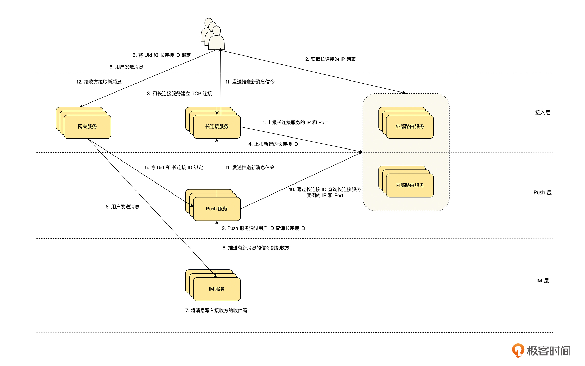

---
date: "2019-06-23"
---  
      
# 期中测试答案｜这些问题你都答对了吗？
你好，我是陈现麟。

在上周的期中测试环节，我留了一道 IM 系统的架构设计题，相信你一定进行了深入的思考，可能还产生了一些疑问。那么在本节课中，我就来详细地解答一下，如何依据业务和架构的需求来设计一个 IM 系统。

## 问题回顾

首先，我们来回顾一下 IM 系统的业务和架构方面的需求。

**业务上的需求**：

* 支持单聊。
* 100 个人以内的群聊。
* 峰值同时在线 1000 w。
* 峰值发送消息 10 w QPS。

**架构上的需求**：

* 开发模式简单，新功能支持快速迭代。
* 长连接支持就近接入和负载均衡。
* 分层设计。
* 在功能迭代上线的时候，不要影响到用户已经建立好的长连接。
* 发送消息的接口是幂等的。

## 问题解析

基于这些业务和架构上的需求，我完成了一个架构设计，具体见下图。接下来，我们就基于这个设计图来回答期中测试的问题。这里要特别说明一点，如果你的架构设计和我的不一样，也不一定就是错了。我们在做架构设计的时候，都是在不断地做 trade-off，很多方案没有绝对的对与错，只有深入理解业务，才能做出更适合业务场景的架构设计。

1.IM 系统一般都会涉及基于 TCP 的长连接通道和基于 HTTP\(S\) 的短连接通道，你认为长连接通道和短连接通道的职责分别是什么？

长连接在客户端和服务器端都需要维护状态，并且消息是异步收发的，我们对长连接的设计应该尽量简单，而短连接可以理解为无状态的，并且请求是同步处理的，方便去完成一些复杂的功能，所以我认为一个比较好的职责划分方式是：

<!-- [[[read_end]]] -->

* **长连接作为信令通道，用于服务端主动给客户端发送信令通知**，例如有新消息之类的主动通知，信令通知的数据结构做通用设计，在扩展的时候，新增信令类型的枚举即可。
* **短连接作为业务通道，用于实现业务功能，客户端通过短连接请求服务器的 API** **，来完成业务功能**，例如长连接通道发送有新消息的信令后，客户端通过短连接请求获得消息之类的接口，得到新消息的内容和顺序。

2.长连接的就近接入和负载均衡应该怎么来做？（可以考虑通过设计一个路由服务来解决。）

设计一个路由服务，客户端在建立长连接之前，先请求路由服务，路由服务通过客户端的 IP 或者 GPS 等位置信息，在充分考虑就近接入和负载均衡的基础上，给客户端返回最合适的接入点。

3.整个 IM 系统应该怎么分层？每一层的职责是什么？（可以考虑从长连接接入、Push 和 IM 等方面来进行分层。）

**这个 IM 系统可以分为 3 层：接入层、Push 层 和 IM 层**，它们具体的职责为：

* 接入层：

  * 外部路由服务：负责长连接服务的发现、负载均衡和连通性保障。
  * 长连接服务：负责长连接高效高质量的鉴权、接入和数据发送，它与业务无关，长连接 ID 为全局唯一 ID 即可，不要包含任何业务信息。
  * 网关服务：负责接入短连接请求，以及鉴权相关网关职责功能。

* Push 层：

  * Push 服务：负责服务器对客户端的信令推送，由于信令一般都是通过用户 ID 来发送的，所以在 Push 层需要做一个绑定操作，将用户 ID 和长连接 ID 进行绑定，在发送推送的时候，通过用户 ID 找到长连接 ID，然后再发送推送的信令数据。
  * 内部路由服务：存储长连接与长连接服务的对应关系，提供通过长连接 ID 查询长连接服务实例的接口。

* IM 层：负责 IM 层的业务逻辑，主要的业务功能都通过短连接的 API 对外提供，如果服务器需要主动通知客户端，则通过 Push 层来发送信令。

4.在系统设计中，如何让功能在迭代上线的时候，不要影响到用户已经建立好的长连接呢？

在上面的分层中，**我们接入层长连接服务的设计与业务无关，并且信令的数据结构易扩展**，这样可以保证业务功能迭代上线时，只需要发布 IM 层的服务，而长连接服务几乎不需要迭代升级，这也就保证了在功能上线时，不会影响到用户已经建立好的长连接。

5.对于业务需求，IM 系统的消息扩散模式，采用读扩散还是写扩散？为什么？

**因为业务需求为单聊和 100 人以内的群聊，所以我们可以采用写扩散的模式**，为每一个用户建立一个“收件箱”，该用户在每一次收到消息后，我们都向用户的收件箱写入一条数据，这样用户在获取新消息的时候，只需要拉取收件箱的数据即可。

而对于微博这样的关注模式，一个明星用户可能有 1000 w 的粉丝，如果采用写扩散，那么一个明星用户发布一条微博，就会导致 1000 w 次写“收件箱”，所以这种情况下，**我们一般采用读扩散，用户拉取微博消息列表的时候，即用户读微博信息的时候，根据关注用户发布的微博列表来生成微博消息列表**。

其实，**很多的场景为了满足业务要求，会通过写扩散和读扩散的混合模式来进行消息的扩散**，如果一条消息的接收者非常多，则采用读扩散，否则采用写扩散。

6.如何保障消息的发送接口是幂等的？

客户端在发送消息时，生成唯一 ID，唯一 ID 的生成逻辑可以按以下的方式生成：

**唯一 ID = Hash（UID + DID + 时间戳 + 自增计数）**

其中，UID 为用户 ID，DID 为设备 ID，自增计数为同一个时间戳下发送的消息数。然后我们可以依据[第 8 讲重试幂等](https://time.geekbang.org/column/article/485201)中的“至少一次消息传递加消息幂等性”的方式来处理。

7.如果要对 IM 系统进行限流，你认为应该在哪几个地方来实施？为什么？

我认为可以在下面三个地方进行限流：

* 接入层，保证接入点不会出现过载的情况，所以我们可以**对路由服务进行限流**。超过阈值，则返回客户端当前不能建立新的连接，让客户端等待一段时间后再重试，这个时间依据当时的情况而定。
* Push 层，整个 Push 层的关键是信令通道的正常，所以**对推送信令的 QPS 进行限流**，并且由于很多对 IM 层接口的访问，都是收到信令后的动作，比如收到有新消息的信令，就会执行获得消息相关的接口，那么减少信令数也可以减少对 IM 层接口的访问。
* 网关服务或者 IM 服务，整个 IM 层的关键是消息发送和获取消息相关的接口，所以我们可以**对消息发送和获取消息相关的接口进行限流**，确保这些接口和服务的正常性。

8.如何提高长连接和短连接通道的连接成功率？

关于这个问题，你可以具体查看[第 15 讲“被动故障的预案梳理”](https://time.geekbang.org/column/article/490456)，其中关于 DNS 解析问题和网络连通性问题的预案，就能解答你的疑惑。

9.整个 IM 系统要满足业务需求的指标，大约需要多少机器资源？是怎么计算的？

这部分我们一起按照业务的需求，来估算所需要的机器数量，注意，这里只是估算，不是绝对准确的数据。

* 接入层：如果我们决定通过一个接入实例承载 100 w 长连接，通过 10 个接入实例承担 1000 w 的长连接，那么一个实例运行的配置为：
  * 内存：一个 TCP 连接在接入服务运行的系统上，最大消耗的内存为 8 k 左右，那么为了支撑 100 w 长连接需要 8 G 内存，还需要为业务层内存保留 8 G 内存，另外，期望支持 100 w 长连接的时候，系统的内存使用率为 50\%，所以，最终内存为 **32 G**。
  * CPU：因为接入层为 IO 密集型服务，所以CPU 和内存的配比为 1：1，**CPU 为 32 核**。
* Push 层：峰值发送消息 10 w QPS，考虑到群消息会放大消息数量，我们预估放大 1 倍为 20 w QPS。假设经过我们的测试， 32 核 32 G 的机器可以支撑 5 w QPS 的信令推送，并且预留一定的空间，那么最终需要 **5 台 32 核 32 G 的机器**。
* IM 层：峰值发送消息为 10 w QPS，对应消息发送 API 的 QPS 为 10 w，如上讨论，信令推送的 QPS 为 20 w QPS，对应消息拉取 API 的 QPS 为 20 w QPS，IM 层其它的 API 接口预估 10 w QPS，可以得出 IM 层 API 接口总计 40 w QPS。假设经过我们的测试， 32 核 32 G 的机器，可以支撑 5 w QPS 的 IM 层 API 接口的调用，并且预留一定的空间，最终需要 **10 台 32 核 32 G 的机器**。

通过这一次期中测试，我们对“分布式计算篇”的知识，以及架构设计的一些思想进行了查漏补缺，如果你完成得很好，请不要骄傲，接下来的学习中还要继续温故而知新；如果你在完成时，遇到了很多问题或者成绩并不好，也不要灰心丧气，现在你知道了不擅长的部分或者不懂的知识，一定要抓紧时间认真复习，有不明白的地方欢迎和我在留言区交流，继续加油！