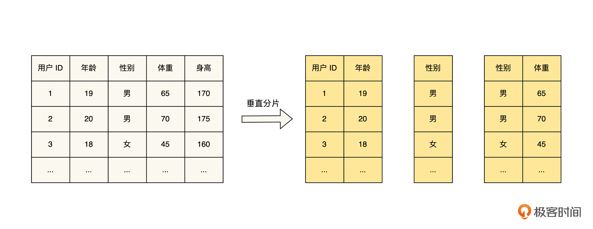
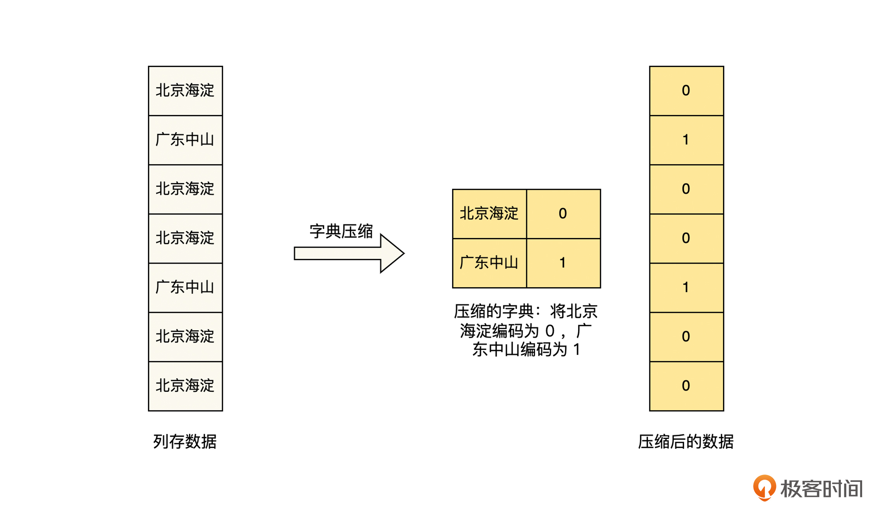
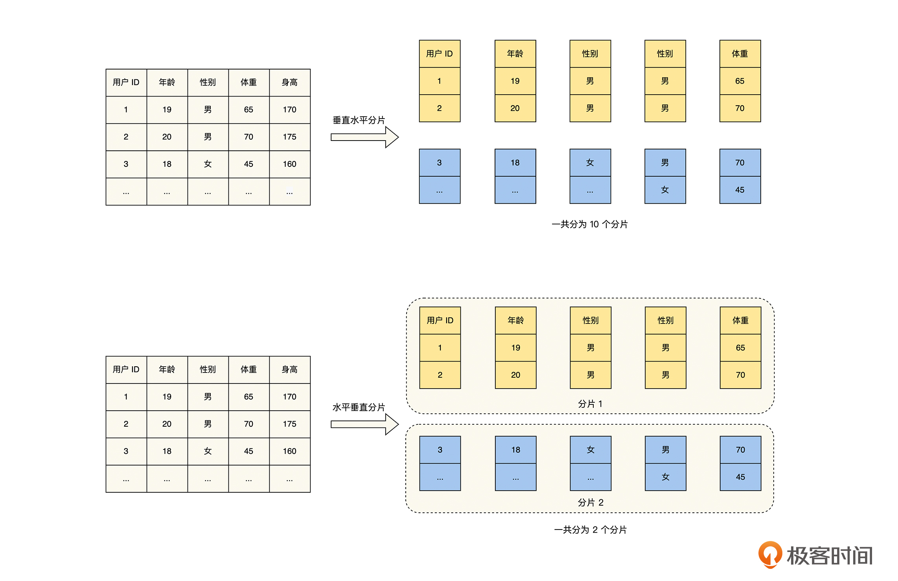

---
date: "2019-06-23"
---  
      
# 18｜分片（二）：垂直分片和混合分片的 trade-off
你好，我是陈现麟。

通过了解水平分片策略中，关于数据划分和数据平衡的原理和知识，我们可以基于极客时间的业务场景，选择合适的数据划分和数据平衡的方式，组合出最佳的水平分片策略。

而在一些数据分析的场景中，一行数据往往有非常多的字段，我们在计算时，却只需要一列或者几列的数据。这时基于水平分片策略，虽然能解决数据容量的问题，但是却没有充分利用数据分析场景的业务特点进行优化。那么是否有针对这个场景设计的数据分片方式呢？

答案是肯定的，**数据的垂直分片与混合分片，比起水平分片来说，能更好地满足数据分析场景**。所以在本节课中，我们将一起来讨论数据分片的另外两种方式：垂直分片与混合分片，思考一下垂直分片与混合分片，是如何利用数据分析场景的业务特点，来做数据存储优化的。

我们会先讨论垂直分片策略的应用场景和技术原理，接着分析混合分片策略是如何结合垂直分片与混合分片，在读写和水平扩展之间达到最优平衡的，最后再对讨论垂直分片时，引入的两种存储方式：行式存储和列式存储，进行对比和总结。

## 垂直分片策略

垂直分片策略和水平分片策略都是对数据进行分片，但是它们的思路却截然不同。水平分片策略将整个数据集的条数作为划分的对象，每一个分片负责处理一定的数据条数。而垂直分片策略则是将数据 Schema 的字段集个数作为划分的对象，每一个分片负责处理一个或几个字段的全部数据，具体如下图所示。

<!-- [[[read_end]]] -->

从上文的描述中不难看出，对于数据的水平扩展能力，垂直分片策略是很有限的。因为数据 Schema 的字段个数是非常有限的，常见的字段个数从几个到几百个不等，即使一个字段一个分片，在字段数少的数据集上，水平扩展能力也是非常差的。关于这个问题，可以将垂直分片与水平分片策略组合起来解决，我们会在下一部分的“混合分片策略”中讨论。

这里你会发现一个很有意思的地方，**如果垂直分片策略的处理方式为一个字段一个分片，那么垂直分片策略就等价于列式存储了，所以列式存储是垂直分片策略的一种特殊情况，也是最常见的情况**。接下来，我们就以列式存储为例，从它应用最广泛的大数据分析场景，来讨论垂直分片策略的特点，当然这些特点在垂直分片策略中依然生效。

我们先来解释下大数据分析场景，它是指从用户的行为数据中获得新的洞见，来改进我们的产品和运营方式。大数据分析场景的数据处理一般有以下的特点：

* **宽表存储，按列读取**：数据往往以宽表的形式存储，一个表上百列，但是一次分析往往只关心一列或者几列。
* **读多写少**：一次写入，多次读取，几乎不更新。
* **数据量大**：大数据会存储全站的所有数据，包括日志和数据库内的数据，并且会持续增加。
* **查询无规律，不能索引覆盖**：在分析场景中，我们会通过各种维度和组合，来统计和分析数据，所以这些查询方式是无规律的，不可能全部通过索引来覆盖。

由于大数据场景存储和计算的数据非常大，所以存储成本和计算性能是非常核心的设计指标，现在我们就来分析一下，列式存储是如何利用数据分析场景的特点，来达到低成本、高性能的。

第一，对于宽表存储，按列读取的场景，如果采用行式存储，当我们只需要读取一列数据的时候，可以按行顺序读取整个宽表所有列的数据，但是这会导致读取的数据量放大上百倍；或者我们可以跳着只读取所需列的数据，这样读取的数据量不会放大，但是读取数据的方式就从顺序读取变成随机读取了，这会增加非常多的寻址操作。并且，因为不能充分预读，在很大程度上，会降低磁盘的读性能。特别是对于机械磁盘来说，随机读取导致的寻址操作是毫秒级别的时延。

第二，读多写少的场景，会减少列式存储对写性能的影响。一般来说，数据写入存储系统是以行的形式写入的，而列式存储会导致一行数据的写入操作，按字段拆分为多个写入操作，使写入放大。不过，这个问题可以进行一定的优化，并且由于分析场景的数据写入模式是读多写少，所以不会影响整个系统性能的设计目标。

第三，因为数据量大，并且会持续增加的特点，要求存储系统能进行非常高效的压缩，降低存储数据的容量。那么我们先来分析下，列式存储是如何利用业务特性，进行数据压缩和提升性能的。

首先，在列式存储中相邻的数据类型是一致性的，并且通常会出现前缀一样，甚至完全相同的数据的特点，比如在用户的地址信息中，同一个地方的用户，省市县都是完全相同的，这非常适合使用 RLE 压缩、前缀压缩和字典压缩等压缩算法去压缩。

这里我们介绍一下字典压缩算法，其他的算法也是类似的思路，就不再一一介绍了。字典压缩算法的思路是，**在数据重复度比较高的情况下，对数据采用字典重新编码，来减少数据的大小**，具体见下图。

其次，虽然列式存储通过数据压缩大大提高了存储效率，节省了存储成本，但是与原始数据的存储相比，在写入和读取数据时，需要进行压缩和解压的操作，这需要消耗 CPU 来进行计算，所以，数据压缩其实是利用 CPU 资源来换取 IO 资源。

不过，在数据分析场景中，这是一个非常值得的选择，因为压缩算法在减少数据大小的同时，也减少了磁盘的寻道时间，提高了 I/O 性能，**因为减少了数据的传输时间，并且提高了缓冲区的命中率，导致这些环节中得到的收益，能轻易地补偿压缩数据带来的额外 CPU 开销**。

第四，如果熟悉数据库索引设计，你应该知道，数据库虽然有 Hash 索引或位图索引，但是最常见的索引模型是，将被索引的一个或多个关键词作为 Key ，按一定规则进行排序，Value 为行数据主键的指针，然后我们可以通过二分查询或 B+ Tree 进行查询，查到索引的关键词后，通过主键的指针找到行数据。

而对于大数据场景来说，经常需要读取一列或者几列中的大量数据、全表数据，那么**列式存储通过按列顺序存储、按需读取和高效压缩，可以使按列读取的性能大大提高**。其中，主键所在的列是有序的，其他列的读取性能也非常不错，可以理解为数据即索引，所以一般来说，列式存储系统对二级索引依赖不大，列式存储可以方便地应对查询无规律，不能预先建立索引的情况。

到这里，我们会发现，架构设计总是依赖业务场景的特点来做取舍，所以我们说，没有完美的架构，只有完美的 trade-off，列式存储其实是牺牲了按行写入的性能，去换取按列读取性能的 trade-off。

## 混合分片策略

在上文中，我们分析出了数据 Schema 的字段个数是非常有限的，特别是在字段数少的数据集上，完全依赖垂直分片策略，解决数据的水平扩展是不现实的，所以我们可以将垂直分片策略和水平分片策略结合起来解决这个问题。

根据这两种策略的组合顺序，可以将它们分为垂直水平分片策略和水平垂直分片策略。前者先进行垂直分片，再进行水平分片，而后者先进行水平分片，然后再进行垂直分片，具体方法如下图所示。

我们可以从图中看出，**垂直水平分片策略就是垂直分片策略的水平扩容版本**。对于水平分片策略，我们通常会选择主键进行水平分片，这样主键的列在整个存储系统中是有序的，垂直水平分片策略的数据分布特性和优缺点，与垂直分片策略完全相同，这里就不再重复讨论了。

**而水平垂直分片策略更像是，水平分片策略和垂直分片策略的结合体**，它对于整个数据集来说，一般是主键先利用基于关键词划分的水平分片策略，将数据集成不同的分片，然后对一个分片内的数据再进行垂直分片。

这样带来的好处是在一个水平分片内，依然按列式存储来存储数据，所以它有列式存储按列读取数据，高效和压缩比高的优点。在按行写入和读取多列的时候，都在一个数据分片上，大大地减少了网络 IO ，要知道在大规模的数据处理系统中，网络 IO 有可能是整个系统的瓶颈，同时，也能将一些分布式事务变成本地事务，提升系统的处理效率。

总体来说，水平垂直分片策略不仅保留了列式存储的优点，而且将多列操作控制在一个数据分片上，减少了网络 IO 和分布式事务，是混合分片策略常见的方式，Google 的 Dremel 数据库就采用了这种分片策略。

## 行列存储比较

在介绍水平分片、垂直分片和混合分片这三种分片策略的过程中，我们引入了行式存储和列式存储的讨论，并且我们发现这是存储引擎非常关键的一个选择，所以，最后我们来总结和分析一下，它们的优缺点以及应用场景，具体如下表。

## 总结

本节课，我们讨论了垂直分片策略在按列读取时的 IO 优势、数据压缩方面的存储优势和数据自动索引的查询优势，当然这些优势都是付出了代价的。这样你就深入了解了垂直分片策略的特点，并且掌握了在架构设计时，如何根据业务场景进行取舍。

接着，我们解决了垂直分片模式水平扩容差的问题，了解了混合分片策略的两种模式：垂直水平分片策略和水平垂直分片策略，**其中垂直水平分片策略是垂直分片策略的水平扩容版本，而水平垂直分片策略，是水平分片策略和垂直分片策略的结合版本**。

然后，我们对行式存储和列式存储，进行了全面的对比和总结，这样你就进一步地理解了行式存储和列式存储的优缺点以及适用场景。同时，它也是一个非常有价值的结论，一个非常方便的知识库，在有需要的时候，你也可以直接查看。

通过对各种策略不同优缺点的讨论和对比，希望你能明白，架构设计总是依赖业务场景的特点来做取舍，没有完美的架构，只有完美的 trade-off。

## 思考题

你在工作中经常接触的数据库系统，是行式存储还是列式存储呢？

欢迎你在留言区发表你的看法。如果这节课对你有帮助，也推荐你分享给更多的同事、朋友。