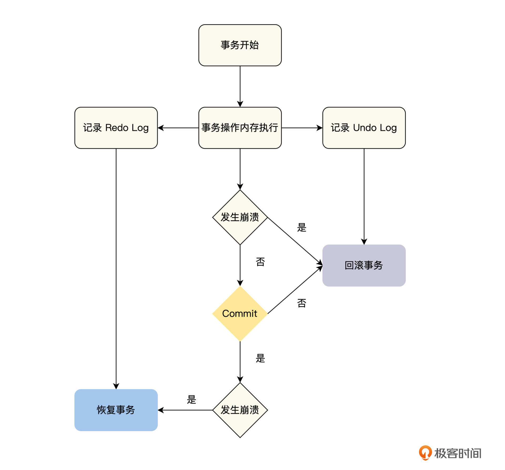
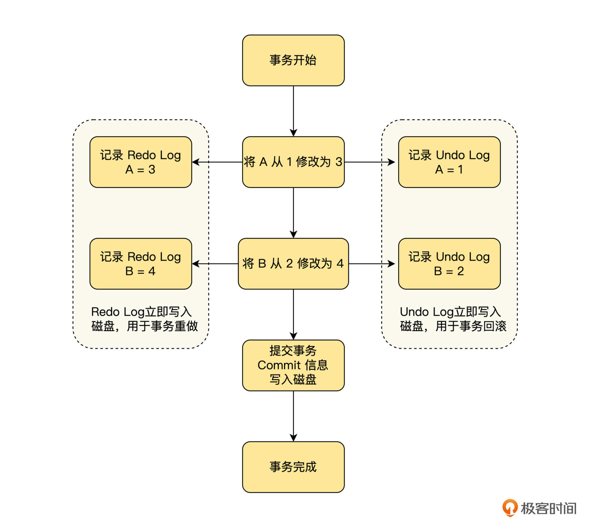

---
date: "2019-06-23"
---  
      
# 23｜事务（二）：原子性，对应用层提供的完美抽象
你好，我是陈现麟。

通过上节课的学习，我们理解了事务的一致性的定义，并且知道了事务一致性的实现，是通过底层存储的多副本数据强一致性，事务的原子性、隔离性和持久性一起协作，以及数据库层和应用层的约束检测等各方面来保障的，那么本节课，我们就继续来讨论事务中，另一个非常重要的特性：原子性。我们从原子性的定义出发，一起分析在分布式系统中，原子性的实现方法，最后再对原子性的关键问题进行讨论。

当我们对事务的原子性进行讨论和学习后，你就能明白原子性是一个非常完美的抽象，因为它对应用程序，屏蔽了分布式系统中部分失败的问题，这可以大大减少我们在编程时的心智负担。

## 原子性的定义

一般来说，我们在计算机领域第一次接触“原子”这一概念，都来源于操作系统的“原子操作”。在操作系统中，原子操作的定义是指，不可被中断的一个或者一系列操作，它包含了两个层面的意思。

首先，是**整体的不可分割性**。一个原子操作的所有操作，要么全部执行，要么就一个都不执行，即 all-or-nothing 。

其次，是**可串行化的隔离性，即线程安全**。原子操作是在单核 CPU 时代定义的，由于原子操作是不可中断的，那么系统在执行原子操作的过程中，唯一的 CPU 就被占用了，这就确保了原子操作的临界区，不会出现竞争的情况。原子操作自带了线程安全的保证，即最严格的隔离级别的可串行化，所以我们在编程的时候，就不需要对原子操作加锁，来保护它的临界区了。

<!-- [[[read_end]]] -->

但是，我们上节课提到了事务中原子性的定义，一个事务所有的操作，要么全部执行，要么就一个都不执行，即 all-or-nothing 。它可以让事务在执行的过程中，当遇到故障等原因，不能全部执行成功的时候，将已经执行的操作，回滚到事务前的状态。

你会发现事务中对原子性的定义，只保留了原子操作的不可分割性，并没有关注可串行化的隔离性。其实这也很好理解，主要是基于性能的考虑，如果事务的原子性同时定义了不可分割性和可串行化的隔离性，那么对数据库性能的影响将会非常大，因为数据库需要频繁地操作，相对于内存来说非常慢的磁盘，而可串行化地去操作磁盘，在很多业务场景下的性能是我们不可以接受的。

因此，**在事务的定义中，就将原子操作的不可分割性和隔离性，分别定义出了两个特性，即原子性和隔离性**。其中隔离性为了在性能和正确性之间权衡，定义了多种隔离级别，我们可以依据自己的业务情况进行选择，具体的隔离性讨论，我们将在下一节课进行。

## 怎么实现原子性

通过上面的讨论，我们知道了事务的原子性只关注整体的不可分割性，一个事务所有的操作，要么全部执行，要么就一个都不执行。那么我们应该如何实现事务的原子性呢？

从不可分割性的角度来思考，实现一个事务需要解决两个维度上的操作分割：

**第一个维度是单节点事务，即单节点上操作的不可分割性**。在单节点上，一个事务在执行的过程中出现崩溃等问题，它的一部分操作已经执行完成，而另一部分操作则无法继续执行，这时就会出现整个事务操作无法继续完成，仅仅部分操作完成的情况。

**第二个维度是分布式事务，即多节点之间的操作不可分割性**。在多节点上，一个事务操作需要在多个节点上运行，如果某些节点检测到违反约束、冲突、网络故障或者崩溃等问题，事务将无法继续执行，而其他节点的事务却已经顺利完成了，这时就会出现部分节点操作完成的情况。

下面我们就从单节点事务和分布式事务的维度，来一一讨论事务原子性的实现。

### 单节点事务

对于单节点上运行的事务（单节点事务）来说，在执行过程中，不需要与其他的节点交互，也就不会出现部分节点失败导致的操作分割，我们只需要考虑当前节点整体失败导致的操作分割即可。对于单节点事务，一般是在存储引擎上，通过 Undo Log 、 Redo Log 和 Commit 记录来实现，具体流程如下图。

我们从图中不难看出，对于单节点事务来说，一个非常关键的顺序就是在磁盘上持久化数据的顺序：先写入 Undo Log 和 Redo Log ，然后再写入 Commit 记录。其中事务的提交或中止由 Commit 记录来决定，如果在写入 Commit 记录之前发生崩溃，那么事务就需要中止，通过 Undo Log 回滚已执行的操作；如果事务已经写入了 Commit 记录，就表明事务已经安全提交，后面发生了崩溃的话，就要等待系统重启后，通过 Redo Log 恢复事务，然后再提交。

接下来，我们通过举例来简单描述下这个过程，注意这里简化了 Undo Log 和 Redo Log 的格式。假设一个事务操作 A、B 两个数据，他们的初值分别为 1 和 2 ，事务的操作内容为将 A 修改为 3 ，B 修改为 4 ，那么事务的执行流程如下图。

通过这些讨论，我们可以看出， **Redo Log 保证了事务的持久性， Undo Log 保证了事务的原子性，而写入 Commit 记录了事务的提交点**，它来决定事务是否应该安全提交。通过提交点，我们就可以将事务中多个操作的提交，绑定在一个提交点上，实现事务的原子提交。

### 分布式事务

对于多节点上运行的事务（分布式事务）来说，除了当前节点整体失败导致的操作分割之外，还存在部分节点失败导致的操作分割。我们知道当前节点整体失败导致的操作分割，可以按单节点事务来处理，而对于部分节点失败导致的操作分割，一个常见的思路是通过两阶段提交（ 2PC ）来解决，实现 2PC 的思路如下图所示。

* 选择一个协调者，这个协调者可以是分布式事务的参与节点，也可以是一个单独的进程。
* 阶段 1
  * 协调者发送事务请求（Prepare）到所有的参与节点，并询问它们是否可以提交。
  * 如果所有的参与节点都回复“是”，那么接下来协调者在阶段 2 发出提交（Commit）请求。
  * 如果任何的参与节点都回复“否”，那么接下来协调者在阶段 2 发出放弃（Rollback）请求。
* 阶段 2
  * 依据阶段 1 返回的结果，决定事务最终是提交（Commit）还是放弃（Rollback）。

关于 2PC ，在实现的时候，要特别注意 2 个关键点。

一是，**两个关键承诺**。第一个承诺在阶段 1 ，当事务的参与节点回复“是”的时候，对于当前事务，这个参与节点一定是能够安全提交的，它不仅要保障事务在提交时，不会出现冲突和约束违规之类的问题，还要保障即使出现系统崩溃、电源故障和磁盘空间不足等系统问题时，事务依然能够正常提交成功。

第二个承诺在阶段 2 ，当协调者基于参与者的投票，做出提交或者中止的决定后，这个决定是不可以撤销的。对于协调者来说，如果协调者通知参与者失败，那么协调者必须一直重试，直到所有的参与节点都通知成功为止；而对于参与者来说，不论协调者通知的结果是提交还是中止，参与者都必须严格执行，不能反悔。即使出现了故障，在故障恢复后，还是必须要执行，直到成功为止。

第二个关键点是**2PC 的提交点**。当协调者通过参与者的投票，做出提交或者中止事务的决定后，需要先将决定写入事务日志，然后再通知事务的参与者。如果协调者在事务执行过程中崩溃了，那么等到协调者恢复后，在事务日志中如果没有发现未解决的事务，就中止事务；反之，就会继续执行事务。

所以，协调者将阶段 1 的决定写入事务日志就是 2PC 中事务的提交点，通过这个提交点，将多个节点的事务操作绑定在一个提交点上，然后像单节点事务一样，利用这个提交点来保证事务的原子性。

## 2PC 面临的问题

通过上面的讨论，我们知道了 2PC 可以解决分布式事务的原子性问题，但是要正确使用 2PC，还需要了解以下几个方面的问题。

第一，**2PC 是一个阻塞式协议**。当 2PC 的一个参与者，在阶段 1 做出了“是”的回复后，参与者将不能单方面放弃，它必须等待协调者的决定，也就意味着参与者所有占用的资源都不能释放。如果协调者出现故障，不能将决定通知给参与者，那么这个参与者只能无限等待，直到协调者恢复后，成功收到协调者的决定为止。

因为 2PC 有阻塞问题，所以后来又提出了**3PC 协议，它在 2PC 的两个阶段之间插入了一个阶段，增加了一个相互协商的过程，并且还引入了超时机制来防止阻塞**。虽然 3PC 能解决 2PC 由于协调者崩溃而无限等待的问题，但是它却有着超高的延迟，并且在网络分区时，还可能会出现不一致的问题，这些原因导致它在实际应用中的效果并不好，所以目前普遍使用的依然是 2PC 。

第二， **2PC 是一个逆可用性协议**。如果在阶段 1 ，任何一个参与者发生故障，使准备请求失败或者超时，协调者都将中止操作；如果在阶段 2 ，协调者发生故障，也会导致参与者只能等待，无法完成操作。

你是否感觉很奇怪，同样是共识算法，Raft 和 Paxos 等共识算法都能容忍少数节点失败的情况，那为什么 2PC 则完全不能容忍节点的失败呢？**其实，这个差异的出现是因为 2PC 是一个原子提交协议，为了 all-or-nothing ，在操作过程中就需要与所有的节点达成共识**；而 Raft 和 Paxos 则只需要与大部分节点达成一致，确保共识成立即可，它可以容忍少数节点不可用，当故障恢复的时候，之前不可用的节点可以向其他正常的节点同步之前达成的共识。

第三，虽然 2PC 能保证事务的原子性，即一个事务所有的操作，要么都成功，要么都失败，**但是它并不能保证多个节点的事务操作会同时提交**。如果没有同时提交，即一部分节点已经提交成功，而另一部分节点还没有提交的时候，就将使事务的可见性出现问题，这部分知识，我们将在课程“事务（三）”中继续讨论。

总而言之，虽然 2PC 在性能、可用性和可见性方面都存在问题，但是目前分布式事务中，使用最广泛的还是 2PC 。

## 总结

在这节课中，我们先讨论了原子性的定义，了解了事务的原子性，以及操作系统的原子操作是两个不同的概念，事务的原子性只要求 all-or-nothing ，而操作系统的原子操作除了要求 all-or-nothing 之外，还需要可串行化的隔离级别。

然后，我们从单节点事务和分布式事务的角度，讨论了如何实现事务的原子性。对于单节点事务来说，我们将事务的多个操作绑定到，事务提交信息写入的一个提交点上，如果提交信息写入成功，那么事务提交，否则事务回滚。

而对于分布式事务来说，它在单节点事务的基础上，进一步地要求事务的多个参与者做出两个关键承诺，第一个承诺在阶段 1 ，当事务的参与节点回复“是”的时候，该参与者是一定可以提交的；第二个承诺在阶段 2 ，当协调者基于参与者的投票，做出提交或者中止的决定后，这个决定是不可以撤销的。

最后，我们讨论了 2PC 在性能、可用性和可见性方面有着一些问题，但是 **2PC 依然是当前分布式事务场景中，使用最多的原子提交协议**。

## 思考题

在学习 2PC 协议的过程中，我们提到了 3PC 协议，它在 2PC 的两个阶段之间插入一个阶段，从而增加了一个相互协商的过程，并且还引入了超时机制来防止阻塞，你知道这是怎么做的吗？

欢迎你在留言区发表你的看法。如果这节课对你有帮助，也推荐你分享给更多的同事、朋友。